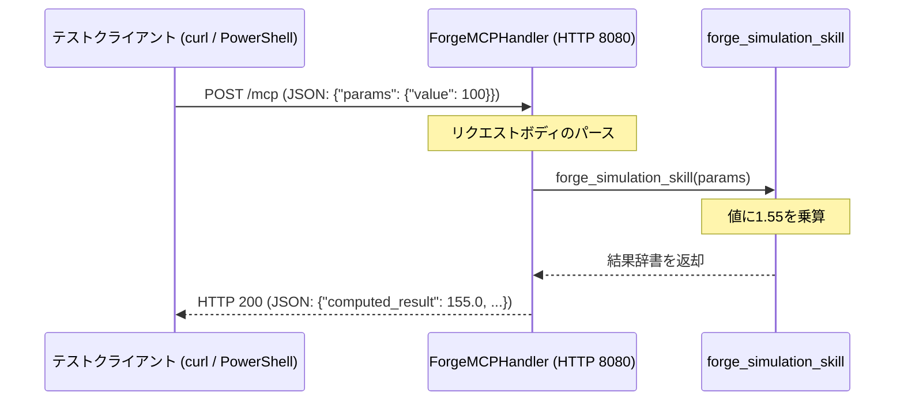

# 設計仕様書: Forge MCP エージェント & Antigravity 設定

## 1. 概要
本設計書は、Forge側で動作するMCPサーバーエージェント `forge_mcp_agent.py` の実装、およびAntigravity側でそれを認識するための設定ファイル `.antigravity/agents.json` の作成手順を定義します。

## 2. 目的
- Forge側に高度なシミュレーション処理を行うための簡易MCPサーバーエンドポイント（HTTP POST）を構築する。
- Antigravity側から上記のForge側エージェントをサブエージェントとして利用するための設定ファイルを配置する。

## 3. システム構成・データフロー



## 4. 作成するファイル一覧

### ① [forge_mcp_agent.py](file:///C:/Users/PC_User/Forge/forge_mcp_agent.py)
Forge側で動作する簡易MCPサーバーです。
- **配置パス:** `C:\Users\PC_User\Forge\forge_mcp_agent.py`
- **ポート番号:** `8080` (待情ポート)
- **エンドポイント:** `POST /mcp`
- **ソースコード:**

```python
import json
from http.server import BaseHTTPRequestHandler, HTTPServer


# Forgeエージェントのメインロジック（専門スキル）
def forge_simulation_skill(params):
    # ここにForge側で作り込んだ高度な処理やシミュレーションを記述
    base_value = params.get("value", 100)
    result = base_value * 1.55  # 例: Forge特有 of 補正ロジック

    return {
        "status": "success",
        "agent": "Forge-Specialist-Agent",
        "computed_result": result,
        "message": "Forge側での高度な演算が完了しました。",
    }


# Antigravityと通信するための簡易MCPハンドラー
class ForgeMCPHandler(BaseHTTPRequestHandler):

    def do_POST(self):
        if self.path == "/mcp":
            content_length = int(self.headers["Content-Length"])
            post_data = self.rfile.read(content_length)
            req_json = json.loads(post_data.decode("utf-8"))

            # Antigravityからの指示（タスク）を解析
            print(f"📥 Antigravityからのタスクを受信: {req_json}")
            params = req_json.get("params", {})

            # Forgeのスキルを実行
            response_data = forge_simulation_skill(params)

            # レスポンスを返却
            self.send_response(200)
            self.send_header("Content-Type", "application/json")
            self.end_headers()
            self.wfile.write(json.dumps(response_data).encode("utf-8"))
        else:
            self.send_response(404)
            self.end_headers()


def run_forge_server(port=8080):
    server = HTTPServer(("localhost", port), ForgeMCPHandler)
    print(f"🚀 Forgeサブエージェントが localhost:{port}/mcp で待機中...")
    server.serve_forever()


if __name__ == "__main__":
    run_forge_server()
```

### ② [.antigravity/agents.json](file:///C:/Users/PC_User/Forge/.antigravity/agents.json)
AntigravityからForgeシミュレーターを呼び出すための設定ファイル。
- **配置パス:** `C:\Users\PC_User\Forge\.antigravity\agents.json`
- **ソースコード:**

```json
{
  "sub_agents": [
    {
      "id": "forge-specialist",
      "name": "Forgeシミュレーター",
      "type": "mcp_worker",
      "endpoint": "http://localhost:8080/mcp",
      "description": "Forge側で構築された、高度な数値計算とシミュレーションを専門とするサブエージェント",
      "capabilities": ["simulation_execution", "data_patch"],
      "meta": {
        "vibe_mode_compatible": true
      }
    }
  ]
}
```

## 5. 検証手順

### ① JSONファイルの検証
PowerShellから以下のコマンドを実行してJSONにエラーがないことを確認します。
```powershell
Get-Content "C:\Users\PC_User\Forge\.antigravity\agents.json" -Raw | ConvertFrom-Json
```

### ② Pythonサーバーの起動と動作検証
1. **サーバーの起動:**
   ```powershell
   python C:\Users\PC_User\Forge\forge_mcp_agent.py
   ```
2. **動作確認用リクエストの送信（別ターミナルから実行）:**
   ```powershell
   Invoke-RestMethod -Uri "http://localhost:8080/mcp" -Method Post -ContentType "application/json" -Body '{"params": {"value": 100}}'
   ```
3. **期待されるレスポンス:**
   ```json
   {
       "status": "success",
       "agent": "Forge-Specialist-Agent",
       "computed_result": 155.0,
       "message": "Forge側での高度な演算が完了しました。"
   }
   ```
