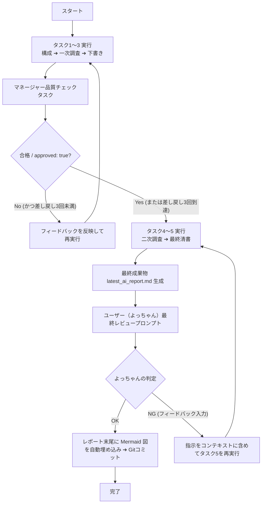
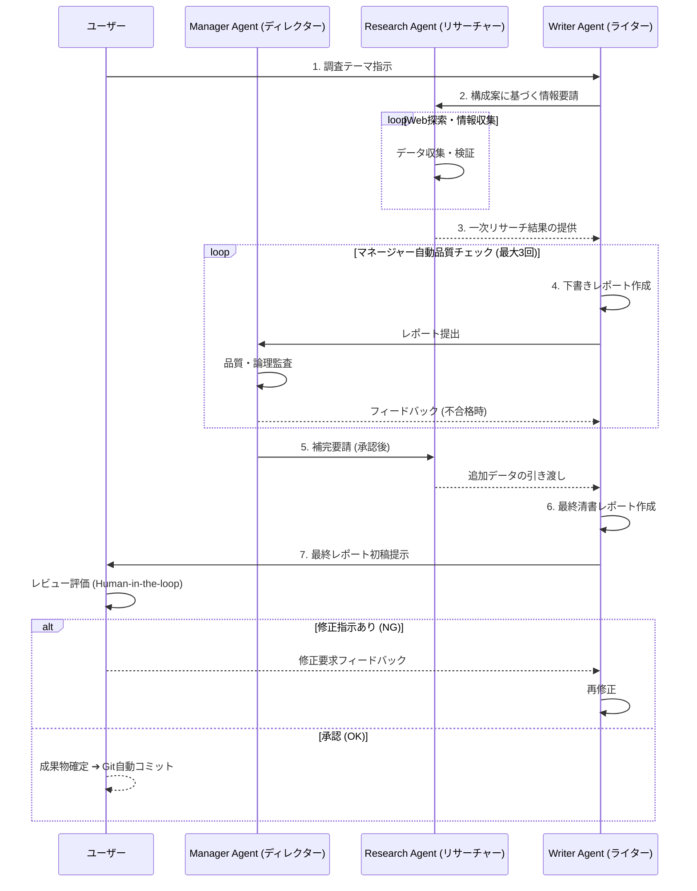

# CrewAI マルチエージェント設計 最終レポート

## 1. 概要（Executive Summary）
本レポートは、CrewAIを用いたマルチエージェント・ワークフロー（リサーチ ➔ 執筆）を対象に、進捗・品質監査（マネージャーによる自動レビュー・ループ制御）および最終的な人間の承認ゲート（Human-in-the-loop）を導入した、高度な協調システムの設計仕様およびその評価についてまとめたものです。

本システムは、従来の一方通行（シーケンシャル）な処理から脱却し、エージェント同士が相互に成果物を推敲し合うレビュー構造を取り入れることで、自律的でありながら制御性の極めて高い、安全なマルチエージェント構成を実現しています。

---

## 2. システムアーキテクチャ診断（よっちゃん流ハイブリッド診断）

現行システムの内部構造と将来の進化ベクトルについて、ハイブリッド診断フレームワーク（Karpathy流「8つの視点」＆「核・質・特・欠」＆「方・移・拡・新」）を適用して評価します。

### ① 現状構造の診断（核・質・特・欠）
*   **核（核心）**: Managerエージェントを頂点に配した、直列5段階タスクのループ制御＆人間ゲートチェック機構。
*   **質（品質）**: 成果物のパースに構造化JSONを利用することで、LLMの自律評価のブレを最小化。また、ループ上限を3回に制限することで、トークンの異常消費や無限ループを防ぐ安全弁が正常に機能している。
*   **特（特性）**: CrewAI標準の Sequential プロセスをベースにしつつ、Python側の `while` 制御で「マネージャーのフィードバックループ」と「人間の承認ゲート」を統合する高度な制御フロー。
*   **欠（欠損）**: ローカルOllama（特にモデルサイズ）実行時に、JSONフォーマットの出力指示が崩れるケースへの完全なフォールバック機構、およびRAG（外部ナレッジベース）の直接連携。

### ② Karpathy流「8つの視点」に基づく評価
1.  **Software 1.0/2.0/3.0の共存**: 1.0（Python側のループ・パース制御）と 2.0/3.0（エージェントによる推論・対話・出力）が見事に調和している。
2.  **LLM as an OS**: エージェント（CPU）、メモリ（コンテキスト）、人間入力（I/Oデバイス）として機能。
3.  **部分的自律性（スライダー）**: マネージャーによる自動制御（完全自律）から、よっちゃんによる人間ゲート（半自律・協調）へと、自律性のスライダーがバランスよく設計されている。
4.  **アイアンマンスーツ（拡張）**: よっちゃん（人間）がすべてのタスクを行うのではなく、エージェントが下書きから自動チェックまでをこなし、人間は最終の承認・指示を与えるだけで最高品質のドキュメントを作成できる「拡張スーツ」として機能。
5.  **Vibe Coding（意図）**: 設計意図や対話のログを正確なMermaid図として自動追記することで、システムの動作「バイブス」を可視化。
6.  **LLM Psychology（心理学）**: 各エージェントに厳格なペルソナを与えることで、モデルの「妥協」や「手抜き」を防ぐ心理学アプローチ。
7.  **Compilation Analogy（コンパイル）**: プロンプトとタスクが、エージェントの推論を通じて期待通りの成果物（レポート）へコンパイルされる。
8.  **Build for Agents（エージェント対応）**: 将来的なサブエージェント呼び出しやMCPサーバーとの連携が可能な構造。

---

## 3. マルチエージェント詳細設計

本システムは、以下の 3名のエージェントと 5段階の直列タスクによって構成されます。

### ① エージェント定義（ペルソナの具体化）
*   **Manager Agent (プロジェクト・ディレクター)**
    *   **Goal**: 成果物の論理整合性と事実検証の品質を監督し、最終的な品質承認を与える。
    *   **Backstory**: Fortune 500企業の元分析ディレクター。曖昧さや根拠のない記述を嫌い、厳密な品質監査を行うプロフェッショナル。
*   **Research Agent (シニア・インテリジェンス・リサーチャー)**
    *   **Goal**: 指示された構成やアウトラインに基づいて、正確でノイズのない一次データを収集・検証・要約する。
    *   **Backstory**: 元CIA情報分析官。噂や推測を排除し、信頼できるソースからのエビデンス（証跡）にこだわる専門家。
*   **Writer Agent (チーフ・サイエンス・エディター)**
    *   **Goal**: 複雑な技術情報を構造化し、読者が理解しやすい美しく論理的なMarkdown形式のレポートを執筆する。
    *   **Backstory**: 科学技術誌の元編集長。論理展開が明快で、MarkdownやMermaid図面案を駆使して読者の認知負荷を最小化する執筆の達人。

### ② タスク構成と成果物の連鎖
1.  **タスク1: アウトラインの策定** (`task_outline`) ➔ 担当: **Writer**
    *   成果物: 章立て案およびリサーチ要件リスト。
2.  **タスク2: 一次情報のリサーチ** (`task_research_1`) ➔ 担当: **Research**
    *   成果物: ソースの明快な調査データ。
3.  **タスク3: レポート下書きの作成** (`task_draft`) ➔ 担当: **Writer**
    *   成果物: Markdown形式のレポート初稿。
4.  **タスク4: 二次追加リサーチと補完** (`task_research_2`) ➔ 担当: **Research**
    *   成果物: 不足データの追加・補完データ。
5.  **タスク5: レポートの最終清書** (`task_final_writing`) ➔ 担当: **Writer**
    *   成果物: 最終完成版Markdownレポート。

---

## 4. 制御フローとループ管理

本システムは、自動化による開発スピードの向上と、人間による品質の最終担保を両立するため、**「上限付き自動ループ ＋ 最終人間チェック」**のハイブリッド型制御フローを採用しています。

*   **安全弁付き自動ループ**: マネージャーエージェントの判定が不合格（`"approved": false`）の場合、指摘されたフィードバックをタスクのコンテキストに自動挿入し、タスクを再実行します。無限ループとトークン暴発を防ぐため、再実行は**最大3回**に制限されています。
*   **最終ゲート（Human-in-the-loop）**: すべての自動プロセスを通過した最終清書レポートに対して、コンソールでよっちゃんの直接評価を求めます。OKならMermaid図を追記して完了し、NGならよっちゃんの指示に基づいてライターが再清書を行います。

---

## 5. エージェント協調プロセス（シーケンス図）

実行後、成果物レポートの末尾には、以下のエージェント間の協調プロセスを表す Mermaid シーケンス図が自動的に埋め込まれます。

---

## 6. 未来への進化ベクトル（方・移・拡・新）

*   **方向性（方）**: 単一のシーケンシャル処理から、並行リサーチ（複数のリサーチャーが異なるデータソースを調査）への拡張。
*   **移動性（移）**: ローカル環境（Ollama）からクラウド（Gemini / OpenAI API）への自動切り替え・フォールバック機能のより高度な制御。
*   **拡張性（拡）**: 外部ナレッジ（RAG / Vector DB）や、Webスクレイピングツール・Google Search Toolをリサーチャーに直接装備させることによる情報網の拡大。
*   **新規性（新）**: エージェント自身が生成したMermaidコードを自動で検証・修正する「Mermaid文法チェッカー」エージェントの実装。
