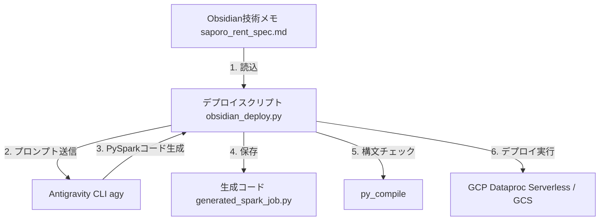

# 📋 設計書：Obsidian 技術メモからのクラウド自動デプロイ

## 1. 概要
ユーザー（よっちゃん）が Obsidian Vault に記述した「数式混じりの Markdown 技術メモ」を読み込み、AIエージェント（Antigravity）がロジックを解釈して PySpark コードを抽出・生成し、GCP (Dataproc Serverless Spark) へのデプロイまでを自動で行う連携スクリプトを構築します。

## 2. システム構成・データフロー



## 3. 作成ファイル

### 3.1 模擬 Obsidian Vault / 技術メモ
- **パス**: `scratch/obsidian_vault/saporo_rent_spec.md`
- **内容**: 家賃と駅からの距離に応じた加重平均の数式（LaTeX）および要件を記述。

### 3.2 デプロイ管理スクリプト
- **パス**: `scratch/obsidian_deploy.py`
- **主要な処理**:
  1. `scratch/obsidian_vault/saporo_rent_spec.md` を読み込む。
  2. 以下のようなシステムプロンプトと共に `agy` を呼び出す：
     > 「以下のMarkdownに書かれた数式と要件を理解し、同じ処理を行う PySpark (Spark 3.5) のコードのみを出力してください。解説は不要です。必ず ```python と ``` のブロックで囲んでください。」
  3. 抽出されたコードを `scratch/generated_spark_job.py` に書き出す。
  4. ローカル環境での `py_compile` による構文チェック。
  5. GCP (Dataproc Serverless) へのデプロイコマンド `gcloud dataproc batches submit pyspark ...` の生成および実行（実際のデプロイと、デモ用のドライラン出力をサポート）。

## 4. 検証（テスト）項目
1. `python scratch/obsidian_deploy.py` を実行する。
2. `scratch/generated_spark_job.py` が正常に作成され、中に PySpark の加重平均集計ロジック（重み $w_i = \frac{1}{d_i + 1}$）が正しく実装されていることを目視で確認する。
3. `gcloud dataproc` コマンドがエラーなく組み立てられ、ログに出力されることを確認する。
