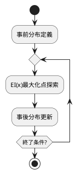

---
id: okf-20260915
title: ベイズ最適化と獲得関数
category: アルゴリズム・数理
tags:
  - source/okf
  - tech/math
status: indexed
created: 2026-09-15
---

# ベイズ最適化と獲得関数

## 1. hermes：理論サマリー
自律エージェントによる数理最適化の体系化ノート。

## 2. LaTeX：数理モデル
$$EI(x) = (\mu(x) - f(x^+) - \xi)\Phi(Z) + \sigma(x)\phi(Z)$$

## 3. PlantUML：探索ループ

## 4. 連携ノート
- [[No.084_AGY_Antigravity CLI活用]]
- [[No.107_発想技法AIナビゲーター]]
