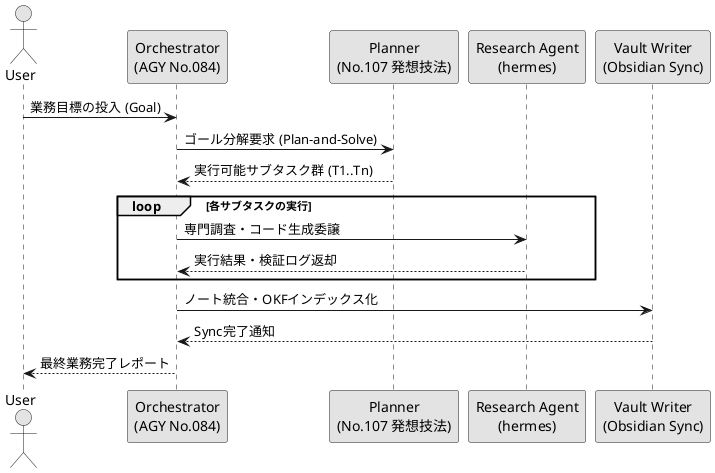

---
id: okf-multi-agent-01
title: マルチエージェント協調・自律タスク委譲フロー仕様書
category: エージェント工学・アーキテクチャ
tags:
  - source/okf
  - tech/multi-agent
  - tech/llm-orchestration
status: indexed
created: 2026-09-15
---

# マルチエージェント協調・自律タスク委譲フロー仕様書

## 1. hermes：理論サマリー
Plan-and-Solve型プロンプティングおよびReAct拡張に基づく階層型タスク分解アーキテクチャ。オーケストレーターが上位ゴールを部分問題群へと分解し、専門サブエージェントへ動的委譲・実行するフレームワークの仕様ノート。

## 2. LaTeX：タスク探索木とトークン消費の数理モデル
タスク集合を $T = \{t_1, t_2, \dots, t_K\}$ とし、各部分タスク $t_k$ の成功確率を $p(t_k)$ とする。

システム全体のタスク完了確率 $P_{\text{complete}}$（直列依存型）：

$$P_{\text{complete}} = \prod_{k=1}^K p(t_k)$$

探索木のノード $s$ におけるUCT（Upper Confidence bounds applied to Trees）評価値関数：

$$Q(s, a) + c \sqrt{\frac{\ln N(s)}{N(s, a)}}$$

総トークン消費量の期待値 $\mathbb{E}[C]$（入力 $C_{\text{in}}$、出力 $C_{\text{out}}$、リトライ回数上限 $M$）：

$$\mathbb{E}[C] = \sum_{k=1}^K \sum_{m=1}^M \left( C_{\text{in}}^{(k,m)} + C_{\text{out}}^{(k,m)} \right) \cdot P(\text{Retry} = m)$$

## 3. PlantUML：エージェント協調シーケンス

## 4. 連携ノート
- [[No.084_AGY_Antigravity CLI活用]]
- [[No.107_発想技法AIナビゲーター]]
- [[MOC_業務自動化]]
