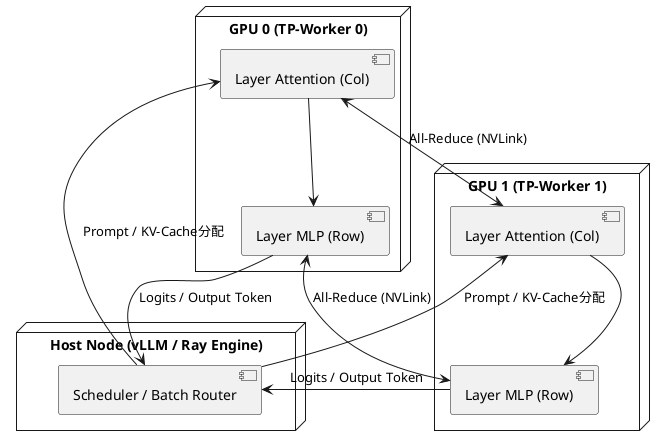

---
id: okf-dist-inf-01
title: 分散並列推論・システムアーキテクチャ設計書
category: システム設計・基盤
tags:
  - source/okf
  - tech/distributed-systems
  - tech/inference-opt
status: indexed
created: 2026-09-15
---

# 分散並列推論・システムアーキテクチャ設計書

## 1. hermes：理論サマリー
大規模言語モデル（LLM）の高スループット・低遅延推論を実現するため、テンソル並列（Megatron-LM型）およびパイプライン並列を組み合わせた分散推論基盤のアーキテクチャ設計ノート。

## 2. LaTeX：メモリフットプリントと通信オーバーヘッドの数理モデル
モデルパラメータ数を $P$、隠れ層次元数を $H$、レイヤー数を $L$、テンソル並列度を $TP$、パイプライン並列度を $PP$ と置く。

各GPUにおける重みパラメータのメモリ消費量 $M_{\text{weight}}$（16bit精度）：

$$M_{\text{weight}} \approx \frac{2P}{TP \times PP} \quad [\text{Bytes}]$$

1トークン生成あたりのAll-Reduce通信データ量 $C_{\text{comm}}$（Forward時）：

$$C_{\text{comm}} = 2L \times \left( \frac{2(TP - 1)}{TP} \right) \cdot B \cdot H \cdot 2 \quad [\text{Bytes}]$$

バッチサイズ $B$ のスループット最大化とKVキャッシュ容量・通信遅延のトレードオフを考慮した設計を採用する。

## 3. PlantUML：コンポーネント配置・All-Reduce通信トポロジー

## 4. 連携ノート
- [[No.084_AGY_Antigravity CLI活用]]
- [[No.107_発想技法AIナビゲーター]]
- [[MOC_業務自動化]]
