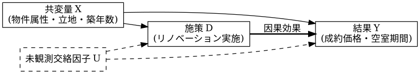

# 因果推論・施策インパクト評価モデル仕様書

## 1. hermes：理論サマリー
傾向スコアマッチング（PSM）および二重差分法（DID）を統合し、観測データにおける交絡因子のバイアスを除去して施策の真の処置効果（因果効果）を推定する分析パイプライン仕様。

## 2. LaTeX：因果推定量数理モデル
処置変数 $D \in \{0, 1\}$、潜在的結果変数を $Y(1), Y(0)$ とする。

平均処置効果（ATE: Average Treatment Effect）：

$$\tau_{\text{ATE}} = \mathbb{E}[Y(1) - Y(0)]$$

処置群における平均処置効果（ATT: Average Treatment Effect on the Treated）：

$$\tau_{\text{ATT}} = \mathbb{E}[Y(1) - Y(0) \mid D = 1]$$

共変量 $X$ に基づく傾向スコア $e(X) = P(D = 1 \mid X)$ による重み付け（IPW推定量）：

$$\hat{\tau}_{\text{ATE}} = \frac{1}{N} \sum_{i=1}^N \left( \frac{D_i Y_i}{e(X_i)} - \frac{(1 - D_i) Y_i}{1 - e(X_i)} \right)$$

## 3. PlantUML：因果DAGと交絡調整フロー

## 4. 連携ノート
- [[No.084_AGY_Antigravity CLI活用]]
- [[No.107_発想技法AIナビゲーター]]
- [[MOC_業務自動化]]
