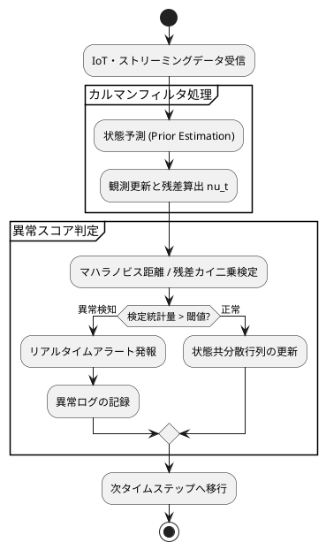

---
id: okf-ts-anomaly-01
title: 時系列データ分析・異常検知パイプライン仕様
category: データ分析・AI
tags:
  - source/okf
  - tech/timeseries
  - tech/anomaly-detection
status: indexed
created: 2026-09-15
---

# 時系列データ分析・異常検知パイプライン仕様

## 1. hermes：理論サマリー
状態空間モデルおよびカルマンフィルタに基づく動的ノイズ除去と、マハラノビス距離を用いた多変量時系列データの異常検知ロジックの体系化ノート。

## 2. LaTeX：状態空間数理モデル
状態方程式および観測方程式の定式化：

$$x_t = F_t x_{t-1} + G_t v_t, \quad v_t \sim \mathcal{N}(0, Q_t)$$
$$y_t = H_t x_t + w_t, \quad w_t \sim \mathcal{N}(0, R_t)$$

予測残差（イノベーション） $\nu_t$ およびその共分散行列 $S_t$：

$$\nu_t = y_t - H_t x_{t|t-1}$$
$$S_t = H_t P_{t|t-1} H_t^T + R_t$$

## 3. PlantUML：データフロー・異常判定

## 4. 連携ノート
- [[No.084_AGY_Antigravity CLI活用]]
- [[No.107_発想技法AIナビゲーター]]
- [[MOC_業務自動化]]
