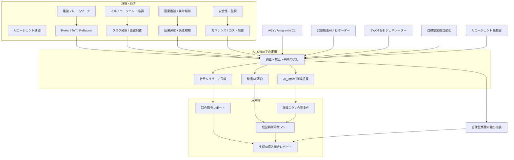

# AIエージェント MOC

AIエージェントのテーマは、推論フレームワークの比較から、複数エージェントの協調設計、業務自動化の実装、そして安全性・評価の考え方までを含む横断的な知識領域として整理できる。ここでは、基礎理論・応用実装・議論と設計の3層で、既存ノートを再利用可能な形でまとめる。

## 概要・全体像

本テーマの中心課題は、単なる「自動応答」ではなく、複数の判断・実行・検証を持つエージェントが、どのようにタスクを分解し、委譲し、再帰的に改善するかを設計することにある。ワークスペースでは、推論メカニズムの比較、マルチエージェントの制御フロー、実務への応用、異常検知と最適化までが相互に接続されている。

## 体系別ノート一覧

### 1. 基礎理論・設計原理

- [[エージェント推論フレームワーク_サーベイ]]
  - 逐次推論、探索型推論、自己反省型推論、協調型推論を比較し、用途別の選択肢を整理する。
- [[マルチエージェント協調_タスク委譲フロー]]
  - オーケストレーターとサブエージェントの役割分担により、複雑タスクを実行可能な単位へ分解する設計を扱う。
- [[ベイズ最適化_理論と実装]]
  - 獲得関数に基づく探索と意思決定を通じて、自律エージェントの最適化ループを説明する。
- [[因果推論_施策インパクト評価]]
  - 施策の効果を偏り抜きに推定するための因果分析モデルと実務的運用を整理する。
- [[異常検知_理論]]
  - 時系列データの異常検知と状態推定により、エージェントの失敗や外乱を監視する基盤を解説する。
- [[分散並列推論_設計書]]
  - LLMや推論処理をスケールさせるための分散アーキテクチャと通信設計をまとめる。

### 2. 実践・運用・自動化

- [[No.084_AGY_Antigravity CLI活用]]
  - AGY/Antigravity CLI の利用フローと、業務を自動化するための実装観点を簡潔に示す。
- [[No.107_発想技法AIナビゲーター]]
  - 発想技法とエージェント連携を組み合わせ、アイデア生成の自動化を狙う実践ノート。
- [[No.160_戦略SWOT分析ジェネレーター]]
  - SWOT分析の生成・可視化・評価を自動化する具体的な実装・業務フローを扱う。
- [[発想展開_自律型エージェント業務自動化]]
  - 自律型エージェントによる業務自動化の着想やSCAMPER思考をまとめた発想ノート。
- [[agent_automation_proposal]]
  - 無限ループ、ハルシネーション、ガバナンスといった破綻リスクと、その設計解をまとめる構想書。
- [[AI_Office/Employee_A/2026-09-26_Report]]
  - 社員Aが競合調査と感情分析を実施した日報で、調査結果と次アクションの整理を行う実務ログ。
- [[AI_Office/Inbox_Office/Secretary_Summary_Latest]]
  - 秘書AIが議論ログを要約し、経営判断に必要な結論と推奨方向をまとめた運用成果物。
- [[20260919_173449_中小企業における生成AI・ローカルLLM活用の実践ステップと]]
  - 中小企業向けの生成AI・ローカルLLM導入ステップ、費用対効果、セキュリティ運用を総合分析した実務レポート。

### 3. 議論ログ・検討・戦略

- [[business_discussion_log]]
  - 5人の専門家による多角的な議論を記録し、AIエージェント基盤の進化方向や制度設計の懸念点を検証する。
- [[AI_Office/Discussion_Room/2026-09-26_Discussion_Log]]
  - B社料金調査の延長可否をめぐる議論ログで、正確性・合法性・スピードの三軸から合意条件を整理する。
- [[AI_Office/Discussion_Room/README]]
  - AI社員たちの議論部屋の役割と保存方針を示し、議論ログを運用するための入口ノート。
- [[AI_Office/Inbox/2026-09-26_Secretary_Summary]]
  - 秘書による簡潔な会議要約で、経営者が意思決定しやすい判断材料として整理された短文版。

### 4. 成果物・定型アウトプット

- [[AI_Office/Employee_A/2026-09-26_Report]]
  - 実際の業務ログから作成されたリサーチ日報で、調査の現実と課題を具体的に残す成果物。
- [[AI_Office/Inbox_Office/Secretary_Summary_Latest]]
  - 議論→要約→判断の変換を行うことで、意思決定用の成果物として再利用できるまとめ。
- [[20260919_173449_中小企業における生成AI・ローカルLLM活用の実践ステップと]]
  - 生成AI活用の導入戦略とセキュリティ観点を体系化した実務向け総合レポート。

## 今後の未着手テーマ / 検討課題

- エージェント評価指標の標準化ノート
  - 成功率、コスト、速度、検証品質を統合した評価メトリクス体系を作成したい。
- 安全ガードと監査設計の整理
  - 承認ゲート、サンドボックス、ログ保全、再現可能性を扱う専用ノートが不足している。
- メモリと知識永続化の設計
  - 長期実行エージェントに必要なメモリ管理、文脈圧縮、ナレッジ再利用の方式を整理したい。
- マルチモーダル活用の観点
  - 画像・音声・表データを入力にするエージェント運用や、ツール連携の設計を補完したい。
- 実務導入のロードマップ
  - PoC、社内導入、運用保守、ROI評価の流れを一連の導入パスとしてまとめるノートが必要。

## まとめ

このMOCの中心は、「エージェントをただ作る」のではなく、「判断、分業、検証、監査を含む実運用基盤として設計する」ことにある。既存ノート群はすでに推論、設計、実践、議論といった主要な土台を備えており、次は評価・安全性・導入計画のノートを追加して、テーマを実運用レベルまで拡張できる。

---

次に行く: [[No.084_AGY_Antigravity CLI活用]] / [[No.107_発想技法AIナビゲーター]] / [[マルチエージェント協調_タスク委譲フロー]] / [[agent_automation_proposal]]
