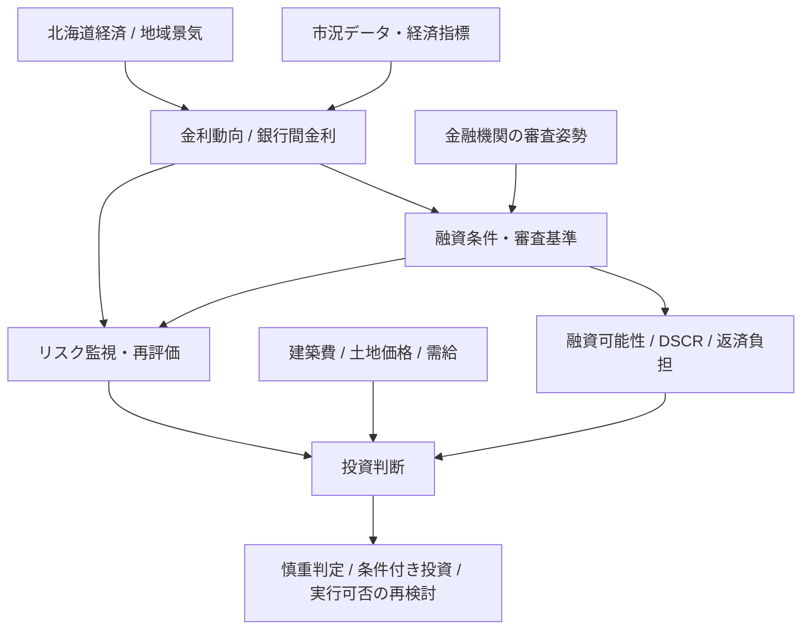

# 不動産投資 MOC（目次・知識体系）

## 全体サマリー

本レポート群から読み取れる投資スタンスは、札幌を中心とした新築RCマンション投資は「現在の金利水準では市場で受け入れられる範囲にあるが、地域経済と融資条件の変動リスクが残るため慎重に判断すべき」という方向性に集約される。融資審査の柔軟化や複数金融機関の比較申請が相場化しつつある一方、金利上昇・土地価格高騰・景気鈍化が採算悪化要因になる。したがって、投資判断は「買い急ぎ」ではなく、金利動向と融資条件の更新を前提にした継続的な再評価が重要である。

## 体系別ノート一覧

### 1. 最新市況・投資判断レポート

- [[2026-09-19_1338_最新市況_投資判断レポート]]
  - 金融機関の融資審査基準の見直しにより融資受け入れ可能性が上がった一方、承認結果は依然として不確実であり、継続監視が必要と整理したレポート。
- [[2026-09-19_1341_最新市況_投資判断レポート]]
  - 市場情報の変動が大きく、最新金利の把握が難しい状況を前提に、詳細な投資判断には追加調査が必要とした報告。
- [[2026-09-19_1344_最新金利市況_投資判断レポート]]
  - 北海道銀行の公募金利や建築費高騰を踏まえ、固定費・融資条件・金利急変リスクの両面を検討した分析。
- [[2026-09-19_1347_最新金利市況_投資判断レポート]]
  - 最新のWeb情報が限定的であるため、長期的な金利動向とリスク管理を重視した慎重な判断観を示したレポート。
- [[2026-09-19_1348_最新金利市況_投資判断レポート]]
  - 札幌の新築RCマンション投資では、銀行間金利と北海道経済の影響を受けるため、金利の急上昇リスクの回避が重要と整理した内容。
- [[2026-09-19_1351_最新金利市況_投資判断レポート]]
  - 現在の平均金利下では融資しやすいものの、土地価格上昇と資金管理を両立させる戦略が必要とした判断。
- [[ollama/2026-09-19_1304_5者合議_投資判断レポート]]
  - 5者合議で、金利低下局面から上昇局面への移行時に、DSCRや借入コストが悪化するリスクを複眼的に可視化したもの。
- [[ollama/2026-09-19_1353_最新金利市況_投資判断レポート]]
  - 固定金利・日銀政策との関係を前提に、投資家にとって固定金利型融資が有利な局面であるとした分析。
- [[ollama/2026-09-19_1357_最新金利市況_投資判断レポート]]
  - 建設金利の安定と収益性の予想を重視しつつ、需要変動と投資タイミングの不確実性を警告したもの。
- [[ollama/2026-09-19_1401_最新金利市況_投資判断レポート]]
  - フラット35や変動金利の比較から、資金計画と金利リスクの分散が投資の前提条件であるとした判断。
- [[ollama/report]]
  - 札幌市の地域特性・観光開発・人口減少といった強みと懸念を併せて整理し、投資判断の全体像を把握しやすくした市況まとめ。

### 2. 意思決定・判断理由（理由.md 等）

- [[理由]]
  - 金利は現時点では市場で受け入れられる水準だが、北海道経済と業界環境の急変リスクを前提に、慎重な条件付き判断が妥当とした結論。
- [[AI_Office/Inbox_Office/2026-09-26_Secretary_Summary]]
  - 議論を短くまとめ、意思決定に必要な条件と判断の方向性を要約した運用ログ。
- [[AI_Office/Inbox_Office/Secretary_Summary_Latest]]
  - 計画・判断・実行の要点を一つの文脈でまとめ、経営判断に利用しやすい形に再構成した要約。

### 3. タスク・アクション管理

- [[2026-09-28_タスク管理ノート]]
  - 市況確認・投資判断・調査更新の優先順位と未完了理由を管理し、意思決定を継続的に維持するための実務ノート。
- [[report/obsidian/タスク管理]]
  - 進行中タスクと確認事項を整理し、情報収集と判断プロセスを順序立てて回すための補助的な運用メモ。
- [[report/obsidian/要約]]
  - 個別情報を簡潔に要約し、判断材料を再利用しやすい形式へ落とし込み、意思決定の速さを支えるまとめノート。

## 全体構造図

## まとめ

投資判断の軸は、単なる「低金利だから買う」ではなく、「現時点での融資条件と市況が許容範囲にあるか」「地域経済や金利変動で条件が崩れないか」を同時に見ていることにある。重要なのは、金利や審査基準の変化を定期的に追跡し、複数の金融機関と比較しながら、投資の採算とリスクを再評価する習慣を持つことだ。これらのノート群は、その判断の土台として、最新市況・理由・管理計画を一つの知識体系として再利用できる形で整理している。

---

次に行く: [[2026-09-19_1338_最新市況_投資判断レポート]] / [[理由]] / [[2026-09-28_タスク管理ノート]] / [[ollama/2026-09-19_1304_5者合議_投資判断レポート]]
