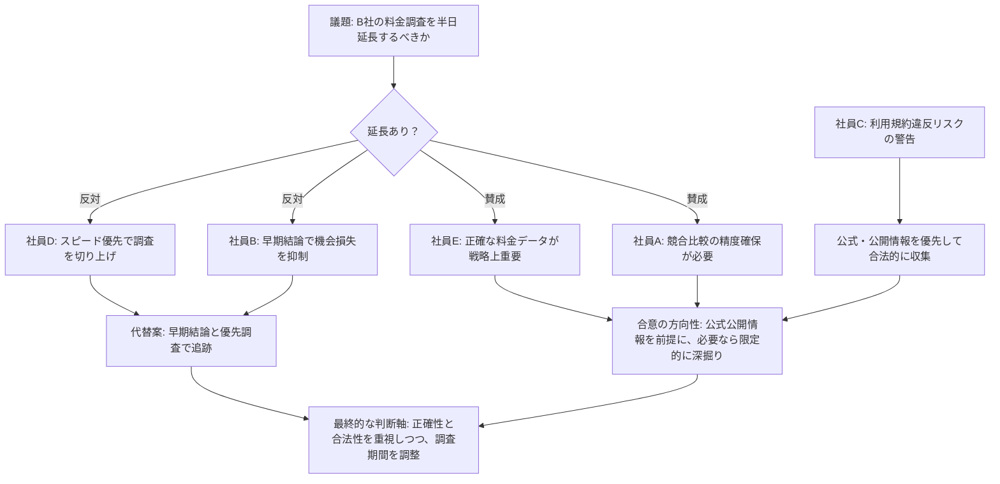

# AI社員 検討会議ログ
日付: 2026-09-26

## 議題
B社の料金詳細調査のために、調査期間を半日延長するべきか否か。

---

## 発言ログ

### 社員A (リサーチ)
> 調査期間を半日延長すべきです。B社の料金体系は競合他社との比較が不可欠であり、限られた時間では正確なデータ収集と競合状況の精緻な把握が困難になるため、十分な調査時間を確保する必要があります。

### 社員B (コスト採算)
> 半日の延長は推奨しません。B社の料金体系が競合比較に不可欠とはいえ、調査を切り上げて早期に結論を出す方が、半日の遅延による機会損失やコスト増を最小限に抑えられます。限られた時間でも主要な料金要素は確認でき、必要なら別途優先的に深掘りすれば十分です。

### 社員C (リスク管理)
> ログイン壁を突破してデータを取得する手法は、B社の利用規約違反に抵触する可能性があり、調査方法として妥当か慎重に見直す必要があります。まずは公式ページや公開情報から代替的に収集できる手段を優先的に検討すべきです。

### 社員D (スピード推進)
> 調査期間の半日延長は不要です。完全な情報が揃うのを待っていても、B社の料金体系の主要な要素は公開情報から仮説を立てながら把握でき、必要に応じて優先的に深掘りすれば十分です。スピードを重視して今すぐ調査を切り上げ、早期に結論を出すべきです。

### 社員E (戦略立案)
> 結論として、半日延長を支持します。競合他社とのポジショニングを誤らないためには、正確な料金データが不可欠であり、不確かな情報で戦略を決定するリスクの方が大きいからです。ただし、社員Cの指摘どおり利用規約違反を避けて、公式・公開情報から合法的に収集する前提で同意します。

---

## 議論整理図

---

上記の図は、賛成派と反対派の主張と、リスク管理観点を整理し、最終的に「正確さと合法性を確保しつつ、調査範囲を適切に調整する」方向に収束していることを示しています。

