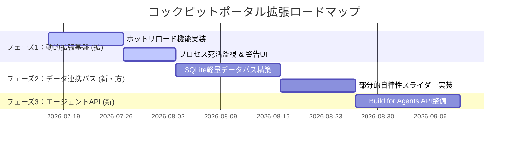

---
tags:
  - type/discussion
  - topic/antigravity
  - topic/cockpit-portal
aliases:
  - "Antigravityコックピットポータル拡張性検討 議論ログ"
created: 2026-07-17
updated: 2026-09-05
---

# 💬 Antigravity コックピットポータル拡張性検討 議論ログ

> [!abstract] 概要
> 5人の専門家エージェント（マーケター、エンジニア、法務、財務、ユーザー）による多角的な討論と、それに基づく秘書エージェントの最終経営判断（ジャッジ）を記録した2階層マルチエージェント意思決定システムの実録ログです。

---

## 🏛️ 討議概要

- **議題**: Antigravityコックピットポータルの拡張性向上ロードマップの是非
- **現状の「核」**: `portal_config.json` に基づき、各種ローカルアプリ（Colabジェネレータ、DecideFlow、資源配分コックピット等）を一元的に把握・起動できる静的ハブ（Software 1.0）。
- **検討の目的**: 自律型エージェント（Antigravity等）と高度に連携し、各アプリ間でのデータ共有や動的プラグイン化を可能にする次世代プラットフォーム（LLM as an OS）への進化の是非と、その具体的ロードマップの策定。

---

## 👥 討論メンバー

1. **👑 秘書 (Executive Secretary)** [Gemini 1.5 Flash]: 全体進行の管理と、最終的な実行可否判断。
2. **📈 マーケター (Marketer)** [Gemini 1.5 Flash]: 市場ニーズ、競合優位性、ターゲット層への訴求力の評価。
3. **💻 エンジニア (Engineer)** [Gemini 1.5 Flash]: 技術的実現可能性、開発期間、システム運用の難易度の評価。
4. **⚖️ 法務 (Legal Expert)** [Gemini 1.5 Flash]: 規制、コンプライアンス、契約上のリスク、権利関係の評価。
5. **💰 財務 (Financial Expert)** [Gemini 1.5 Flash]: 初期投資、運用コスト、投資対効果（ROI）、損益分岐点の評価。
6. **👤 ユーザー (Target User)** [Gemini 1.5 Flash]: 実際の顧客・利用者の視点からの本音、不満点の表明。

---

## 💬 討論ログ（3往復）

### 👑 秘書 (開廷発言)
> 「皆様、お集まりいただきありがとうございます。本日の議題は『Antigravityコックピットポータルの拡張性』についてです。
> 現在のポータルは、`portal_config.json`に静的に登録されたバッチファイルやURLを叩くだけの『起動ランチャー（Software 1.0）』に留まっています。
> これを、エージェントがポータルを介して各ツールを自在に操る『LLM as an OS』へと進化させ、動的プラグイン機構やアプリ間データ連携を導入すべきか、皆様の専門的知見から多角的な議論をお願いいたします。」

---

### 🔄 第1往復：初期見解の提示

- **📈 マーケター**:
  > 「現在のポータルは単なる『便利リンク集』であり、競合優位性が弱いです。しかし自律エージェントが各ツールを『手足』として使いこなす『アイアンマンスーツ（拡張）』として再定義できれば強力な差別化になります。拡張は必須です。」

- **💻 エンジニア**:
  > 「アイアンマンスーツ化には同意しますが、アプリ間データ受け渡しや死活監視がない『欠』があります。各アプリを API 化（Build for Agents）し、ポータルをメッセージバスとして機能させる必要があります。シンプルな設計（Simplicity First）を保つ工夫が求められます。」

- **⚖️ 法務**:
  > 「動的プラグイン化に伴い、`GEMINI_API_KEY` の漏洩リスクやプロンプトインジェクション、ファイルシステムの権限管理などコンプライアンス上の法防壁（アクセス制御と利用規約）が必要です。」

- **💰 財務**:
  > 「静的ポータルは運用コストほぼゼロですが、プラットフォーム化には初期開発コストや API トークン消費コストの増加が発生します。一気に全機能を開発するのではなく、コストを抑えた段階的アプローチが必要です。」

- **👤 ユーザー**:
  > 「起動時に黒い画面（コマンドプロンプト）が開くのが不気味で怖いです。アプリ間でデータが自動で引き継がれるなら使いたいですが、エージェントが勝手にファイルを書き換えるのは不安です。」

---

### 🔄 第2往復：相互批判と代替案の提示

- **📈 マーケター**:
  > 「ユーザーの『黒い画面が怖い』『コピペが面倒』という痛点こそ最大のチャンスです。アプリ間データ連携を『プレミアム機能』としてマネタイズするか、自作プラグインのアプリストアモデルで初期開発コストを回収することを提案します。」

- **💻 エンジニア**:
  > 「ユーザーの不安と法務の懸念には、GUIで行動権限を調整できる『部分的自律性（スライダー）』の導入で解決できます。また重厚なメッセージバスの代わりに軽量なローカル SQLite / JSON-RPC を使えば初期コストを半減できます。」

- **⚖️ 法務**:
  > 「『部分的自律性スライダー』は法的に非常に有効です。利用規約で『自動実行モード時の動作は自己責任』と定義できます。プロンプトインジェクション防御バリデータをポータル入口に一元化して開発工数を削減（Surgical Changes）します。」

- **💰 財務**:
  > 「軽量 SQLite/JSON-RPC 設計であれば開発コストを大幅抑制でき、ローカルキャッシュ導入で API トークン代も削減可能です。これならプレミアム課金モデルなしでも十分 ROI が成立します。」

- **👤 ユーザー**:
  > 「スライダーでエージェントの動きを制限できるなら安心です！ただ、プラグインの追加手順が難しいと使わなくなっちゃうかも。」

---

### 🔄 第3往復：課題解決に向けた着地点の合意

- **📈 マーケター**:
  > 「『所定フォルダに zip を置くだけで即座に追加される』、あるいはチャットで『〇〇機能を追加して』と頼めば自動インストールされる『Vibe Coding 直結型プラグイン導入』を提案します。」

- **💻 エンジニア**:
  > 「プラグインを独立プロセス（サンドボックス）として動かし、ヘルスチェックを行う構成にします。指定ディレクトリの構成変化をウォッチして `portal_config.json` を動的に更新（ホットリロード）すれば、コード変更なしで安全に追加できます。」

- **⚖️ 法務**:
  > 「サンドボックス化は法的な必須条件とします。『公式認定プラグイン』と『非公式プラグイン』に区分し、非公式の免責事項をポップアップで同意させることで損害賠償リスクを回避します。」

- **💰 財務**:
  > 「サンドボックス化とホットリロードのミニマム設計であれば開発工数も数週間で済みます。ユーザーが Vibe Coding で自作ツールを追加するエコシステムができれば、開発費をかけずに価値が向上する高い ROI が得られます。」

- **👤 ユーザー**:
  > 「フォルダに入れるだけで安全に追加できるなら全然怖くないし使いたいです！Colabで作った内容が自動でタスク管理アプリに連携される未来を期待しています！」

---

## ⚖️ 最終判断レポート（経営ジャッジ）

> [!summary] 👑 秘書 (Executive Secretary) による最終ジャッジ
> **📢 最終判定: Go (条件付き実行)**  
> 静的な『核』の価値を維持しつつ、多種多様なテクノロジースタック（特）を包含したまま、アプリ間データ連携の『欠』を埋めるプラットフォーム化を実行します。以下に定める **「3段階のハイブリッド・拡張ロードマップ」** に従って開発を進めます。

---

### 🗺️ 3段階の拡張ロードマップ

#### **フェーズ1: プラグイン動的ロードと安全性の確保 (拡)**
- **実装内容**: フォルダ監視による `portal_config.json` の自動ホットリロード機能、サンドボックス化とヘルスチェック死活監視。
- **目的**: ユーザーが「フォルダに置くだけ」で安全かつ軽量にアプリを追加できる仕組みの構築。

#### **フェーズ2: 部分的自律性スライダーとデータ連携バスの導入 (新・方)**
- **実装内容**: 軽量ローカル SQLite メッセージバスの構築、GUI で自動実行度を調整できる「自律性スライダー」の実装。
- **目的**: コピペの解消とセキュリティ・責任境界の明確化。

#### **フェーズ3: エージェント APIの整備 (Build for Agents)**
- **実装内容**: 各ツールを外部エージェントがコマンドラインや API 経由で操作できる統合スキーマの定義。
- **目的**: ポータルを「LLM as an OS」として昇華させ、エコシステムを最大化。

---

## 🛠️ システム診断サマリー（ハイブリッド診断）

| 診断カテゴリ | 診断結果 (核・質・特・欠) | 進化ベクトル (方・移・拡・新) | 適用するKarpathy 8つの視点 |
| :--- | :--- | :--- | :--- |
| **核 (Core)** | 各ツールの統合ハブ機能。バッチ起動による確実なツール呼び出し。 | **方 (Direction)**: 静的起動から、エージェント主導の動的制御（LLM as an OS）へ。 | **LLM as an OS** / **Software 1.0 -> 3.0** |
| **質 (Quality)** | 静的JSONによる定義で動作は安定しているが、エラー時の検知力がない。 | **移 (Mobility)**: サンドボックス化によるローカル実行の安全性向上。 | **Compilation Analogy** (メタデータの統一コンパイル) |
| **特 (Property)** | 多種多様な技術スタック（Next.js, Streamlit等）が混在している。 | **拡 (Extension)**: フォルダ監視・動的ホットロードによるプラグイン機構。 | **Vibe Coding** (自作ツールの即時取り込み) |
| **欠 (Defect)** | アプリ間の連携データバスの不在、動的な登録・死活監視の欠如。 | **新 (Novelty)**: 部分的自律性スライダーを搭載した軽量ローカルデータバス。 | **部分的自律性 (スライダー)** / **Build for Agents** |

---

> [!check] 結論
> **人間（よっちゃん）による承認完了 (Proceed)**  
> 経営判断ロードマップおよびフェーズ1の開発開始を承認。成果物ログは `business_discussion_log.md` に保存。
