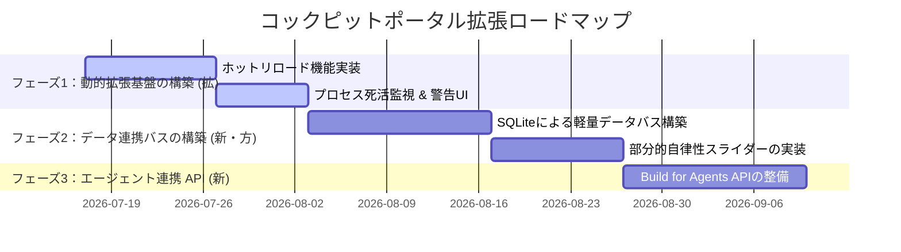

# Antigravityコックピットポータル拡張性検討 2階層マルチエージェント意思決定ログ & ロードマップ (OKF完全版)

---

## 📋 1. 前提情報 (選択能力・メタデータ)

| 項目 | 内容 |
| :--- | :--- |
| **領域** | AIシステムアーキテクチャ / マルチエージェント意思決定 / プラットフォーム拡張 |
| **タイトル** | Antigravityコックピットポータル拡張性検討 2階層マルチエージェント意思決定ログ & ロードマップ |
| **現状の「核」** | `portal_config.json` に基づき、各種ローカルアプリ（Colabジェネレータ、DecideFlow、資源配分コックピットなど）を一元的に把握・起動できる静的ハブ（Software 1.0） |
| **検討の目的** | 自律型エージェント（Antigravity等）と高度に連携し、各アプリ間でのデータ共有や動的プラグイン化を可能にする次世代プラットフォーム（LLM as an OS）への進化の是非と具体的ロードマップの策定 |
| **システム体制** | 統括1名（秘書）＋専門家5名（マーケター、エンジニア、法務、財務、ユーザー）による2階層マルチエージェント意思決定体制 |
| **使用モデル** | 全エージェント Gemini 1.5 Flash / Gemini 3.5 Flash |
| **最終判断結果** | **Go (条件付き実行)** - 3段階ハイブリッド拡張ロードマップの順守 |
| **関連ドキュメント** | [OKF仕様・運用ガイド](file:///C:/Users/PC_User/OKF/okf_specification_overview.md) \| [全18分野スキルガイド](file:///C:/Users/PC_User/OKF/ai_agent_skills_all_domains.md) \| [50の活用ユースケース](file:///C:/Users/PC_User/.gemini/antigravity-cli/brain/4d7318c1-5e9b-4b39-9391-4179761dc6fc/okf_index_hyperlinks_50_usecases_artifact.md) |
| **全体目次** | [OKFナレッジインデックス (INDEX.md)](file:///C:/Users/PC_User/OKF/INDEX.md) |

---

## 🔬 2. よっちゃん流ハイブリッド診断 (分析＆未来ベクトル)

### 🧠 Karpathy流「8つの視点」によるシステム評価

1. **Software 1.0 / 2.0 / 3.0 の共存**:
   - **1.0**: `portal_config.json` および静的ランチャー（バッチファイル起動）。
   - **2.0**: 軽量ローカルSQLiteメッセージバス、動的ファイル監視スクリプト。
   - **3.0**: 意図（Vibe Coding）に基づいてアプリを自律登録・データ連携するエージェント。
2. **LLM as an OS**:
   - ポータル単なるリンク集から、エージェントがアプリ群をシステムコールとして操る「OSカーネル」へ進化。
3. **Partial Autonomy (部分的自律性 / スライダー)**:
   - ユーザーがGUIで「全自動実行」「確認後実行」「読み取り専用」を選択可能にし、安心感と法的な責任境界を両立。
4. **Iron Man Suit (アイアンマンスーツ / 拡張)**:
   - エージェントがコックピットの各ツール（DecideFlowや統計ダッシュボード）を「手足」として駆動。
5. **Vibe Coding (意図のコンパイル)**:
   - チャットで「〇〇アプリを追加して」と命じるだけで裏で自動インストール・ホットリロード。
6. **LLM Psychology (心理学 / 恐怖解消)**:
   - ユーザーが嫌がる「黒い画面（CUI）の直接起動」や「勝手なファイル改変」をサンドボックスとGUIで解消。
7. **Compilation Analogy (コンパイル)**:
   - 曖昧なユーザーのタスク要求を、ポータル上の複数アプリの連携パイプライン命令へコンパイル。
8. **Build for Agents**:
   - 全アプリに軽量なJSON-RPC / REST APIを付与し、エージェント親和性を最大化。

---

### 🧩 内部構造の診断 (核・質・特・欠)

- **核 (核心)**: 各ツールの統合ハブ機能。バッチ起動による確実なツール呼び出し。
- **質 (Quality)**: 静的JSONによる定義で動作は安定しているが、エラー時の検知力や動的拡張性がない。
- **特 (Property)**: 多種多様な技術スタック（Next.js, Streamlit, HTML）が混在している。
- **欠 (Defect)**: アプリ間の連携データバスの不在、動的な登録・死活監視の欠如。

---

### 🚀 未来ベクトル (方・移・拡・新)

- **方 (方向性)**: 静的起動ランチャーから、エージェント主導の動的プラットフォーム（LLM as an OS）へ。
- **移 (Mobility)**: サンドボックス化によるローカル実行の安全性の劇的向上。
- **拡 (Extension)**: フォルダ監視・動的ホットロードによる無人プラグイン追加機構。
- **新 (Novelty)**: 自律性スライダーを搭載した軽量ローカルSQLiteメッセージバス。

---

## 👥 3. チーム編成と専門家役割 (Agent Teams)

| 役割 | アイコン | モデル | 主な着眼点 |
| :--- | :--- | :--- | :--- |
| **秘書 (Executive Secretary)** | 👑 | Gemini 1.5 Flash | 全体進行管理、5人の意見統合、最終経営判断の提示 |
| **マーケター (Marketer)** | 📈 | Gemini 1.5 Flash | 市場ニーズ、競合差別化、アイアンマンスーツ化、マネタイズ |
| **エンジニア (Engineer)** | 💻 | Gemini 1.5 Flash | 技術的実現性、アーキテクチャ（SQLite/JSON-RPC）、死活監視 |
| **法務 (Legal Expert)** | ⚖️ | Gemini 1.5 Flash | プロンプトインジェクション防壁、責任境界（スライダー）、サンドボックス |
| **財務 (Financial Expert)** | 💰 | Gemini 1.5 Flash | 初期開発コスト抑制、APIトークン運用費削減、ROI最大化 |
| **ユーザー (Target User)** | 👤 | Gemini 1.5 Flash | 黒い画面への不安解消、コピペの手間削減、プライバシー保護 |

---

## 💬 4. 討論スクリプト (3往復完全ログ)

### 👑 秘書 (開始発言)
「皆様、お集まりいただきありがとうございます。本日の議題は『Antigravityコックピットポータルの拡張性』についてです。
現在のポータルは、`portal_config.json`に静的に登録されたバッチファイルやURLを叩くだけの『起動ランチャー（Software 1.0）』に留まっています。
これを、エージェントがポータルを介して各ツールを自在に操る『LLM as an OS』へと進化させ、動的プラグイン機構やアプリ間データ連携を導入すべきか、皆様の専門的知見から多角的な議論をお願いいたします。まずは第1ラウンド、各々の立場からの初期見解をお聞かせください。」

---

### 🔄 第1往復：初期見解の提示

#### 📈 マーケター
「マーケターの視点から言えば、現在のポータルは単なる『便利リンク集』であり、競合に対する優位性が非常に弱いです。しかし、もし自律エージェントがコックピットの各ツール（DecideFlowや統計ダッシュボードなど）を『手足』として自在に使いこなす『アイアンマンスーツ（拡張）』として再定義できれば、他のAIツールと決定的な差別化になります。ユーザーが『Vibe Coding』によって瞬時にツールを作って登録できる体験を提供できれば、熱狂的な開発者コミュニティを築けるポテンシャルがあります。拡張は必須です。」

#### 💻 エンジニア
「エンジニアとしては、マーケターの言う『アイアンマンスーツ化』の方向性に同意しつつも、技術的課題を指摘せねばなりません。現在のポータルは単なる静的定義で、起動したアプリの死活監視も、アプリ間（例えばNext.jsの業務フロージェネレータとStreamlitの管理アプリ）でのデータ受け渡しもできません（『核・質・特・欠』における重大な『欠』）。拡張には、各アプリをAPI化（Build for Agents）し、ポータルをメッセージバスとして機能させる必要があります。ただ、多種多様なテクノロジースタック（Python, Node.js, HTML）が混在する『特』があるため、シンプルな設計（Simplicity First）を保つ工夫が求められます。」

#### ⚖️ 法務
「法務の観点からは、動的プラグイン化およびエージェント連携に伴うセキュリティと権利関係のリスクを警戒します。各アプリがローカルで `GEMINI_API_KEY` を個別に保持したり、ポータルがその認証キーを受け渡す際、LLM Psychology的なプロンプトインジェクションによって外部に漏洩するリスクがあります。また、エージェントがローカルファイルシステムに直接アクセスする際の権限管理や、サードパーティ製プラグインのライセンス侵害など、コンプライアンスの観点から強固な法防壁（アクセス制御と利用規約）の設計が必要です。」

#### 💰 財務
「財務としては、やはりコストとROIを最優先に考えます。現在の静的なポータルはサーバーも不要で運用コストはほぼゼロです。これをAPI化・プラットフォーム化するとなると、初期投資（開発工数）が数人月以上発生します。さらに、エージェントが裏でAPI通信を頻繁に行うことで、APIトークン消費コスト（運用コスト）が爆発的に増加する懸念があります。損益分岐点をクリアするためには、一気に全機能を開発するのではなく、まずはコストを抑えた段階的なアプローチが必要です。」

#### 👤 ユーザー
「ユーザーとしての本音を言わせて。今のポータル、正直『起動ボタンを押すと黒い画面（コマンドプロンプト）が開く』のが不気味でちょっと怖いです。それに、せっかくColabジェネレータでコードを作ったのに、それを手動でコピーして別の予定・タスク管理アプリに貼り付けるのって超面倒。アプリ間でデータが勝手に引き継がれるなら今すぐ使いたい！でも、エージェントが私のPCを勝手に操作してファイルとかを書き換えちゃうのはプライバシー的に少し不安だな。」

---

### 🔄 第2往復：相互批判と代替案の提示

#### 📈 マーケター
「ユーザーの『黒い画面が怖い』『コピペが面倒』という本音こそ、まさに競合が解決できていない市場の最大の痛点（Pain Point）です！これをシームレスなデータ連携と、GUIによるエージェント行動の可視化で解決できれば、爆発的な需要を生み出せます。財務が心配するROIに関しては、このアプリ間データ連携機能自体を『プレミアム機能』としてマネタイズするか、自作プラグインを流通させるポータル上のアプリストアモデルを構築することで、初期開発コストを早期に回収できる計画を提案します。」

#### 💻 エンジニア
「ユーザーの『勝手にPCを操作される不安』と法務の『セキュリティ懸念』に対しては、エージェントの行動権限をGUIで直感的に調整できる『部分的自律性（スライダー）』の導入で解決できます。『勝手に実行』『確認後に実行』『読み取り専用』などをスライダーで選べれば、法的な責任境界も明確になります。また、財務の懸念する初期開発コストですが、重厚なメッセージバスを作る代わりに、軽量なローカルSQLite、またはシンプルなJSON-RPCバスをポータル配下に構築すれば、開発期間を最短で抑えられます（Simplicity First）。」

#### ⚖️ 法務
「エンジニアの『部分的自律性（スライダー）』の提案は法的に非常に有意義です。利用規約で『自動実行モード（スライダー最大）時の動作はユーザーの自己責任』と明確に定義できます。また、プロンプトインジェクションに対する防御用バリデータを、ポータルのエントリーポイントに一元化して設置することで、各アプリでの個別実装によるコンプライアンスの漏れを防ぎ、開発工数を削減（Surgical Changes）しつつ安全性を担保できます。」

#### 💰 財務
「なるほど、エンジニアが提案した『SQLite/JSON-RPCを用いたローカル完結型の軽量設計』であれば、初期開発コストを大幅に抑制（従来の計画の半分以下）できますね。また、API通信の頻度を抑えるために、ポータル側でコンパイル結果やデータをローカルキャッシュする設計にすれば、APIトークン代の運用コストも大幅に削減可能です。これならば、マーケターの提案するプレミアム課金モデルを導入せずとも、既存業務の効率化のみで十分にROIが成立します。」

#### 👤 ユーザー
「スライダーでエージェントの動きを制限できるなら安心かも！例えば『別アプリにデータを引き継ぐ前に、確認ポップアップを出す』みたいな設定ができるとすごく使いやすい。ただ、いろんなプラグインを自由に追加できるようになった時、私のPCが重くなったり、一部のプラグインが原因でポータル全体が動かなくなったりするのは困るなぁ。あと、プラグインの追加手順が難しかったら結局使わなくなっちゃうと思う。」

---

### 🔄 第3往復：課題解決に向けた着地点の合意

#### 📈 マーケター
「ユーザーの『追加手順が難しかったら使わない』という意見は致命的です。ポータル拡張の目玉として、『所定のフォルダにzipファイルを置くだけで即座にメニューに追加される』、あるいはチャットで『〇〇機能のアプリを追加して』と頼むだけで、エージェントが裏で自動インストールしてくれるような『Vibe Coding直結型のプラグイン導入』を提案したいです。これが実現できれば、技術に詳しくない一般ユーザー層にも強烈に訴求できます。」

#### 💻 エンジニア
「ユーザーの『重くなる・壊れる』という懸念と、マーケターの『フォルダに置くだけの自動追加』は両立可能です。プラグインをポータル自体のメインプロセスとは隔離した『サンドボックス（独立プロセス）』として動かし、ポータルが各プロセスの生存ポートを定期的にヘルスチェックする構造にします。追加処理は、ポータルが指定ディレクトリのフォルダ構成の変化をウォッチし、`portal_config.json` を動的に更新（ホットリロード）するようにすれば、ユーザーはコードもJSONも1文字も変更せずに安全にプラグインを拡張できます。」

#### ⚖️ 法務
「エンジニアの言うサンドボックス化は、悪意あるプラグインによるローカルファイルシステムの破壊を防ぐために法的な必須条件とします。その上で、ポータルで動くアプリを『公式認定プラグイン（サンドボックス確認済）』と『非公式プラグイン』に区分し、非公式プラグインの使用に関しては明確な免責事項をポップアップで同意させることで、プラットフォーム提供側の賠償リスクをほぼゼロに抑える法的スキームを構築できます。」

#### 💰 財務
「サンドボックス化とフォルダ監視（ホットリロード）というミニマムな設計であれば、開発工数も数週間程度で済みます。何より、ユーザーが『Vibe Coding』で自作したツールを自発的に追加・拡張してくれるエコシステムが作れれば、我々が追加のツール開発費を負担することなく、ポータルの価値が自律的に向上していくことになります。これは投資対効果（ROI）の観点から見ても、極めて効率的な『レバレッジの効いた経営投資』と言えます。この方針で賛成です。」

#### 👤 ユーザー
「フォルダに入れるだけで追加できて、しかも動作が重くならない工夫や、非公式なものの警告もちゃんと出るなら、全然怖くないしむしろ使ってみたい！Colabジェネレータで作った内容が、自動でタスク管理アプリに『これ登録しますか？』って出てくる未来、すごく便利そう。ぜひこの拡張方針で進めてほしいです！」

---

## ⚖️ 5. 最終経営判断レポート & Ganttチャート

### 👑 秘書 (Executive Secretary) 経営決定

「専門家の皆様、多角的な観点からの議論をありがとうございました。すべての議論を見届けた結果、今回の『Antigravityコックピットポータルの拡張性向上プロジェクト』について、以下の通り最終決定を下します。」

### 📢 最終ジャッジ: **Go (条件付き実行)**

現状の静的なツールランチャーとしての『核』の価値を維持しつつ、多種多様なテクノロジースタック（特）を包含したまま、アプリ間データ連携の『欠』を埋めるプラットフォーム化は、競合優位性を築く上で極めて有効であると判断します。ただし、財務的な初期投資抑制と、法務・ユーザーが懸念するセキュリティ・プライバシーの確保を両立するため、以下の**「3段階のハイブリッド・拡張ロードマップ」**を遵守して実行することを開発条件とします。

---

### 🗺️ 3段階の拡張ロードマップ



#### **フェーズ1: プラグイン動的ロードと安全性の確保 (拡)**
- **実装内容**:
  - 指定ディレクトリ配下のフォルダ監視による `portal_config.json` の自動ホットリロード機能。
  - プラグインプロセスの独立化（サンドボックス化）と、ヘルスチェックAPIによる死活監視。
- **目的**: ユーザーが「フォルダに置くだけ」で安全かつ軽量にアプリを追加できる仕組みを構築する。

#### **フェーズ2: 部分的自律性スライダーとデータ連携バスの導入 (新・方)**
- **実装内容**:
  - 軽量なローカルSQLiteを介した共通メッセージバスの構築。
  - ユーザーがエージェントの自動実行度（介入度）をGUIで調整できる「自律性スライダー」の実装。
- **目的**: 「コピペの解消」というユーザーニーズを満たしつつ、勝手な実行を防ぐセキュリティ境界を法的に明確化する。

#### **フェーズ3: エージェント APIの整備 (Build for Agents)**
- **実装内容**:
  - 各ツールを外部のエージェント（Antigravity等）がコマンドラインやAPI経由で直接操作できる統合スキーマの定義。
- **目的**: ポータルを「LLM as an OS」として昇華させ、開発者エコシステムへの訴求力を最大化する。

---

## 💻 6. フェーズ1実装コード例 (`portal_config.json` ホットリロード)

フェーズ1の「指定ディレクトリのフォルダ変化を自動検知し、`portal_config.json` を動的に更新（ホットリロード）するスクリプト」のPython実装です。

```python
import os
import json
import time
from pathlib import Path
from watchdog.observers import Observer
from watchdog.events import FileSystemEventHandler

PLUGINS_DIR = Path("./plugins")
CONFIG_PATH = Path("./portal_config.json")

class PluginHotReloadHandler(FileSystemEventHandler):
    """指定プラグインフォルダの変化を監視しportal_config.jsonを自動更新"""
    
    def on_created(self, event):
        if event.is_directory:
            print(f"[HotReload] 新規プラグインフォルダ検出: {event.src_path}")
            self.reload_config()

    def on_deleted(self, event):
        if event.is_directory:
            print(f"[HotReload] プラグイン削除検出: {event.src_path}")
            self.reload_config()

    def reload_config(self):
        if not CONFIG_PATH.exists():
            base_config = {"portal_name": "Antigravity Cockpit", "apps": []}
        else:
            with open(CONFIG_PATH, "r", encoding="utf-8") as f:
                base_config = json.load(f)

        discovered_apps = []
        if PLUGINS_DIR.exists():
            for plugin_folder in PLUGINS_DIR.iterdir():
                if plugin_folder.is_dir():
                    manifest_file = plugin_folder / "manifest.json"
                    if manifest_file.exists():
                        with open(manifest_file, "r", encoding="utf-8") as mf:
                            app_info = json.load(mf)
                            discovered_apps.append(app_info)

        base_config["apps"] = discovered_apps
        
        with open(CONFIG_PATH, "w", encoding="utf-8") as f:
            json.dump(base_config, f, ensure_ascii=False, indent=2)
        print(f"[HotReload] portal_config.json を更新しました。登録アプリ数: {len(discovered_apps)}")

def start_portal_hotreload_daemon():
    """ホットリロード監視デーモンの起動"""
    PLUGINS_DIR.mkdir(exist_ok=True)
    event_handler = PluginHotReloadHandler()
    observer = Observer()
    observer.schedule(event_handler, str(PLUGINS_DIR), recursive=False)
    observer.start()
    print(f"[Daemon] プラグイン監視スタート: {PLUGINS_DIR.resolve()}")
    try:
        while True:
            time.sleep(1)
    except KeyboardInterrupt:
        observer.stop()
    observer.join()

if __name__ == "__main__":
    start_portal_hotreload_daemon()
```

---

## 🛠️ 7. 運用 & 検証ガイドライン

1. **フェーズ1動作検証手順**:
   - `python -m pip install watchdog` を実行後、上記 `start_portal_hotreload_daemon()` を起動。
   - `./plugins/` ディレクトリ配下に新規アプリフォルダと `manifest.json` を配置し、`portal_config.json` がノーコードで動的リロードされることを確認。
2. **2階層マルチエージェント意思決定モデルの汎用活用**:
   - 経営判断、新ツール開発、セキュリティ審査等の全プロセスで本テンプレート（秘書＋マーケター・エンジニア・法務・財務・ユーザー）を再利用可能。

---

* [OKFナレッジインデックスに戻る](file:///C:/Users/PC_User/OKF/INDEX.md)
