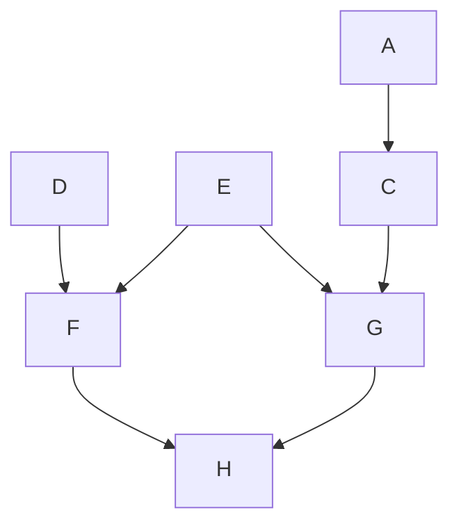

# ER図エクスポート

* **作成日時**: 2026/7/9 9:50:33
* **作成目的**: 枝分かれ図表

## ER図 (Mermaid)

## 復元用データ (JSON)
<!--
{
  "nodes": [
    {
      "id": "node_gen_1783557963225_0",
      "x": 100,
      "y": 100,
      "width": 150,
      "height": 60,
      "label": "A",
      "shape": "rectangle"
    },
    {
      "id": "node_gen_1783557963225_2",
      "x": 306,
      "y": 272,
      "width": 150,
      "height": 60,
      "label": "C",
      "shape": "rectangle"
    },
    {
      "id": "node_gen_1783557963225_3",
      "x": 575,
      "y": 60,
      "width": 150,
      "height": 60,
      "label": "D",
      "shape": "rectangle"
    },
    {
      "id": "node_gen_1783557963225_4",
      "x": 580,
      "y": 176,
      "width": 150,
      "height": 60,
      "label": "E",
      "shape": "rectangle"
    },
    {
      "id": "node_1783557989592",
      "x": 832,
      "y": 121,
      "width": 150,
      "height": 60,
      "label": "F",
      "shape": "rectangle"
    },
    {
      "id": "node_1783558016216",
      "x": 836,
      "y": 278,
      "width": 150,
      "height": 60,
      "label": "G",
      "shape": "rectangle"
    },
    {
      "id": "node_1783558120928",
      "x": 1084,
      "y": 200,
      "width": 150,
      "height": 60,
      "label": "H",
      "shape": "rectangle"
    }
  ],
  "edges": [
    {
      "id": "edge_gen_1783557963225_1",
      "startNodeId": "node_gen_1783557963225_0",
      "endNodeId": "node_gen_1783557963225_2"
    },
    {
      "id": "edge_1783558052560",
      "startNodeId": "node_gen_1783557963225_3",
      "endNodeId": "node_1783557989592"
    },
    {
      "id": "edge_1783558065576",
      "startNodeId": "node_gen_1783557963225_4",
      "endNodeId": "node_1783557989592"
    },
    {
      "id": "edge_1783558080528",
      "startNodeId": "node_gen_1783557963225_4",
      "endNodeId": "node_1783558016216"
    },
    {
      "id": "edge_1783558094176",
      "startNodeId": "node_gen_1783557963225_2",
      "endNodeId": "node_1783558016216"
    },
    {
      "id": "edge_1783558149423",
      "startNodeId": "node_1783557989592",
      "endNodeId": "node_1783558120928"
    },
    {
      "id": "edge_1783558155104",
      "startNodeId": "node_1783558016216",
      "endNodeId": "node_1783558120928"
    }
  ],
  "actors": []
}
-->
