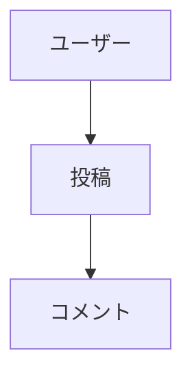

# 初期テストER図

* **作成日時**: 2026-07-09 08:42:30
* **作成目的**: インタラクティブER図メーカーの履歴・ズームおよびObsidian連携機能のテスト

## ER図 (Mermaid)

## 復元用データ (JSON)
<!--
{
  "nodes": [
    { "id": "node_user", "x": 100, "y": 100, "width": 150, "height": 60, "label": "ユーザー", "shape": "rectangle" },
    { "id": "node_post", "x": 350, "y": 100, "width": 150, "height": 60, "label": "投稿", "shape": "rectangle" },
    { "id": "node_comment", "x": 600, "y": 100, "width": 150, "height": 60, "label": "コメント", "shape": "rectangle" }
  ],
  "edges": [
    { "id": "edge_1", "startNodeId": "node_user", "endNodeId": "node_post" },
    { "id": "edge_2", "startNodeId": "node_post", "endNodeId": "node_comment" }
  ],
  "actors": []
}
-->
