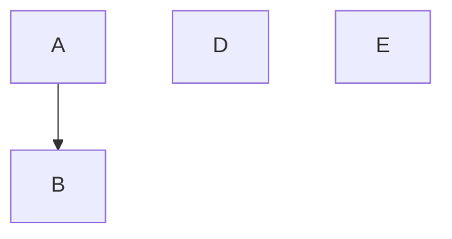

# ER図エクスポート

* **作成日時**: 2026/7/9 11:11:19
* **作成目的**: 枝分かれ図表_1

## ER図 (Mermaid)

## 復元用データ (JSON)
<!--
{
  "nodes": [
    {
      "id": "node_gen_1783562899195_0",
      "x": 100,
      "y": 100,
      "width": 150,
      "height": 60,
      "label": "A",
      "shape": "rectangle"
    },
    {
      "id": "node_gen_1783562899195_1",
      "x": 300,
      "y": 100,
      "width": 150,
      "height": 60,
      "label": "B",
      "shape": "rectangle"
    },
    {
      "id": "node_1783562934380",
      "x": 540,
      "y": 178,
      "width": 150,
      "height": 60,
      "label": "D",
      "shape": "rectangle"
    },
    {
      "id": "node_1783562957027",
      "x": 545,
      "y": 311,
      "width": 150,
      "height": 60,
      "label": "E",
      "shape": "rectangle"
    }
  ],
  "edges": [
    {
      "id": "edge_gen_1783562899195_0",
      "startNodeId": "node_gen_1783562899195_0",
      "endNodeId": "node_gen_1783562899195_1"
    }
  ],
  "actors": []
}
-->
