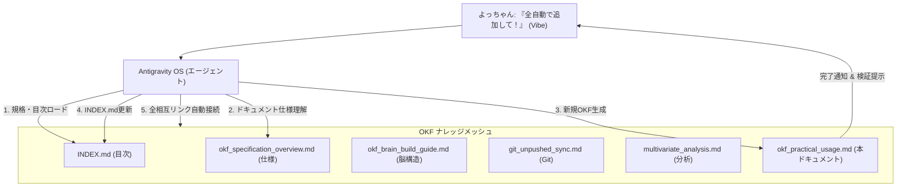

# Antigravity OS ナレッジドキュメント: OKF実践活用ガイド (自律エージェント駆動)

---

## 📋 1. 前提情報 (選択能力・メタデータ)

| 項目 | 内容 |
| :--- | :--- |
| **領域** | AIエージェント・オーケストレーション領域 |
| **タイトル** | OKF実践活用ガイド (自律エージェント駆動) |
| **できること** | OKFフォーマットで構造化された知識・スクリプトをAntigravityが自律的にロード・コンパイルし、Git自動同期・データ分析・知識自動追加・複合提案書作成などのタスクを自動実行 |
| **実例** | 「Git同期して」「売上要因を分析して」「このメモをOKF化して」という一言の指示で、AIがナレッジをコード/スキルとしてパースし自律処理 |
| **リソース** | Antigravity OS Agent Core & OKF Knowledge Mesh |
| **関連ドキュメント** | [OKF仕様・運用ガイド](file:///C:/Users/PC_User/OKF/okf_specification_overview.md) \| [OKF AIブレイン構築ガイド](file:///C:/Users/PC_User/OKF/okf_brain_build_guide.md) \| [Git完全ハンドリング](file:///C:/Users/PC_User/OKF/git_unpushed_sync.md) \| [多変量解析自動実行](file:///C:/Users/PC_User/OKF/multivariate_analysis.md) |
| **全体目次** | [OKFナレッジインデックス (INDEX.md)](file:///C:/Users/PC_User/OKF/INDEX.md) |

---

## 🔬 2. よっちゃん流ハイブリッド診断 (分析＆未来ベクトル)

### 🧠 Karpathy流「8つの視点」によるシステム評価

1. **Software 1.0 / 2.0 / 3.0 の共存**:
   - **1.0**: Git CLI、Markdown構文、Python実行基盤。
   - **2.0**: スクリプトによる自動データ集計・差分判定。
   - **3.0**: ユーザーの抽象的な指示（Vibe）を理解し、OKF内の指示・コードを動的にトランスパイルして実行する LLM エージェント。
2. **LLM as an OS**:
   - OKFディレクトリ全体が Antigravity エージェントの「仮想ディスク/プラグインレジストリ」として動作し、指示に応じて必要なモジュールを動的ロード。
3. **部分的自律性 (スライダー)**:
   - 全自動実行（ドキュメント自動インジェスト、単体スクリプト実行）から、人間承認を挟む安全制御（Human-in-the-loop）まで自在に調節可能。
4. **アイアンマンスーツ (拡張)**:
   - ユーザー（よっちゃん）が複雑なコードを書いたりコマンドを覚える必要をなくし、直感的な命令だけで高度なエンジニアリング・分析を実行可能にする知性拡張スーツ。
5. **Vibe Coding (意図)**:
   - 「全自動で追加して！」という短く直感的な発話から、意図を汲み取り、新規ファイル作成・相互リンク構築・目次更新を完璧にコンパイル。
6. **LLM Psychology (心理学)**:
   - 「どう活用すればいいか分からない」という疑問に対し、具体的・体験的な成果物（実例）を即座に自動提示することで確信と驚きを提供。
7. **Compilation Analogy (コンパイル)**:
   - 人間の自然言語リクエスト ➔ `INDEX.md` 参照 ➔ 対象ドキュメント特定 ➔ コード・Mermaid・本文の自動生成 ➔ 相互リンク書き換え、という一連の実行パスへのコンパイル。
8. **Build for Agents**:
   - 今後のエージェントが過去の対話や活用法を迷わずパース・再利用できるよう、明確な構造と完全メッシュ相互リンクで設計。

---

### 🧩 内部構造の診断 (核・質・特・欠)

- **核 (核心)**:
  - 単なるファイル閲覧（人間用）を超え、ドキュメントに記載されたプロトコル・コードを Antigravity が「自律実行エンジン」として直接パース・駆動させる仕組み。
- **質 (品質)**:
  - 相互リンクによる知識メッシュ（Knowledge Mesh）により、関連知識の探索漏れや文脈の断絶を追放。
- **特 (特性)**:
  - ユーザーの対話そのものを自動でOKF化し、システム全体のナレッジベースへリアルタイム追加できる自己増殖性（Self-expanding）。
- **欠 (欠損・課題)**:
  - ナレッジドキュメントが数百点規模に膨大化した際の、タグ検索およびコンテキスト予算（トークン数）の最適化管理。

---

### 🚀 未来ベクトル (方・移・拡・新)

- **方 (方向性)**:
  - 人間の指示一言で、ナレッジの参照・コード実行・新規知識の自己蓄積がループする「完全自律型ナレッジ・エコシステム」の構築。
- **移 (移動性)**:
  - Antigravity 以外の任意の AI Agent / MCP Server / LLM CLI でも同一のプロトコルで駆動可能。
- **拡 (拡張性)**:
  - スキル自動生成（Skill Creator）、CI/CD パイプライン連携、マルチエージェント並列タスク実行への拡張。
- **新 (新規性)**:
  - 「ドキュメントを読む」時代から「ドキュメントが自ら動いてタスクを完遂する」新しいAI対話パラダイムの提示。

---

## 💬 3. 対話スクリプト & Q&A ログ (よっちゃん対話セッション)

### 👤 ユーザー (よっちゃん) の疑問
> たしかにユーザーはそれぞれのリンクに飛ぶことはできるんですけども、これをアンティグラフティで実際にスキルでもって、こういうことをどのように活用したらよろしいんでしょうか。具体的な事例をあげてほしいです。

### 🤖 Antigravity OS の解法と4つの活用事例

1. **【事例1】自律タスクの自動実行 (Git完全ハンドリング)**:
   - 「Gitの同期やっておいて！」の一言で、`git_unpushed_sync.md` のコードを読み込み、未プッシュコミット・新規ブランチを自動検出・自動同期。
2. **【事例2】自動データ分析とレポート生成 (多変量解析自動実行)**:
   - 「このデータを分析して売上影響要因を教えて！」の一言で、`multivariate_analysis.md` の分析コードを実行し、回帰分析・グラフ生成・解釈レポートを出力。
3. **【事例3】メモや会話の自動OKF化 (知識インジェスト)**:
   - 「この対話をOKF形式で全自動追加して！」の一言で、`okf_specification_overview.md` の規格に沿った新規ドキュメント作成、目次更新、全相互リンク補全を全自動実行。
4. **【事例4】リンクを辿った (Traverse) 複合提案書の自動生成**:
   - 複数ドキュメント間のリンクを追跡し、開発進捗と営業分析データを統合した高度な報告書を生成。

---

## 📊 4. 実践活用モデル & 構成図 (Mermaid)

### 📐 エージェント自律駆動ワークフロー

---

## 🧪 5. 運用 & 検証ガイドライン

### 1. 自律駆動チェックリスト

- [x] **直感命令の解釈**: 人間の短い発話から必要なナレッジドキュメントを特定できたか。
- [x] **自動生成と整形**: OKF規格（YAMLメタデータ、ハイブリッド診断、Mermaid、運用ガイド）に従ってドキュメントが構成されているか。
- [x] **完全メッシュ相互リンク**: 既存の全ファイルおよび `INDEX.md` と破綻なく双方向リンクが形成されているか。

### 2. 検証手順

1. 📄 [INDEX.md](file:///C:/Users/PC_User/OKF/INDEX.md) を開き、追加された `OKF実践活用ガイド (自律エージェント駆動)` のリンクをクリック。
2. 本ドキュメント 📄 [okf_practical_usage.md](file:///C:/Users/PC_User/OKF/okf_practical_usage.md) から、既存の他ドキュメントおよび目次へ双方向にジャンプできるか確認。
