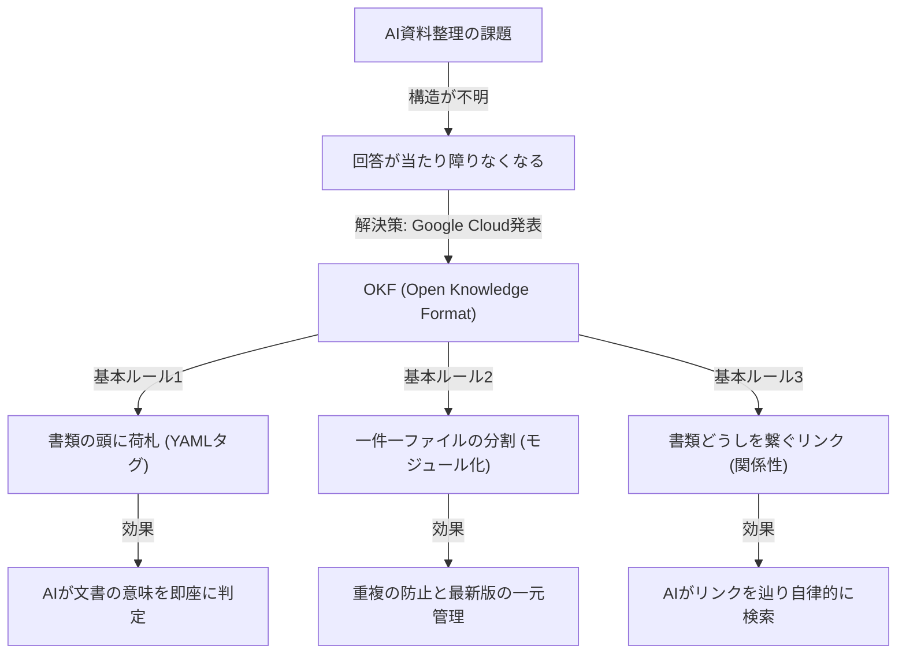

# Antigravity OS ナレッジドキュメント: OKF (Open Knowledge Format) 仕様・運用ガイド

---

## 📋 1. 前提情報 (選択能力・メタデータ)

| 項目 | 内容 |
| :--- | :--- |
| **領域** | ナレッジマネジメント・AIエンジニアリング領域 |
| **タイトル** | OKF (Open Knowledge Format) 仕様・運用ガイド |
| **できること** | 人間とAIが共通参照可能な標準化ドキュメント構造（荷札、分割、リンク）によるナレッジのセカンドブレイン化 |
| **実例** | 散在する社内プロジェクト資料をモジュール化し、YAMLタグとMarkdownリンクで接続してAIの自律検索を実現 |
| **リソース** | Google Cloud (2026年6月公開仕様) & Andrej Karpathy (LLM Wikiパターン) |
| **関連ドキュメント** | [OKF実践活用ガイド](file:///C:/Users/PC_User/OKF/okf_practical_usage.md) \| [OKF AIブレイン構築・運用ガイド](file:///C:/Users/PC_User/OKF/okf_brain_build_guide.md) \| [Git完全ハンドリング](file:///C:/Users/PC_User/OKF/git_unpushed_sync.md) \| [多変量解析自動実行](file:///C:/Users/PC_User/OKF/multivariate_analysis.md) |
| **全体目次** | [OKFナレッジインデックス (INDEX.md)](file:///C:/Users/PC_User/OKF/INDEX.md) |

---

## 🔬 2. よっちゃん流ハイブリッド診断 (分析＆未来ベクトル)

### 🧠 Karpathy流「8つの視点」によるシステム評価

1. **Software 1.0 / 2.0 / 3.0 の共存**:
   - **1.0**: シンプルな Markdownファイルと Gitによるバージョン管理。
   - **2.0**: スクリプトによる自動正規化・リンク抽出。
   - **3.0**: Andrej Karpathyが提唱した「LLM Wiki」パターンに沿い、LLM自身がリンクを辿り自律的に推論・回答するコンテキスト基盤。
2. **LLM as an OS**:
   - OKFファイル群がLLM（エージェント）の「ファイルシステム/仮想メモリ」として機能し、必要な知識を自律的にロード・コンパイル。
3. **部分的自律性 (スライダー)**:
   - 人間が手動で整理する運用から、AIエージェントによる自動OKF化・モジュール分割の自律実行までスライダー調整が可能。
4. **アイアンマンスーツ (拡張)**:
   - 社員やエンジニアの頭の中に閉じていた「文脈や経緯（なぜそうなったか）」を可視化し、組織全体の思考能力を拡張。
5. **Vibe Coding (意図)**:
   - 「社内資料をまとめて回答して」という曖昧なユーザーの意図（Vibe）に対し、明確な構造（荷札・リンク）を与えることで確信ある正確な回答を出力。
6. **LLM Psychology (心理学)**:
   - 書類の山に対するAIの「文脈消失・適当な回答（ハルシネーション）」を防ぎ、AIが迷わず確信を持って正確に探索できる信頼空間を構築。
7. **Compilation Analogy (コンパイル)**:
   - 散在する情報群を、YAMLフロントマターとWikiリンクによって「AIが即座にパース可能な中間言語（IR）」へコンパイル。
8. **Build for Agents**:
   - エージェントが自律的に探索（Traverse）しやすいよう、1件1ファイルのモジュール分割と明示的なMarkdownリンクで設計。

---

### 🧩 内部構造の診断 (核・質・特・欠)

- **核 (核心)**:
  - 3つの基本ルール（①YAMLフロントマターの荷札、②1件1ファイルのモジュール分割、③Markdownリンクによる関係性接続）。
- **質 (品質)**:
  - 特別な専用DBやプロプライエタリソフトを必要とせず、プレーンな Markdown と標準的なディレクトリ構造で永続性を担保。
- **特 (特性)**:
  - 人間がそのまま読んでも理解しやすく、かつAIエージェントにとっても決定論的にパースしやすい双方向の親和性。
- **欠 (欠損・課題)**:
  - 初期導入時のファイル分割・タグ付けコスト（AIによる自動整理で補完可能）、大規模化に伴うリンク切れ（デッドリンク）の管理が必要。

---

### 🚀 未来ベクトル (方・移・拡・新)

- **方 (方向性)**:
  - 社内の全ドキュメントを「AIセカンドブレイン」として即座に活用可能な状態に変換。
- **移 (移動性)**:
  - Git、Obsidian、VS Code、Google Cloud、各種RAG・Vector DBなど、あらゆるツール環境へ移設・連携可能。
- **拡 (拡張性)**:
  - 自動OKF変換エージェント、セキュリティマスキングフィルター、CI/CDでのOKF整合性チェック等の周辺エコシステム拡張。
- **新 (新規性)**:
  - 単なるファイル保存を超えた、「AIと人間が共有するオーガニックな知識共有プロトコル」の確立。

---

## 💬 3. 対話スクリプト & タイムライン (ずんだもん・めたん解説)

### ⏱️ タイムライン
| タイムスタンプ | セクション名 | 主な内容 |
| :--- | :--- | :--- |
| **00:00** | イントロダクション：AI資料整理の限界 | 書類をそのまま放り込んでもAIに『構造』が見えず、抽象的な回答になる理由。 |
| **02:30** | OKF（Open Knowledge Format）とは | 2026年6月にGoogle Cloudが公開した、人間・AI共通の標準Markdown仕様。 |
| **05:15** | ルール1：書類の頭に貼る「荷札」 | YAMLフロントマター（---）で `type`（議事録、仕様書等）を明示する手法。 |
| **08:45** | ルール2：一件一ファイルの「分割」 | テーマごとにモジュール化し、重複やバージョン混乱を解消。 |
| **11:30** | ルール3：書類どうしを繋ぐ「リンク」 | Markdownリンク（`[[ファイル名]]`等）で繋ぎ、AIの自律推論を支援。 |
| **14:15** | AIを使った自動整理と実践方法 | OKF化そのものをAIエージェントに自律実行させるスマートなアプローチ。 |
| **17:00** | 安全に導入するための作法とセキュリティ | 機密情報のマスキングやGit/フォルダ権限によるアクセス制御。 |
| **19:30** | まとめ | OKFによる社内ナレッジのAIセカンドブレイン化。 |

---

### 🗣️ 対話文字起こしログ

> **[00:00]**  
> **ずんだもん**: 「みんな、進行中のプロジェクトの書類をぜんぶAIに放り込んでみたことはあるのだ？でも、返ってくるのは当たり障りのない答えだけだったりするのだ。今日はその理由と解決策について解説するのだ！」  
> **めたん**: 「そうね。その理由は、AIに書類の山の『構造』が見えていないからなの。どんなに優秀なAIでも、ただのテキストが山積みになっているだけでは、どれが何に関するドキュメントで、どう関係しているのかを理解するのは困難なのよ。」  

> **[02:30]**  
> **ずんだもん**: 「そこで登場するのが、2026年6月にGoogle Cloudが公開したばかりの『OKF』なのだ！正式名称はオープンナレッジフォーマット（Open Knowledge Format）と言うのだ。」  
> **めたん**: 「OKFは、特別なソフトウェアも必要なくて、ちょっとしたルールで整理されたメモのフォルダなの。人間にとってもAIにとっても同じように読める『共通語』として機能する、シンプルだけど強力な仕様なのよ。アンドレイ・カルパシーが提唱したLLM Wikiのパターンを体系化したものとも言われているわ。」  

> **[05:15]**  
> **ずんだもん**: 「OKFのルールは大きく分けて3つだけなのだ！まず1つ目は『書類の頭に荷札（タグ）を貼る』なのだ。」  
> **めたん**: 「これは技術的には、ファイルの頭に区切り線（---）で挟んだ数行のYAMLフロントマターを足すだけの仕様よ。そこに『これは何か（type）』を最低限1つ書けばOKなの。例えば『これは議事録』『これは仕様書』といった感じね。」  

> **[08:45]**  
> **ずんだもん**: 「2つ目のルールは『一件一ファイルの分割』なのだ。あれもこれも1枚のファイルに詰め込まないことが大事なのだ！」  
> **めたん**: 「そう。例えば、部品Aの仕様は専用のファイルに、取引先との納期のやり取りはまた別のファイルに分けるの。こうしてモジュール化しておくことで、同じ情報が複数箇所に重複して存在する事故が起きず、どれが最新版だっけ？と迷うことがなくなるのよね。」  

> **[11:30]**  
> **ずんだもん**: 「そして3つ目のルールは『書類どうしをつなぐリンク』なのだ！これがあることでAIが自律的に動き回れるのだ。」  
> **めたん**: 「ドキュメントの中で、別の関連ドキュメントをMarkdownのリンク（例えば `[[ファイル名]]` など）で繋いでおくの。これによって、AIはリンクを辿って仕様書や全体スケジュールを自動で突き合わせ、問題の影響範囲を自律的に推論できるようになるのよ。」  

> **[14:15]**  
> **ずんだもん**: 「でも、この資料整理を人間が全部やるのは面倒くさいのだ…」  
> **めたん**: 「心配いらないわ。この整理作業そのものをAIに任せちゃうのが一番スマートなの。既存のフォルダと資料をAIに渡して、この3つのルールに沿ってOKF形式のMarkdownファイルに変換してって頼むだけで、AI自身がどんどん整理してくれるのよ。」  

> **[17:00]**  
> **ずんだもん**: 「最後に、社内データをAIに読ませる前のセキュリティについても重要なお作法があるのだ！」  
> **めたん**: 「その通りね。個人情報や取引先の極秘データなど、AIに食わせる前にマスキングやアクセス権の制御をしておくことは必須の安全策よ。OKFはシンプルなMarkdownだからこそ、通常フォルダやGitの権限で簡単にコントロールできるのがメリットね。」  

> **[19:30]**  
> **ずんだもん**: 「OKFを使えば、これまでベテランの頭の中にしかなかった『なんでそうなったか』というナレッジが、AIの超便利な知識ベースに生まれ変わるのだ！」  
> **めたん**: 「少しのルールで、社内のドキュメントがAIにとっての黄金の宝箱に変わるわ。今回はGoogle Cloudが公開したOKFについて解説しました。」  

---

## 📊 4. OKF基本ルール & 構成図 (Mermaid)

### 📐 OKF構造図

---

## 🧪 5. 運用 & 検証ガイドライン

### 1. OKF準拠チェックリスト

- [ ] **YAMLフロントマター**: ファイル冒頭に `---` で挟まれた `type` などの荷札メタデータが存在するか。
- [ ] **モジュール分割**: 1ファイル内に異なるテーマが混在せず、単一のトピックに絞られているか。
- [ ] **リンク接続**: 関連する他ドキュメントへの有効な Markdown リンク（`file:///...` または相対パス）が記述されているか。

### 2. 検証手順

1. **メタデータ抽出検証**:
   - スクリプトまたはAIエージェントでファイルの冒頭 `---` 領域をパースし、`type` が正確に識別できるか確認。
2. **リンク追跡検証**:
   - 記述された Markdown リンクをクリック、またはプログラムで巡回し、リンク切れ（404）なく目的のファイルに遷移できるか検証。
