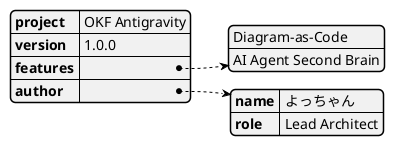
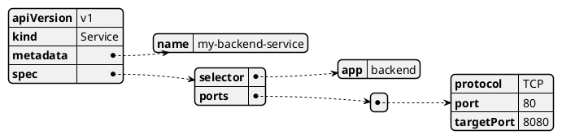
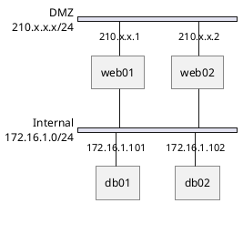
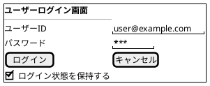
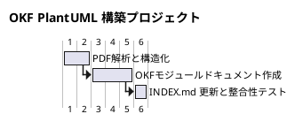
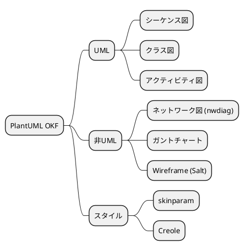
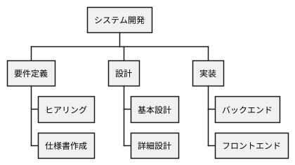
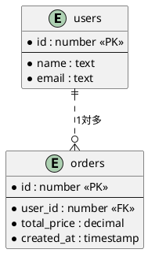

# PlantUML 非UML・データ可視化仕様ガイド (OKFモジュール)

---

## 📋 1. 前提情報 (選択能力・メタデータ)

| 項目 | 内容 |
| :--- | :--- |
| **領域** | データ表現・プロジェクト管理・ワイヤーフレーム領域 |
| **タイトル** | PlantUML 非UML・データ可視化仕様ガイド |
| **できること** | JSON/YAMLのビジュアルツリー化、ネットワーク構成図 (nwdiag)、GUIワイヤーフレーム (Salt)、MindMap、WBS、ガントチャート、ER図のコード生成 |
| **実例** | APIレスポンスデータ構造のツリー可視化、インフラネットワーク構成図の自動レンダリング、画面レイアウトのテキストプロトタイピング |
| **リソース** | PlantUML Language Reference Guide (pp.276 - 470) |
| **関連ドキュメント** | [PlantUML言語リファレンス メイン](file:///C:/Users/PC_User/OKF/plantuml_language_reference.md) \| [PlantUML UMLダイアグラム仕様](file:///C:/Users/PC_User/OKF/plantuml_uml_diagrams.md) \| [PlantUML スタイル・プリプロセッサ仕様](file:///C:/Users/PC_User/OKF/plantuml_styling_and_preprocessor.md) |
| **全体目次** | [OKFナレッジインデックス (INDEX.md)](file:///C:/Users/PC_User/OKF/INDEX.md) |

---

## 🔬 2. よっちゃん流ハイブリッド診断 (分析＆未来ベクトル)

### 🧠 Karpathy流「8つの視点」による評価
- **Software 1.0/2.0/3.0 の共存**: テキスト仕様(1.0) + リッチダイアグラム自動生成(2.0) + AIによる要件定義書からのWBS/MindMap/画面ワイヤーフレーム自動起稿(3.0)。
- **Build for Agents**: JSON/YAMLやインフラ構成、画面レイアウトをエージェントがテキストコードで出力し、人間と即座に画面レビューを行うための基盤。

---

## 📖 3. 非UML・データ可視化 詳細仕様 & 構文リファレンス

### 3.1 JSON / YAML データ構造可視化

#### JSON 可視化 (`@startjson`)

#### YAML 可視化 (`@startyaml`)

---

### 3.2 ネットワーク構成図 (`nwdiag`)
ネットワーク構成、サブネット、IPアドレス、接続ノードを記述します。

---

### 3.3 Salt (Wireframe GUIプロトタイピング)
画面レイアウト、ボタン、入力フォーム、テーブルなどのGUIワイヤーフレームを描画します。

---

### 3.4 ガントチャート (Gantt Chart)
プロジェクトタスク、マイルストーン、進捗・スケジューリングを定義します。

---

### 3.5 MindMap & WBS (Work Breakdown Structure)

#### MindMap (`@startmindmap`)

#### WBS (`@startwbs`)

---

### 3.6 ER図 (Entity Relationship Diagram)
データベースのテーブル構造とリレーションシップを表現します。

---

* [PlantUML言語リファレンス メインに戻る](file:///C:/Users/PC_User/OKF/plantuml_language_reference.md)
