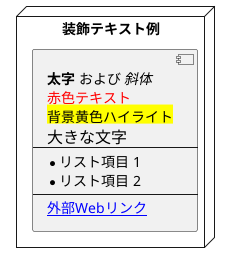

# PlantUML スタイル・プリプロセッサ仕様ガイド (OKFモジュール)

---

## 📋 1. 前提情報 (選択能力・メタデータ)

| 項目 | 内容 |
| :--- | :--- |
| **領域** | スタイルカスタマイズ・マクロ処理・アイコンライブラリ領域 |
| **タイトル** | PlantUML スタイル・プリプロセッサ仕様ガイド |
| **できること** | skinparam によるデザインテーマ変更、Creoleテキスト装飾、プリプロセッサ（!include, !procedure）による共通定義マクロ、クラウドアイコンライブラリ利用 |
| **実例** | 社内デザインガイドラインに沿ったテーマ統一、AWS/Azureアーキテクチャ図の作成、DRY原則に基づくモジュール再利用 |
| **リソース** | PlantUML Language Reference Guide (pp.471 - 571) |
| **関連ドキュメント** | [PlantUML言語リファレンス メイン](file:///C:/Users/PC_User/OKF/plantuml_language_reference.md) \| [PlantUML UMLダイアグラム仕様](file:///C:/Users/PC_User/OKF/plantuml_uml_diagrams.md) \| [PlantUML 非UML・データ可視化仕様](file:///C:/Users/PC_User/OKF/plantuml_non_uml_diagrams.md) |
| **全体目次** | [OKFナレッジインデックス (INDEX.md)](file:///C:/Users/PC_User/OKF/INDEX.md) |

---

## 🔬 2. よっちゃん流ハイブリッド診断 (分析＆未来ベクトル)

### 🧠 Karpathy流「8つの視点」による評価
- **Software 1.0/2.0/3.0 の共存**: プレーンテキスト装飾(1.0) + 標準ライブラリ・インポート(2.0) + AIによるテーマ統一・マルチクラウド設計図マクロの自動生成(3.0)。
- **Build for Agents**: スタイル定義（ダークモード、配色、マクロ）を切り離してモジュール共有することで、AIが本体ダイアグラム構造の生成に集中できる設計。

---

## 📖 3. スタイル・プリプロセッサ 詳細仕様 & 構文リファレンス

### 3.1 Creole & HTMLサブセット (テキスト装飾)

PlantUML内部の各テキスト（ラベル、ノート、タイトルなど）では、標準の Creole 記法や一部の HTML タグを利用して装飾が可能です。



---

### 3.2 `skinparam` コマンド (デザインスタイリング)

図全体のフォント、配色、手書き風エフェクト、影、背景色などを細かくカスタマイズできます。

```plantuml
@startuml
' 手書き風エフェクト
skinparam handwritten true

' 背景色と影の無効化
skinparam backgroundColor #F8F9FA
skinparam shadowing false

' フォント設定
skinparam defaultFontName "Segoe UI", "Hiragino Sans", sans-serif
skinparam defaultFontSize 12

' クラス図/シーケンス図の個別配色設定
skinparam sequence {
    ArrowColor #2B6CB0
    ActorBorderColor #2D3748
    LifeLineBackgroundColor #E2E8F0
    ParticipantBackgroundColor #EDF2F7
}

actor User
participant API
User -> API: リクエスト送信
@enduml
```



---

### 3.3 プリプロセッサ (`!define`, `!include`, `!procedure`, `!function`)

コードの再利用、マクロ関数化、外部ファイルの取り込みが可能です。

```plantuml
@startuml
!define SHOW_EXPLANATION
!include https://raw.githubusercontent.com/plantuml-stdlib/C4-PlantUML/master/C4_Container.puml

!procedure $msg($from, $to, $label)
  $from -> $to : $label
!endprocedure

actor User
participant System

$msg(User, System, "ログインリクエスト")

!if defined(SHOW_EXPLANATION)
  note right of System: 認証処理が実行されます
!endif
@enduml
```

---

### 3.4 標準ライブラリ (Standard Library: AWS / Azure / FontAwesome)

PlantUML に標準同梱されているクラウドアイコンライブラリを取り込んで、アーキテクチャ図を作成できます。

#### AWS アーキテクチャ図例
```plantuml
@startuml
!include <aws/common>
!include <aws/Compute/AmazonEC2/AmazonEC2>
!include <aws/Database/AmazonRDS/AmazonRDS>

AMAZONEC2(web_server, "Web App Server", "t3.medium")
AMAZONRDS(db_server, "Database Server", "Multi-AZ")

web_server --> db_server : SQL Connection
@enduml
```

#### FontAwesome / Material アイコン例
```plantuml
@startuml
!include <font-awesome/user>
!include <font-awesome/server>

FA_USER(user1, "エンドユーザー")
FA_SERVER(server1, "Web サーバー")

user1 -> server1 : Access
@enduml
```

---

* [PlantUML言語リファレンス メインに戻る](file:///C:/Users/PC_User/OKF/plantuml_language_reference.md)
