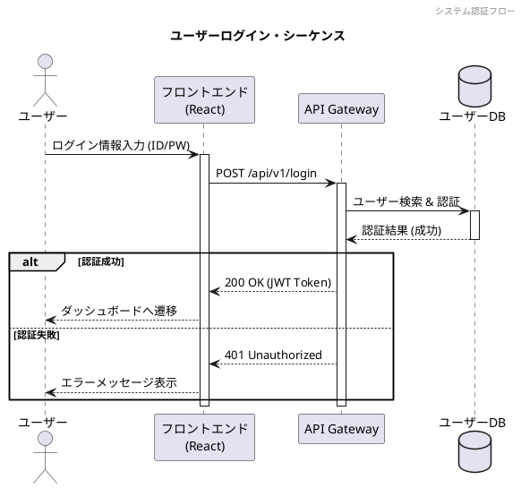
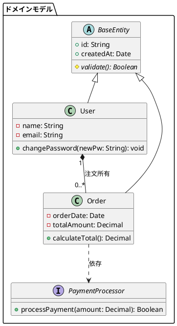
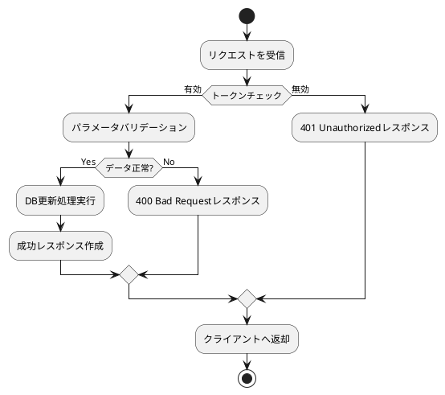
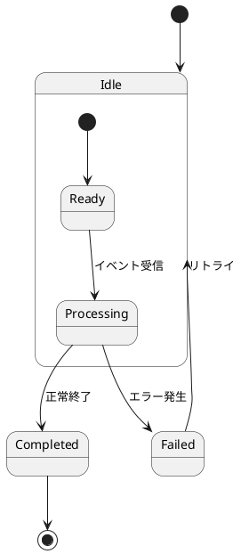

# PlantUML UMLダイアグラム仕様ガイド (OKFモジュール)

---

## 📋 1. 前提情報 (選択能力・メタデータ)

| 項目 | 内容 |
| :--- | :--- |
| **領域** | ソフトウェアアーキテクチャ・UML仕様記述領域 |
| **タイトル** | PlantUML UMLダイアグラム仕様ガイド |
| **できること** | 全9種類の主要UMLダイアグラム（シーケンス、クラス、アクティビティ、ステート、ユースケース、コンポーネント、デプロイ、オブジェクト、タイミング）のテキスト記述 |
| **実例** | API仕様のシーケンス図起こし、ドメインモデルのクラス図設計、状態遷移図や動的処理フローの自動コード生成 |
| **リソース** | PlantUML Language Reference Guide (pp.2 - 275) |
| **関連ドキュメント** | [PlantUML言語リファレンス メイン](file:///C:/Users/PC_User/OKF/plantuml_language_reference.md) \| [PlantUML 非UML・データ可視化仕様](file:///C:/Users/PC_User/OKF/plantuml_non_uml_diagrams.md) \| [PlantUML スタイル・プリプロセッサ仕様](file:///C:/Users/PC_User/OKF/plantuml_styling_and_preprocessor.md) |
| **全体目次** | [OKFナレッジインデックス (INDEX.md)](file:///C:/Users/PC_User/OKF/INDEX.md) |

---

## 🔬 2. よっちゃん流ハイブリッド診断 (分析＆未来ベクトル)

### 🧠 Karpathy流「8つの視点」による評価
- **Software 1.0/2.0/3.0 の共存**: プレーンテキスト記法(1.0) + 図変換(2.0) + LLMによるシーケンス図/クラス図の自動推論記述(3.0)。
- **Build for Agents**: エージェントが迷わずに各図の専用ステートメント（例: `actor`, `participant`, `class`, `state`, `if/then/else`）を選択・出力できる完全な構文ガイド。

### 🧩 内部構造の診断 (核・質・特・欠)
- **核 (核心)**: 矢印 (`->`, `-->`), キーワード (`class`, `participant`, `state`), ブロック構造 (`alt/else`, `if/endif`).
- **質 (品質)**: 国際標準UML 2.x規格に対応した高い互換性。
- **特 (特性)**: レンダリング時の要素自動配置、グループ化 (`group`, `package`, `namespace`) や注釈 (`note`) の自由度。
- **欠 (欠損・課題)**: アクティビティ図の新旧構文の違い、大量の要素による交差線の自動調整リミット。

---

## 📖 3. UMLダイアグラム詳細仕様 & 構文リファレンス

### 3.1 シーケンス図 (Sequence Diagram)
メッセージのやり取りや時系列の処理フローを表現します。

#### 基本記法と主要要素

* **ポイント**: `activate` / `deactivate` による実行線の明示、`alt/else/end` による分岐制御、`autonumber` による連番自動付与。

---

### 3.2 クラス図 (Class Diagram)
オブジェクト指向の構造、クラス間の関係（継承、依存、集約、コンポジション）を定義します。

#### 基本記法と主要要素

* **関係記号**:
  * 継承: `<|--`
  * 実装: `<|..`
  * コンポジション (強結合): `*--`
  * 集約 (弱結合): `o--`
  * 依存: `..>`

---

### 3.3 アクティビティ図 (Activity Diagram - 新構文)
フローチャート形式でビジネスプロセスやアルゴリズムの処理順序を記述します。

#### 基本記法と主要要素

* **ポイント**: `start`, `stop`, `:処理名;`, `if (...) then ... else ... endif`, `repeat / repeat while` など直感的な制御記法。

---

### 3.4 ステートダイアグラム (State Diagram)
オブジェクトやシステムの「状態」と「状態遷移」を定義します。

---

### 3.5 その他のUMLダイアグラム簡易構文

| 図種別 | 開始キーワード例 | 主要構成要素 |
| :--- | :--- | :--- |
| **ユースケース図** | `usecase`, `actor` | `actor User`, `(ログインする) as UC1`, `User --> UC1` |
| **オブジェクト図** | `object` | `object user1 { name = "Alice" }` |
| **コンポーネント図** | `component`, `[Component]` | `[Web App] --> [API Gateway] : HTTP` |
| **デプロイ図** | `node`, `artifact`, `cloud` | `node "App Server" { artifact "app.jar" }` |
| **タイミング図** | `robust`, `concise` | `robust "Web Browser" as WB`, `@0`, `@100` |

---

* [PlantUML言語リファレンス メインに戻る](file:///C:/Users/PC_User/OKF/plantuml_language_reference.md)
