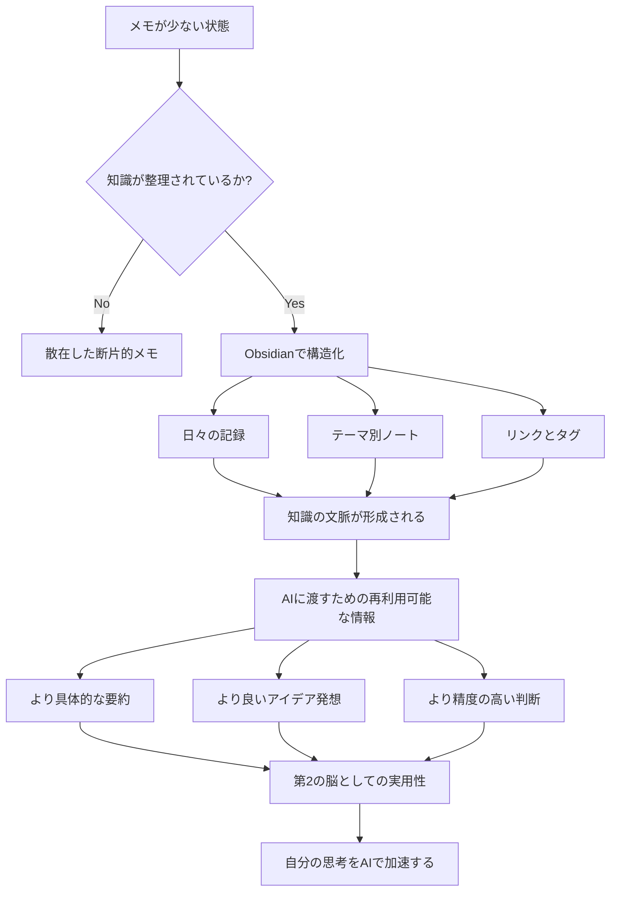

[[要約]] [[タスク管理]] [[スケジュール管理]] [[理由]] [[図解]]

# 図解

以下は、動画で伝えられている思考フローをMermaidで表したものです。

## 補足説明

この図では、動画の主張が「メモ量そのもの」ではなく、「情報を整理し、関係づけ、再利用できる状態」に価値があることを示しています。Obsidianでは、単なる保存だけでなく、知識のつながりを作ることで、その後のAI活用が大きく変わるという流れが描かれています。

---

次に行く: [[要約]] / [[タスク管理]] / [[スケジュール管理]] / [[理由]]
