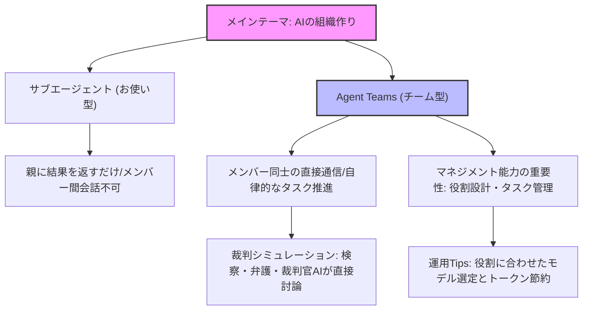

---

tags:
  - type/youtube
  - cat/ai-agent
  - topic/claude
  - topic/chatgpt
---

# (AIの組織作ろう) 新機能Claude Agent Teamsで自分のAIチームを持つ

## タイムライン
| 時間 | セクション | 主な内容 |
| --- | --- | --- |
| 00:00 | イントロダクション | Claudeの新機能「Agent Teams」の概要と、AIをチームとして組織する時代の到来を提示。 |
| 02:00 | サブエージェント vs Agent Teams | 単一タスクの結果のみを返す「お使い型」のサブエージェントと、メンバー間通信で自律協調する「チーム型」の違いを解説。 |
| 04:45 | 裁判シミュレーションの事例 | 検察官役・弁護士役・裁判官役のAI同士が自律的にディベートを行い、高度な結論を導くシミュレーション例を提示。 |
| 08:15 | マネジメントスキルの重要性 | プロンプト作成から組織デザイン（役割・連携・タスク優先順位）へと、人間の役割がシフトすることを解説。 |
| 10:15 | 活用のコツとコスト管理 | トークン消費量（コスト）の増大を避けるため、タスクに応じたモデルの使い分けや依存関係の設定の重要性を説明。 |
| 11:50 | まとめ | AIを道具から「自律チーム」としてマネジメントする時代の生存戦略を強調して締めくくる。 |

## 文字起こし
[00:00] 皆様どうも、海外ワイパです。僕は上海やニューヨークなどを点々として、今はニュージーランドに家族で住んでいます。世界の片隅から垣間見えるテクノロジーや世界の動向を、独自の視点で解説しています。さて、今日はAI時代の仕事術について、非常にエキサイティングなアップデートをお届けします。テーマは「AIの組織を作ろう」です。AnthropicがリリースしたClaudeの画期的な新機能「Agent Teams（エージェントチーム）」について徹底解説します。

[00:45] これまでの生成AIの使い方というと、ChatGPTやClaudeのチャット画面に向かって、「これについて調べて」「この文章を要約して」と、一対一で指示を出すのが主流でしたよね。つまり、AIを一人の「助手」や「お使い」として使っていたわけです。しかし、今回のAgent Teamsの登場によって、私たちは複数のAIを「チーム」として組織し、自律的に働かせることができる時代に突入しました。

[01:30] この変化は、単に便利になるというレベルではありません。実は、エンジニアではないけれど「マネジメント経験がある人」や「組織を動かしたことがある人」こそが、AI時代に圧倒的に強くなれるチャンスが来たということを意味しています。なぜそう言えるのか、これからその具体的な仕組みや、初心者にも分かりやすい裁判のシミュレーション例、そして運用のコツまで詳しくお話ししていきます。

[02:00] まずは、Claude Codeに搭載されている2つの仕組み、「サブエージェント（Subagents）」と「Agent Teams（エージェントチーム）」の違いについて整理しておきましょう。この違いを理解することが非常に重要です。一言で言うと、サブエージェントは「お使い」タイプ、Agent Teamsは「プロジェクトチーム」タイプです。

[02:45] サブエージェント（お使い）の場合、あなたがメインのAIに「お使いに行ってきて」と指示を出すと、メインAIが裏でいくつかの小さな専門AI（サブエージェント）を起動してタスクを処理させます。例えば、「このデータを分析して」と頼むと、分析用のサブエージェントが動き、結果だけをメインAIに返します。この時、起動されたサブエージェント同士はお互いの存在を知りませんし、直接会話することもできません。すべての指示と回収は、親であるメインAI（またはユーザー）が仲介する必要があります。

[03:45] 一方で、今回の主役である「Agent Teams（プロジェクトチーム）」は全く異なります。これは、1つのチームリード（リーダーAI）のもとに、複数のチームメイト（メンバーAI）が参加して、一つの大きな目的を達成するために協調動作する仕組みです。最大の特徴は、チームメイト同士がリーダーや人間を介さずに、直接メッセージをやり取りして仕事を進められる点にあります。共有のタスクリストを見ながら、「ここを修正したよ」「じゃあ私は次のテストを行うね」と、自律的に連携するのです。

[04:45] これだけだと少し抽象的で分かりにくいと思うので、身近な例として「裁判のシミュレーション」で説明してみましょう。例えば、ある事件について、AIに高度な法的・多角的な判断をさせたいとします。

[05:30] 従来のサブエージェント（お使い）方式であれば、あなたが裁判官役になって、アシスタントAIに「検察側の主張を調べて」「弁護側の主張をまとめて」と個別にお願いする形になります。返ってきたそれぞれのレポートを、人間であるあなたが一言ずつ読んで統合し、判決を下さなければなりません。これでは、あなたの作業負担が大きく、思考の深まりにも限界があります。

[06:15] これを「Agent Teams」で組織するとどうなるでしょうか。あなたはチームに「この事件の模擬裁判を行って、公正な判決案を作成して」と指示するだけです。すると、チーム内に「検察官AI」「弁護人AI」「裁判官AI」が自律的に組織されます。検察官AIが「被告人は有罪だ、なぜならこの証拠がある」と主張すると、弁護人AIが直接「その証拠は信憑性に欠ける、反対の証言がある」と反論します。このようにAI同士が直接ツッコミを入れ合い、議論を戦わせるのです。

[07:15] 裁判官AIはその議論を客観的に見守り、最終的に双方の主張を高度に統合した、極めて多角的で精度の高い「判決案」をまとめ上げます。人間が何時間もかけて行うような深いディベートと検証のプロセスを、AIチームが勝手に裏で進めてくれるわけです。この「AI同士の直接コミュニケーション」こそが、Agent Teamsが持つ最大の強みです。

[08:15] では、なぜこの仕組みによって「マネジメント経験がある人」が強くなれるのでしょうか。それは、AIへの指示が「プロンプト（命令文）を書く」という技術的な作業から、「組織をデザインし、役割を分担し、進捗を管理する」という古典的なマネジメント業務にシフトするからです。

[09:00] AIチームを成功させるためには、「誰にどんな役割（ロール）を与えるか」「どのように連携（コミュニケーションパス）させるか」「タスクの優先順位（依存関係）をどう設定するか」を設計する必要があります。これは、現実の会社でプロジェクトを動かすときに、マネージャーや経営者が毎日行っていることそのものですよね。エンジニアリングの知識がなくても、チームビルディングやディレクションが得意な人なら、最強のAIチームを瞬時に作り上げることができるのです。

[10:15] ただし、この強力なAgent Teamsを使うにあたっては、いくつか注意すべき実践的なTipsやコスト面の課題もあります。一番気をつけるべきなのは「トークン消費量（コスト）」です。複数の独立したAIが並列で、かつお互いに何度もメッセージをやり取りしながら動くため、一問一答で使うときと比べてトークンが何倍、何十倍ものスピードで消費されます。気づいたら数千円のコストがかかっていた、ということも起こり得ます。

[11:00] これを防ぐためには、すべての役割に最高スペックのモデル（例えばClaude Opusなど）を使うのではなく、全体の指揮を執るリーダーには賢いモデルを割り当て、個別の定型業務を行うメンバーには軽量で安価なモデル（Haikuなど）を割り当てる、といった「適材適所」の人事設計が有効です。また、タスクリストの依存関係（ブロック設定）を適切に定義して、無駄な並行処理を走らせないようにすることも重要です。

[11:50] まとめに入りましょう。AIはもはや、私たちの代わりに一問一答でお使いをしてくれる便利な「道具」にとどまりません。これからは、人間がリーダーとなり、複数の優秀なAIメンバーを適材適所で組織して、自律的に働かせる「チーム」としてマネジメントする時代です。皆さんもぜひ、自分のビジネスや作業に合わせたAIチームの組織図を思い描き、この新しい「Agent Teams」の世界へ一歩を踏み出してみてください。海外ワイパでした。それではまた、次の動画でお会いしましょう！

## 概要
本動画は、AnthropicのClaude Codeに導入された新機能「Agent Teams（エージェントチーム）」の本質について解説した動画です。これまでの「サブエージェント（お使い型）」は単一タスクの処理結果をメインAIに返すだけでしたが、新機能の「Agent Teams」ではメンバー間の直接メッセージングと共有タスクリストによる自律的かつ高度な協調が可能になりました。動画内では「模擬裁判（検察、弁護、裁判官の各役割）」のシミュレーションを用いてこの仕組みをわかりやすく説明し、AIを組織として統率する時代においてはプログラミングの知識以上に「役割分担」や「進捗管理」などのマネジメント経験が最大の武器になると提唱。さらに、トークン消費を抑えるための「適材適所」のモデル使い分けなど、実践的なTipsについても触れています。

## 構成図 (Mermaid)

