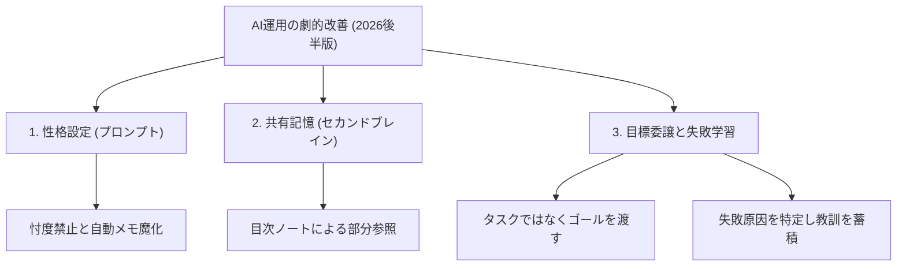

---

tags:
  - type/youtube
  - cat/ai-agent
  - topic/obsidian
  - topic/mindset
---

# AI Agent Fundamentals (Late 2026 Edition): 3 Tips for Dramatic Improvement

  

## 概要

シリコンバレー在住のUXデザイナーRio氏による、2026年後半基準における「AIエージェントの劇的な活用改善をもたらす3つの基礎（コツ）」の解説です。

多くのユーザーが直面する「毎回会話のたびに文脈を忘れられる」「AIが指示待ちで指示通りにしか動かない」といった課題を解決するために、以下の3つの運用基盤を提唱しています。

  

1. **AIの性格設定（システムプロンプト）の最適化**: 忖度を一切禁止し、お世辞ではなく事実や反対意見を言わせる設定や、決定事項を自動でメモに残させる「メモ魔」設定を仕込みます。英語で記述することで精度が向上します。

2. **共有記憶層（セカンドブレイン）の構築**: Obsidianなどの外部データベースにプロフィールやプロジェクト情報を集約。AIの文脈を汚さないよう、必要な時だけ特定の情報へアクセスさせる「目次ノート（インデックス）」を活用したスマートな情報連携を行います。

3. **目標の委譲とフィードバック（失敗からの学習サイクル）**: 細かい手順（タスク）を指示するマイクロマネジメントを辞め、達成すべき「ゴール」を渡してAI自身に考えさせます。失敗時には根本的な原因を振り返り、その教訓を記憶層に保存させることで、AIを自律的かつ継続的に成長させます。

  

「良い上司としての振る舞い」をAIに適用することで、個々のAIチャットの利用が組織全体の知的資産へと昇華していく本質的なアプローチを学べる内容となっています。

  

## タイムライン

| タイムスタンプ | チャプター名 | 概要・重要ポイント |

| --- | --- | --- |

| 00:00 - 01:59 | 導入：なんとなくAIを使って失敗することの罠 | AIを毎回ゼロから説明し直して使う「タイミーのバイト状態」の認知負荷と課題。 |

| 01:59 - 03:11 | AIの基本セットアップ (2026年後半基準) | AIを優秀な部下として自律的に稼働させるための、劇的改善の土台。 |

| 03:11 - 05:13 | システムプロンプトの設定 | クロードなどのツールにおける自分のプロフィールや経歴情報の記述方法。 |

| 05:13 - 05:52 | 何かを作る時のルール | AIのアウトプットのフォーマットや進め方の合意形成のルール化。 |

| 05:52 - 06:31 | 真実を求める・忖度絶対禁止設定 | お世辞を排除し、事実に基づいた反対意見や疑問をAIに積極的に言わせる設定。 |

| 06:31 - 06:59 | メモ魔になれ | 会話を閉じても情報が消えないように、AIに重要な決定や議論のメモ作成を指示。 |

| 06:59 - 08:21 | 安全についてのルール | 機密データの漏洩を防ぎ、安全な運用を担保するためのガードレール。 |

| 08:21 - 09:04 | 英語指示は地味だが有効 | AIが英語脳で論理構築をしているため、重要プロンプトを英語にするメリット。 |

| 09:04 - 12:58 | 共有記憶層の設定 | Obsidian等に蓄積した背景データを、AIが引き出せる共有データベースとする設定。 |

| 12:58 - 14:09 | 文脈エンジン・セカンドブレイン注意事項 | 情報を詰め込みすぎて思考精度を落とさないよう、目次を使った部分参照の重要性。 |

| 14:09 - 17:29 | AIの使い方基礎の基礎 | 優秀な上司として、手順（タスク）ではなく「達成すべきゴール」を委譲する。 |

| 17:29 - 20:11 | フィードバックの重要性 | 失敗した時に根本原因を突き止め、得られた教訓を共有記憶へ蓄積し学習させる。 |

| 20:11 - 23:13 | 2026年後半 AI運用基盤3要素 | 「性格設定」「共有記憶」「失敗学習」を連携させることで回るAI自律改善サイクル。 |

  

## 構成図 (Mermaid)

  

## 文字起こし

AIエージェントでもAIチャットでもいいんですけれど、使っていて一番面倒くさいことって何かって言うと、やっぱり新しい会話に移った瞬間、前の話を全部忘れられていることですよね。コンテクストが圧縮された時とかも、結構肝心なことを忘れられたりして、イライラしたことがあるという人は多いと思います。自分がどういう人間で、どういう仕事をしていて、どう動いて欲しいのか、出力はこういう形がいい、こういう言い方はやめてくれ、そういったことを毎回1から説明し直さなきゃいけない。毎日AIを使う人ほど、やっぱりここが地味に嫌な部分であり、1番のネックなんです。例えるなら、毎朝タイミーで新しいアルバイトが来るようなもので、昨日教えたことも今日また1から教えなきゃいけない。これではいくら相手が優秀でも、使う側の認知負荷が大きすぎますよね。そこで、「ここまでやっとけばとりあえずOK」という、2026年後半のベンチマークとなるAI活用の基本セットアップと、劇的な改善をもたらす3つのコツを解説します。

  

まず1つ目のコツは、「AIの性格付け（システムプロンプト）」を徹底することです。AIを単なる便利ツールではなく、自分の有能な「部下」として設定します。私の場合は、自分が何者か、情報がどこにあるかを冒頭に定義し、何かを作る時のルールや、進行上の取り決めを書いておきます。ここで極めて重要なのが「忖度禁止・真実の追求」の設定です。デフォルトのAIはユーザーを過剰に褒め、気持ちよくさせようとしますが、ビジネスで欲しいのは「事実」と「建設的な反対意見」です。あえて反対意見を言うことを許可し、曖昧な点は勝手に補完せず質問するように設定します。また、「メモ魔になれ」という指示を入れ、会話の中で決まった大事な決定事項や教訓を自動的にメモへ書き残すようにルール化します。これにより、チャットを閉じたら議論が全て消える問題を解決します。さらに、機密情報を守る安全ルールも記載します。なお、AIは基本的に「英語脳」で思考しているため、これらコアとなるシステム指示は英語で記述する方が精度が高く有効です。

  

2つ目のコツは、「共有記憶層（セカンドブレイン）」を構築することです。毎回ゼロからプロフィールや経歴、プロジェクトの背景を説明する手間を省くために、外部のデータベースを活用します。私の場合はObsidian（オブシディアン）に自分の経歴やプロジェクト情報、これまでの決定事項を全て保存しています。しかし、AIにこれら膨大なデータを全て直接読み込ませると、コンテクストが汚れて余計なトークンを消費し、AIの思考精度が下がってしまいます。そこで、データベース内に「目次ファイル（インデックスノート）」を作成します。例えば『プロジェクト情報はこのフォルダを参照』『プロフィールはここ』といった形でリンクをまとめた目次ファイルを1つ作り、その目次ファイルのリンクだけをシステムプロンプトに登録します。AIは指示に応じて、目次から必要なノートだけを自律的に引っ張りに行く（RAGやツールの仕組みを活用）ため、余計な情報で記憶を汚さずに、いつも文脈を維持した一貫性のある作業が可能になります。

  

3つ目のコツは、「タスク（手順）ではなくゴール（目標）を渡し、失敗から学ばせること」です。これは人間組織における優秀なマネジメント手法と全く同じです。ダメな上司は『このエクセルのA列にこれを入れて、グラフはこうして』と、手順をマイクロマネジメント（タスク渡し）します。これでは部下（AI）は言われた通りにしか動かず、自律的な知性は育ちません。優秀な上司は『何のために（背景）、どのようなゴールを達成したいか』だけを伝え、どうやるかは部下に考えさせます。AIにゴールを渡し、AI自身に手順を組み立てて実行させるのです。そして、もしAIが失敗したり、思ったものと違う成果物が出てきた時には、単に表層的な修正をするのではなく、『何が原因で期待とズレたのか』『次はどう改善すべきか』をフィードバックし、その「教訓」を共有記憶層（セカンドブレイン）のメモとして書き残させます。この『失敗から学習し、記憶に教訓を蓄積するサイクル』を回すことで、使えば使うほどAIが賢くなり、あなたのビジネスに最適化された強力なAI組織（運用基盤）へと育っていきます。