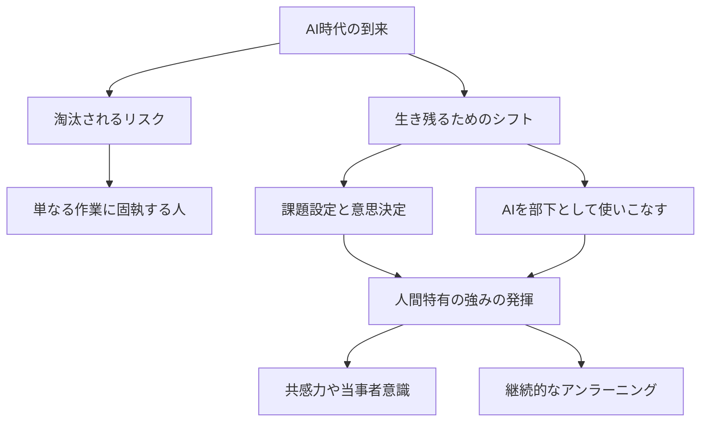

---

tags:
  - type/youtube
  - cat/ai-agent
  - topic/claude
  - topic/chatgpt
---

# AI時代の生存戦略：淘汰される人と生き残る人の違い

## タイムライン
| タイムスタンプ | セクション | 主要な内容 |
| :--- | :--- | :--- |
| 00:00 | 導入：AI時代の不安 | ChatGPT等の進化による雇用の不安と本動画のテーマである生存戦略の提示 |
| 01:30 | AI時代の残酷な現実 | 仕事を奪うのはAIではなくAIを使いこなすライバルであるという結論の提示 |
| 03:00 | 淘汰される人と生き残る人の差 | 問いを立てる力や意思決定が人間の付加価値になる点についての解説 |
| 04:45 | 実践ステップ1：AIを部下にする | AIを優秀なアシスタントとして扱い人間は編集者や監督の役割に徹することの重要性 |
| 06:30 | 実践ステップ2：人間特有のスキル | 共感力やリーダーシップなどAIが代替できない責任能力の価値 |
| 08:15 | まとめ：アンラーニングの重要性 | 過去の成功体験を捨てて新しい技術を試す柔軟性こそが最大の生存戦略であるという総括 |

## 文字起こし
[00:00] 皆さん、こんにちは。今回は、急速に進化するAI時代において、私たちがどのように働き、どのように生き残っていくべきかという「AI時代の生存戦略」について解説します。現在、ChatGPTやClaudeなどの対話型AIだけでなく、画像生成やプログラミング、データ分析まで、あらゆる分野でAIが実用化されています。こうした中で、「自分の仕事が奪われるのではないか」と不安を感じている方も多いのではないでしょうか。

[01:30] 結論から申し上げますと、AIに仕事を奪われるのは「AIを使わない人」であり、生き残るのは「AIを使いこなす人」です。AIそのものが直接あなたの仕事を奪うわけではありません。しかし、AIをまるで手足のように使いこなし、これまでの10倍、100倍の生産性を発揮するライバルたちが、あなたの市場価値を相対的に下げていくことになります。これがAI時代の残酷な現実です。

[03:00] では、淘汰されてしまう人と、生き残る人の違いは具体的にどこにあるのでしょうか。最大の違いは、「問いを立てる力（プロンプト力）」と「意思決定力」にあります。AIは与えられた問いに対して答えを出すのは得意ですが、自ら「何を解決すべきか」という課題を設定することはできません。つまり、ビジネスにおける「何をするか」を決めるのは人間の役割であり、「どうやるか」を最速で実行するのがAIの役割なのです。

[04:45] 生き残るためのステップの1つ目は、まず「AIを自分の優秀なアシスタントとして雇う」というマインドを持つことです。すべてを自分で抱え込むのではなく、リサーチや下書き、ブレインストーミングなどはすべてAIに任せましょう。人間は、AIが吐き出した膨大なアウトプットから、どれが最もビジネス価値が高いかを評価し、最終決定を下す「編集者」や「監督」のような役割にシフトする必要があります。

[06:30] ステップの2つ目は、AIには代替できない「人間特有のスキル」を磨くことです。具体的には、共感力やリーダーシップといった「エモーショナルなコミュニケーション能力」、そしてリスクを取って新しい一歩を踏み出す「当事者意識」です。AIはどれだけ賢くなっても、人間のように責任を取ることはできません。責任を取り、人を動かす力こそが、これからの時代に最も高く評価されるスキルになります。

[08:15] 最後に、最も重要なのは「学び続ける姿勢（アンラーニング）」です。今持っている知識やスキルが、1年後にはAIによって自動化されている可能性があります。過去の成功体験に執着せず、新しい技術をすぐに試し、自分のスキルをアップデートし続ける柔軟性こそが、最強の生存戦略となります。今日からぜひ、小さな業務でも良いのでAIを実際に使ってみることから始めてみてください。

## 概要
本動画では、急速に進化するAI時代において個人が生き残るための具体的なアプローチとマインドセットを解説しています。主なポイントは以下の通りです。
1. AI時代の現実: 仕事を奪うのはAI自体ではなく、「AIを使いこなす競合他者」である。
2. 役割のシフト: 人間は「実務の実行者」から「課題の設定者（問いを立てる人）」および「最終決定を下す監督」へと役割をシフトする必要がある。
3. 人間特有の価値: AIに代替できない「共感力」「意思決定に伴う責任テイク」「当事者意識」の重要性が高まる。
4. 生存戦略: 過去のスキルに固執せず、常に新しい技術を取り入れ自己をアップデートする「アンラーニング」が必須である。

## 構成図 (Mermaid)

