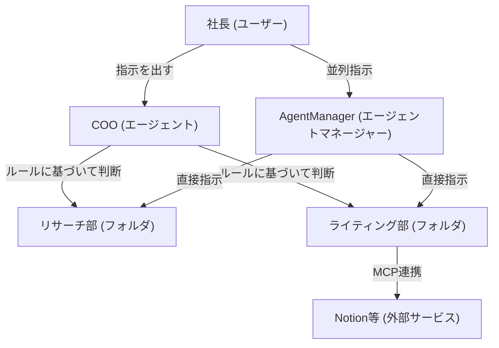

---

tags:
  - type/youtube
  - cat/ai-agent
  - topic/antigravity
---

# AntigravityでAI組織を作る実験をしてみた

## タイムライン
| 時間 | トピック | 概要 |
|---|---|---|
| 00:00 | 組織実験の概要 | Antigravityで社長・COO・部署フォルダというAI組織を構成するコンセプトを説明します。 |
| 01:30 | 組織図と役割の定義 | 社長（自分）からCOOに指示を出し、COOが各部門へ割り振る流れを定義します。 |
| 03:00 | フォルダによる部署の実現 | フォルダ構成にルールファイルを与えることで、AIに特定の役割を持たせる仕組みを解説します。 |
| 04:30 | SkillsとMCPの活用 | MCPを使用して、AIが外部ツール（Notion等）と連携できるようにする方法を説明します。 |
| 06:15 | AgentManagerによる並列処理 | 部署を直列ではなく、並列で動かして指示を出すためのエージェントマネージャーの役割を提示します。 |
| 07:53 | AI組織デモの開始 | 実際にデモフォルダを用意し、各部署のフォルダとルールファイルを設定する手順を実演します。 |
| 10:15 | リサーチ部への自動割り振り | COOに「調べ学習」を指示し、リサーチ部フォルダ内に自動で調査報告書が作成される様子をデモします。 |
| 12:45 | ライティング部への自動割り振り | 続いて「記事執筆」を指示し、ライティング部フォルダに成果物である記事が作成されることを確認します。 |
| 15:30 | MCPでの外部連携デモ | ライティング部がMCPを活用し、チャットだけでNotionに記事を直接書き込むプロセスを実演します。 |
| 18:00 | AgentManagerでの並列設定 | 部署のファイルを変更し、エージェントマネージャーから各部署をワークスペースに追加して並列指示を行う手順を示します。 |
| 21:00 | アクティベーションモードの設定 | 各フォルダの設定ファイルでactivationModeをalwaysOnに書き換える理由を説明します。 |
| 23:00 | 並列チャットの実践 | 異なる部署へ個別にチャットを開き、それぞれ異なる作業を同時並行で進めさせる実演を行います。 |
| 24:30 | まとめ | AI組織の正体はフォルダ構成とルール設定によるものであること、応用次第で様々な構成が可能であることをまとめます。 |

## 文字起こし
[00:00] みなさんこんにちは。今回は、Googleが提供するAIエージェントツール「Antigravity」を使って、AIによる会社組織のようなものを作る実験をしていきたいと思います。AI組織と聞いて、何だか難しそうだなと思うかもしれませんが、要するにAIに人間の組織のように分担して働いてもらおうという試みです。自分は社長として指示を出し、それを受けたAIが適切な部署に仕事を割り振って、成果物を作ってくれるというシステムを構築していきます。

[01:30] まず、今回イメージしている組織図について説明します。組織図は非常にシンプルで、社長である自分、その下に最高執行責任者である「COO」を配置します。社長がCOOに対して「ブログ記事を書いて」や「アンチグラビティについて調べて」といった指示を出すと、COOがその内容を判断し、適切な部署にタスクを依頼して作業を任せるという流れになります。自分はCOOにだけ話しかければいいので、どの部署が稼働するかを細かく意識する必要がなくなります。

[03:00] では、この「部署」という仕組みをAntigravity上でどのように実現するのかというと、実は「フォルダ」の構成を利用します。Antigravityでは、作業フォルダ内に特定のルールファイルを配置することで、AIに役割や振る舞いを与えることができます。つまり、リサーチ用のフォルダ、ライティング用のフォルダなどを個別に作成し、それぞれに「あなたはリサーチ部です」「あなたはライティング部です」というルールを書き込んでおき、それらを組み合わせることでAI組織っぽく動かすわけです。

[04:30] さらに、今回の組織をより実用的にするために「Skills（スキル）」や「MCP（Model Context Protocol）」といった機能を活用します。MCPとは、AIが外部のサービスと連携するための仕組みです。例えば、リサーチ部にはWeb検索や特定のデータベースを参照するスキルを与え、ライティング部には「Notion」などのドキュメント作成ツールに直接アクセスしてメモや記事を書き込むMCPを連携させます。これにより、単なるテキスト出力にとどまらず、実際の業務ツールを自動操作させることが可能になります。

[06:15] また、もう一つ気になる点として「各部署を並列で動かすことはできないのか？」という疑問があるかと思います。通常、COOを介して直列で作業を依頼すると、前のタスクが終わるまで次の部署が動けないといったボトルネックが生じがちです。そこで、Antigravityに備わっている「AgentManager（エージェントマネージャー）」という機能を使用します。これを使うことで、複数の部署に対して同時に並列で個別の指示を出すことができるようになります。

[07:53] それでは、ここからは実際の画面を見ながら「AI組織デモ」を進めていきましょう。まずは準備として、デモフォルダを用意し、その中に各部署に対応するフォルダを作成します。今回は「リサーチ部」と「ライティング部」など、4つの部署フォルダを作成します。それぞれのフォルダのルールを設定するために、ルールファイル（rulesや.agentsettingsなど）を書いていきます。このファイルがあることで、AIはどのフォルダで作業しているかを認識し、指示に応じた適切な役割を演じることができます。

[10:15] 準備が整ったので、まずはCOOを介した直列のテストを行ってみましょう。チャット画面で、COOに対して「アンチグラビティについて調べて、調査報告書を作成してください」と指示を送ります。するとCOOは、このタスクが調査業務であると判断し、「リサーチ部」のフォルダへと指示を流します。しばらく待つと、リサーチ部フォルダの中に「調査報告書.md」というファイルが自動で生成されます。ユーザーは何もフォルダを指定していないのに、AIが自動で適した部署を選択して作業してくれました。

[12:45] 次に、その調査報告書を元にして、記事の執筆を依頼してみましょう。COOに対して「さっきの調査結果を元に、ブログ用の記事を書いてください」と指示します。今度は執筆の依頼ですので、COOは自動的に「ライティング部」のフォルダを稼働させます。実際にフォルダの中身を確認してみると、ライティング部のフォルダ内にしっかりと記事のテキストファイルが生成されています。タスクの性質をAIが正確に読み取って、部署を使い分けているのがわかります。

[15:30] ここでMCPのデモも見てみましょう。ライティング部に「Notionと連携して、作成した記事をNotionのページに直接書き込んでください」と指示します。MCPが有効になっていると、AIは外部のNotion APIを呼び出し、ユーザーのNotionワークスペースに新しいページを作成して記事の内容を自動で流し込みます。完了後にNotionの画面を開いてみると、確かに指定した記事が綺麗に書き込まれているのが確認できます。これがMCPの非常に強力なポイントです。

[18:00] 次に、先ほどお話しした「AgentManager」を使った並列指示のやり方を実践します。並列で指示を出すためには、各部署のフォルダをワークスペースとして登録する必要があります。AgentManagerの画面に行き、右上のボタンなどからワークスペース追加（Add Workspace）を選択し、作成した各部署のフォルダをサイドバーに追加していきます。これで、チャットで話しかける対象を部署ごとに手動で切り替えて、個別に指示を出すことができるようになります。

[21:00] ただし、エージェントマネージャーで各部署に並列で実行させるためには、事前の設定が必要です。各部署のフォルダ内にある.agenttoolsフォルダの中などの設定ファイルを開き、アクティベーションモード（activationMode）を「alwaysOn」に変更しておきます。なぜこれが必要かというと、この設定をしておくことで、エージェントマネージャーで指示を出したときに、その部署の専用ルールファイルをAIが強制的に読み取ってくれるようになるからです。

[23:00] 設定が完了したら、実際に並列でチャットを送ってみましょう。サイドバーから「リサーチ部」を選択して「〇〇について調べて」と指示を出し、それと同時に「ライティング部」を選択して「新しいカンバセーション（新規スレッド）」を立ち上げ、「〇〇に関するキャッチコピーを考えて」と指示を出します。これで、2つの異なる部署のAIが、お互いに干渉することなく並行して作業を進めてくれます。まさに自分だけのAIオフィスが稼働している状態です。

[24:30] 今回はAntigravityを使ってAI組織を作る実験を行いました。一見すると複雑なAIシステムのように思えますが、その中身は「フォルダの構成術」と「ルールファイルによる指示」の組み合わせです。自分が必要な業務に合わせて部署を増やしたり、ルールを細かく書き換えたりすることで、より強力な相棒へと育てていくことができます。会社のように部や課を階層化することも可能ですので、ぜひ自分だけの最強のAI組織を構築してみてください。

## 概要
GoogleのAIエージェントツール「Antigravity」を使い、フォルダとルール設定によって仮想的な「AI組織」を構築する実験動画です。ユーザーが社長、AIが全体統括のCOOとなり、指示内容に応じて適切な部署（リサーチ部やライティング部など）にタスクを自動で割り振ります。動画内では、実際に自動でファイルが作成されるデモや、Notion等の外部サービスと連携するMCP（Model Context Protocol）の活用法、さらに「AgentManager」を使った各部署への並列指示の手順が紹介されています。

## 構成図 (Mermaid)

