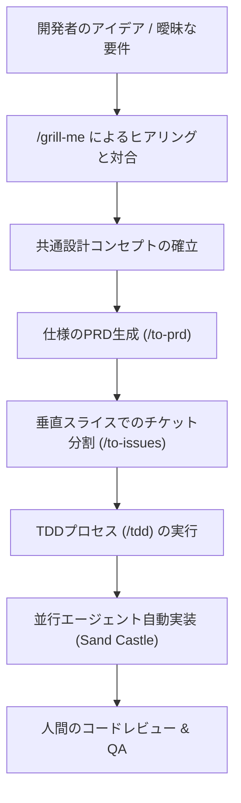

---

tags:
  - type/youtube
  - cat/ai-agent
  - topic/automation
  - topic/mindset
---

# Full Walkthrough: Workflow for AI Coding — Matt Pocock

## タイムライン
| タイムスタンプ | セクション名 | 内容説明 |
|---|---|---|
| [00:00] | イントロダクション＆現状 | 単なるバイブコーディングを脱却し、エンジニアリングの規律をAI開発に融合させる必要性を提起。 |
| [01:31] | エンジニアリング基本原則 | コード生成が自動化されるからこそ、人間の設計・アーキテクチャ判断の価値が高まる理由を解説。 |
| [03:57] | スマートゾーンと制限 | トークン増加によるLLMの判断力低下（100kトークン限界）と、それを回避するタスク管理を定義。 |
| [07:54] | AIの記憶喪失と対策 | セッションを毎回クリアしてスマートゾーンで開始すること、コードベース内での共通言語同期の重要性。 |
| [12:29] | 「/grill-me」による対合 | AIから人間への執拗なヒアリングを通じて曖昧な要件を精査し、人間とAI間で共通の設計コンセプトを築く。 |
| [25:00] | 垂直スライス (曳光弾) | 水平方向のレイヤー開発ではなく、DB・API・UIを一本貫通する「垂直スライス」でチケットを分割し開発する手法。 |
| [28:00] | TDDによる品質担保 | 失敗するテストを最初に書き、テスト通過を強制するフィードバックループがAIの出力品質の天井を規定する。 |
| [30:30] | 自律エージェントと並行化 | Sand Castleフレームワークによる複数ブランチ・Dockerコンテナでの並行自律実装の実演（AFK開発）。 |
| [33:00] | まとめと結論 | 人間の役割は実装そのものではなく、AIを制御する仕様とテストの「設計者・監査役」になることであると結論。 |

## 文字起こし
[00:00] 皆さん、こんにちは。マット・ポコックです。今回は、AIを活用した近代的なコーディングワークフローの完全な実演を行います。現在、多くの開発者がAIを「チャットボット」として扱い、思いついたままにコードを書かせる「バイブコーディング（Vibe Coding）」を行っていますが、これには大きな限界があります。機能が複雑になるとAIは急激に嘘をつき始め、コードベースはメンテナンス不可能な「泥団子（Ball of Mud）」になってしまいます。私たちは、従来のソフトウェアエンジニアリングの厳格な規律をAIエージェントの開発プロセスに融合させる必要があります。これこそが「エージェントエンジニアリング（Agentic Engineering）」です。

[01:31] 多くの人は「AIがコードを書く時代に、なぜソフトウェアエンジニアリングの基本が重要なのか？」と疑問に思うでしょう。しかし、答えは全く逆です。コードの生成が民主化され高速化された今だからこそ、設計、アーキテクチャ、テストの規律、そして要件の定義といった人間の判断の重要性がかつてないほど高まっているのです。AIは完璧な実行者になり得ますが、完璧な設計者にはなれません。

[02:41] 開発者を対象としたライブ調査を行うと、ほとんどの人が毎日のようにAIツールを使用している一方、AIが出力するコードの品質や、何度も同じ対話を繰り返さなければならない手間に不満を感じています。AIエージェントを最大限に活用するには、LLM（大規模言語モデル）の物理的な制約を理解することが不可欠です。

[03:57] ここで最も重要な概念が「スマートゾーン（Smart Zone）」と「ダブゾーン（Dumb Zone）」です。LLMはどれほどコンテキストウィンドウが広いと謳われていても、セッションを開始してトークンが10万（100k）トークンを超えると、急激に注意力が低下し、判断が狂い始めます。この10万トークン未満の、最も頭が冴えている状態を私は「スマートゾーン」と呼んでいます。タスクが大きすぎると、AIは簡単にダブゾーンに陥ってしまいます。そのため、タスクを小さく分割し、スマートゾーン内に収め続ける設計が必要です。

[06:33] そこで、私たちは「マルチフェーズプランニング（複数段階の計画策定）」を採用します。大きな課題を一度に解決させるのではなく、細かく切り分けることで、AIエージェントが常にスマートゾーンの中で思考できるようにします。

[07:54] また、LLMにはセッションが終了するとすべてを忘れてしまう「記憶喪失（LLM Amnesia）」の特性があります。前のセッションの膨大なやり取りを無理に要約して持ち越そうとする（セディメント問題）よりも、セッションを定期的にクリアしてフレッシュな状態で再スタートさせる方が遥かに効果的です。

[09:20] 多くの会話履歴を無理に圧縮してコンテキストに詰め込むよりも、不要な情報を一掃してセッションを完全にリセット（クリア）することを推奨します。そして、コードベース内に常に最新のシステム状態を示す「CONTEXT.md」や「ユビキタス言語（Ubiquitous Language）の用語集」を整備し、新しいセッションが開始された際にはまずそれらを読み込ませることで、無駄なトークンを消費せずに賢い状態（スマートゾーン）を維持します。

[11:58] では、今回は具体例として、オンライン学習プラットフォームへのゲーミフィケーション機能の実装プロジェクトを通じて、このワークフローを実演します。

[12:29] 最初に用いるのは、私が開発した「/grill-me（グリル・ミー）」というエージェントスキルです。曖昧な仕様やアイデアをいきなりコードにするのではなく、まずAIが人間に対して徹底的なヒアリング（質問攻め）を行います。これは「仕様からコードへの無防備な直翻訳」という開発者が最も陥りやすい失敗を防ぎ、人間の意図とAIの認識を完全に同期させるための最善の手段です。

[14:55] 実際にデモをお見せしましょう。ターミナルで `/grill-me` を実行すると、AIが「このゲーミフィケーションのポイントはどのように計算されるのか？」「データベースのスキーマはどうなっているか？」など、時には40から80もの質問を粘り強く、一問ずつ人間の意図を深掘りするように投げかけてきます。この徹底した対話を通じて、人間とAIとの間に「共通の設計コンセプト（Shared Design Concept）」が生まれます。

[18:20] このプロセスにおいて、私たちは「サブエージェント（Sub-agents）」も活用します。メインの対話ウィンドウのトークン容量を守るために、詳細なスキーマの検討やUI設計など、特定領域の検討を子エージェントに委託（隔離）し、その結論だけを親エージェントに書き戻させることで、コンテキストウィンドウの消費を最小限に抑えます。

[21:31] 対話が終わると、AIはすり合わせた内容を体系的なドキュメントとして出力し、コードベース内の用語集（Domain Model / Ubiquitous Language）を更新します。これにより、同じドメイン用語がコード、テスト、ドキュメントのすべてで完全に一致し、以降のセッションでコンテキストがリセットされても、AIは即座に正確な共通言語を認識できます。

[25:00] 次に、合意された仕様を「垂直スライス（Vertical Slices）」（またはPragmatic Programmerに由来する「トレーサーバレット（曳光弾）」）として開発チケットに分解します。AIは放っておくと「まずデータベースを構築し、次にAPIを作り、最後にフロントエンドを作る」といった水平レイヤーでの開発を好みますが、これでは最後の最後まで動作確認ができません。私たちは、スキーマ、API、UI、そしてテストまでを一度に貫通する極めて薄い「垂直なスライス」でチケットを分割し（`/to-issues`）、一つずつ段階的にエンドツーエンドで検証できるようにします。

[28:00] 実装のフェーズでは、TDD（テスト駆動開発）を強制します。AIに「まず失敗するテスト（Red）を書かせ、それを実行し、そのテストをパスする最低限の実装（Green）を書かせ、最後にリファクタリング（Refactor）を行わせる」というサイクルです。この即時フィードバックループこそが、AIに動作する高品質なコードを書かせるための絶対的な品質の天井（Quality Ceiling）となります。テストが通らない限り、AIは次のステップに進めません。

[30:30] 最後に、これらを並行して自律的に実行する仕組みについて説明します。私は「Sand Castle」というTypeScript製のオーケストレーションフレームワークを構築しました。これを利用することで、AIエージェントが自律的にGitのワークツリーを作成し、Dockerコンテナ内で複数のタスク（垂直スライス）を並行して実装し、テストをパスさせ、自動的にプルリクエスト（PR）を作成するまでを「人間が席を外している間（AFK: Away From Keyboard）」に実行させることが可能です。

[33:00] これが、AI時代の真のコーディングワークフローです。私たちの役割は、すべてのコードを自分で手書きすることではなく、システムを設計し、仕様を厳格に定義し、テストによるガードレールを敷き、AIエージェントにその制約の中で安全にコードを実装させる「監督者」になることなのです。ご清聴ありがとうございました。質問があればお受けします。

## 概要
TypeScript教育の第一人者であるMatt Pocock氏による、AI時代の開発者向け実践ワークフロー「エージェントエンジニアリング（Agentic Engineering）」の解説動画。ただAIに指示を出してコードを書かせるだけの「バイブコーディング（Vibe Coding）」の限界を指摘し、LLMの制約（10万トークン付近での性能低下＝「スマートゾーン」の限界）に対応するための実践的手法を提案。曖昧な要件をAIからの質問攻めで精査する「/grill-me」スキル、要件をDBからUIまで一本貫通する「垂直スライス（曳光弾）」に分解する「/to-issues」スキル、実装品質の天井を担保する「TDD（テスト駆動開発）」、そして人間が席を外している間に自律並行開発を進める「Sand Castle」フレームワークなど、エンジニアリングの基本原則とAIエージェントの力を融合させた最高峰のAIコーディングフローが実演されています。

## 構成図 (Mermaid)

