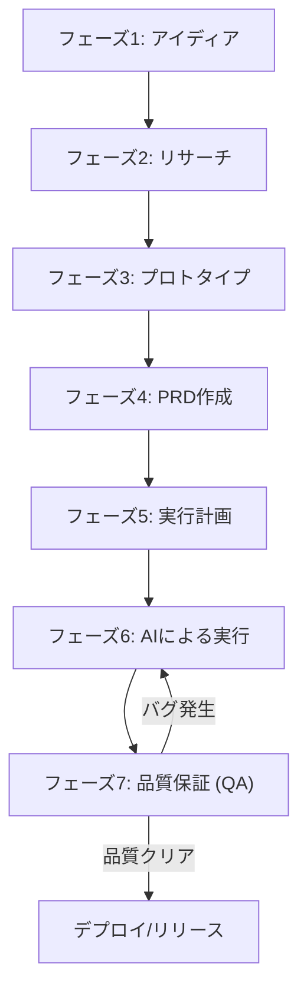

---

tags:
  - type/youtube
  - cat/ai-agent
  - topic/claude
  - topic/coding
---

# The 7 phases of AI-driven development

## タイムライン
| フェーズ | タイムスタンプ | 概要 | 主な成果物・アクション |
| --- | --- | --- | --- |
| フェーズ1: Idea | [01:15] | 開発するアイディアを明確にするフェーズ | ユーザーの課題を解決する1〜2文の説明をドキュメント化する |
| フェーズ2: Research | [02:10] | 技術選定、API、ベストプラクティスを事前調査 | 調査結果を「research.md」としてリポジトリに保存しAIのハルシネーションを防止する |
| フェーズ3: Prototype | [03:20] | フォルダ構成や状態管理、UIなどの基本路線を確定 | 1〜2のクイックな試作版コードを作成し、自分のこだわりをAIに提示する |
| フェーズ4: PRD | [04:15] | 仕様を固める製品要件定義書（PRD） | エンドユーザーの挙動や設計決定、エッジケースを記載した「prd.md」を作成する |
| フェーズ5: Planning | [05:30] | PRDをもとに開発計画をタスクに分解 | カンバンボードで依存関係や並行処理タスクを整理したチケット群を準備する |
| フェーズ6: Execution | [06:45] | AIエージェントに自律的なコーディングを実行させる | AIエージェント（RalphやClaude Code）が各チケットを自動実装する |
| フェーズ7: QA | [07:40] | 実装されたコードをテスト・検証する最高重要フェーズ | AIによるテスト設計、人間によるレビューとテスト、修正のためのフィードバックループ |

## 文字起こし
[00:00] 皆さん、こんにちは。今回はAIを活用したソフトウェア開発における「7つのフェーズ」について、具体的かつ実践的に解説します。私は日頃からClaude CodeなどのAIコーディングアシスタントを使用していますが、AIに丸投げしてコードがスパゲッティ化してしまう、いわゆる「バイブコーディング（Vibe Coding）」に陥らないための確固たるプロセスを確立しました。このフレームワークは、AI時代であってもエンジニアリングの基本がいかに重要であるかを示しています。それでは、早速その7つの段階を見ていきましょう。

[01:15] 【フェーズ1：アイディア（Idea）】 すべてはシンプルなアイディアから始まります。「新しいアプリを作りたい」「新機能を追加したい」「バグを修正したい」、あるいは「コードベースをリファクタリングしたい」といった目的です。ここでの最大の罠は、すぐにコードを書き始めてしまうことです。AIを使う場合でも同様です。まずは、そのアイディアがユーザーのどのような課題を解決するのかを、1〜2文の明確な文章として書き出すことから始めましょう。

[02:10] 【フェーズ2：リサーチ（Research）】 多くの開発者がAIを使う際にスキップしがちな、極めて重要な段階です。ライブラリの選定、APIの仕様、ベストプラクティスの調査、あるいは複数の技術的アプローチの比較検討を行います。調査結果は research.md などのファイルとしてリポジトリ内に「キャッシュ」しておくのがベストです。そうすることで、後からAIエージェントがそれを読み込み、事実に基づいた正確なコードを出力できるようになり、ハルシネーション（嘘の出力）を強力に防ぐことができます。

[03:20] 【フェーズ3：プロトタイプ（Prototype）】 次はプロトタイプです。ここでは「自分のこだわりや好み（Taste）」をAIにインプットするために、1〜2のプロトタイプを迅速に作成します。これはデザインだけでなく、フォルダ構成や状態管理（State Management）、外部サービスとの統合など、ソフトウェアアーキテクチャの方向性を決める上でも必須です。本制作（PRD作成）に入る前に、具体的なフィードバックや手応えを得るための最速のアプローチとなります。

[04:15] 【フェーズ4：PRD（製品要件定義書）】 プロトタイプで方向性が決まったら、プロジェクト全体の「最終設計図」となるPRD（Product Requirements Document）を作成します。ここには、エンドユーザーが体験する挙動、選択した技術的設計、考慮すべき重要なエッジケース、そしてパフォーマンスやセキュリティといった非機能要件を明確に記載します。Matt氏はこれらをGitHub IssuesやLinearに記述することを推奨しています。そうすることで、次の段階でタスク管理が容易になるからです。

[05:30] 【フェーズ5：実行計画の策定（Implementation Planning）】 PRDをもとに、具体的な作業を細分化したタスク（チケット）に分解します。GitHub ProjectsやLinear、Notionなどのカンバンボードを活用し、タスク間の依存関係（どれを先にやるべきか）や、並行して進められるタスクを整理します。この事前のプランニングがあるからこそ、AIエージェントが自律的にタスクを処理する（Loopを実行する）際に迷子にならず、目的の方向に進むことができます。

[06:45] 【フェーズ6：実行（Execution）】 ここでようやく、自律型AIエージェント（Matt氏の開発するRalph、あるいはClaude Codeなど）を本格的に稼働させます。カンバンボードに並んだチケットをAIが1つずつ自動で実装していきます。人間が並行して別の作業を進めることも可能です。Matt氏は「実行（コーディング）は、全開発プロセスのわずか1/7に過ぎない」と強調しています。事前の準備が完璧であれば、AIに完全自動（AFK - Away From Keyboard）で任せても、極めて高品質な結果が得られます。

[07:40] 【フェーズ7：品質保証（QA）】 最後に、最も重要と言っても過言ではない品質保証（QA - Quality Assurance）フェーズです。QAを怠れば、それまでの準備はすべて無駄になります。まずAIにテストケース（QAプラン）を自律的に作成させ、その後は「人間（あなたやシニアエンジニア）」がしっかりとコードレビューと動作確認を行います。テストを実行してバグが見つかれば、再び実行フェーズに戻って修正させます。この「Human-in-the-loop（人間の介入）」が、長期にわたって持続可能なコードベースを維持するための鍵です。

[08:50] 【結論とアクションプラン】 以上がAI駆動開発の7つのフェーズです。このルールに従うことで、コードベースを汚すことなく、高速かつ高品質にプロダクトをデリバリーできるようになります。今日から実践するために、すべてのプロジェクト内に research.md、prd.md、qa-plan.md、そしてタスク管理フォルダなどのテンプレートを用意しましょう。AIは優れたエンジニアを代替するものではなく、優れたエンジニアを「スーパーエンジニア」に進化させる強力な相棒です。ご視聴ありがとうございました。

## 概要
Matt Pocock氏による、AIコーディングアシスタント（Claude Code、Cursor等）を活用して高品質なソフトウェアを持続的に開発するための「7つのフェーズ（段階）」のフレームワークの解説。単に直感でコードを書く「バイブコーディング」から脱却し、従来のエンジニアリングの規律をAI開発に適用する手法を提案しています。
主なポイント：
1. **アイディアから要件定義へ**: すぐにコーディング（実行）するのではなく、アイディア、リサーチ、プロトタイプ、PRDといった「事前準備」に大半のフェーズを割く。
2. **実行はプロセスの1/7**: 開発環境で自律型AIを動かす「実行」段階は全体の1ステージに過ぎず、事前の入念な設計とタスクの細分化があってこそ高い成果を上げる。
3. **人間の目による品質保証**: 最終段階としてのQAとコードレビューには必ず人間が介在（Human-in-the-loop）し、持続可能でクリーンなコードベースを保つ。

## 構成図 (Mermaid)

