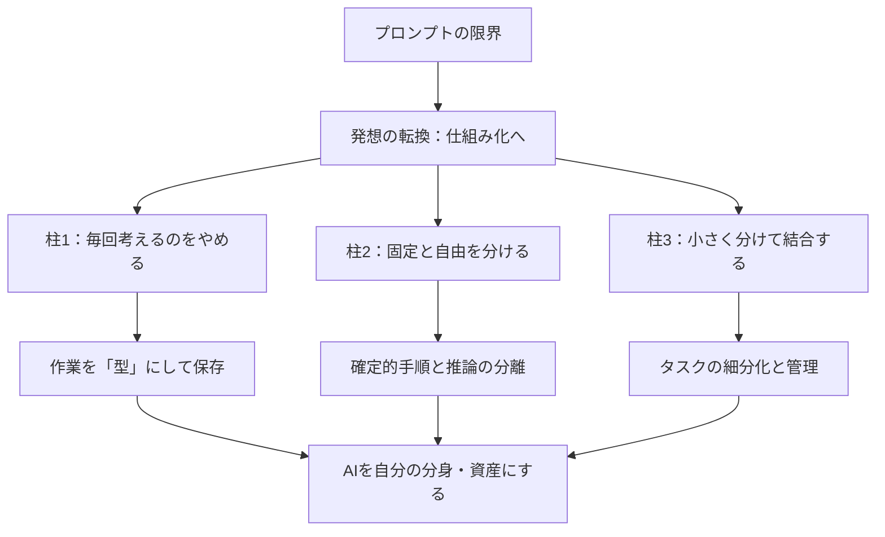

---

tags:
  - type/youtube
  - cat/ai-agent
  - topic/automation
  - topic/investment
---

# [AI Practical Intermediate Course Part 1] Move Beyond Prompting: Use "Templates" and "Automation"...

## タイムライン
| 時間 | 項目 | 内容の要約 |
| :--- | :--- | :--- |
| [00:00] | 導入：プロンプトの限界 | コ先のテクニックを覚えるよりも、繰り返す作業を「型」として保存する仕組み化へのマインド転換が最重要であることを解説。 |
| [01:50] | 第1の柱：毎回考えるのをやめる | 都度プロンプトを作る「手づかみ漁師」から、型をファイル（SKILL.md等）に固定して資産として育てる「網を仕掛ける漁師」への移行を推奨。 |
| [03:45] | 第2の柱：固定と自由を分ける | 毎回出力がブレる問題を解決するため、決まりきった手順（固定）と、AIに考えさせる推論（自由）を切り分ける方法を説明。 |
| [06:20] | 第3の柱：小さく分けて組み合わせる | 巨大な指示を1つ投げるのではなく、タスクを複数シェフのように細分化し、不具合時の原因特定と管理を容易にする設計を解説。 |
| [08:15] | 結論：AIを自分の資産にする | 一問一答の便利ツールとして消費するのではなく、自分の仕事のやり方をAIに覚えさせて「仕組み」として資産化する本質的な意義を提示。 |

## 文字起こし
[00:00] 【導入（プロンプトの限界）】
AIのプロンプトのコツをまとめた記事は世の中に溢れていますが、正直そのような細かいテクニックを100個読んだとしても、あなたのAIの使い方は本質的には変わりません。多くの人は、毎回AIに投げるお願い文（プロンプト）をゼロから悩んで考えています。しかし、本当に効果を発揮するのは言い回しのテクニックではなく、「繰り返す作業を型にしてファイルで残す」という発想の転換です。これまでの「川に入って手づかみで魚を1匹ずつ追いかける漁師」から、「網を仕掛けて待つ漁師」へ変わる必要があります。使うたびにその型が自動的に育ち、1ヶ月後のAIは使い始めた初日よりも明らかに賢くなっています。この動画では、プロンプトを毎回考えるのをやめ、AIを自分の分身として育てていくための3つの柱を具体的に解説します。

[01:50] 【第1の柱：毎回プロンプトを考えるのをやめる】
私たちが日常で行っている仕事の大半は、実は「繰り返し」の作業です。メールの作成、文章の要約、データの分類など、毎回全く新しいことをしているわけではなく、似たような業務を形を変えて繰り返しています。毎回プロンプトを1から考えて入力する行為は、まさに1匹ずつ魚を追いかけるような非効率な方法です。これでは作業品質が毎回ブレてしまい、実務での信頼性が失われます。そこで、繰り返す作業を「型（テンプレート）」としてファイル（Anthropicのエンジニアが提唱する「SKILL.md」など）に保存し、AIに読み込ませて再利用する「仕組み」を構築します。これにより、使うたびに指示が最適化され、AIを強力な資産として積み上げていくことが可能になります。プログラミングの知識がなくても、コード化や型の作成自体をAI自身に指示して作成させれば問題ありません。

[03:45] 【第2의 柱：固定する部分と任せる部分を分ける（仕組みの重要性）】
一般的なプロンプト術では言葉の選び方や言い回しが重視されますが、実務で決定的に重要なのはその裏にある「仕組み」です。AIにすべてを考えさせようとすると、毎回出力がブレる不確実性の問題に直面します。これを解決するために、プログラミングのように「同じ入力をすれば必ず同じ答えが返る部分（固定する手順・ルール）」と、「AIに自由に推論・思考させる部分（任せる部分）」を明確に切り分けます。決まりきったフォーマットや検証のステップはあらかじめガチガチに固定して定義しておき、創造的な思考が必要なコア部分だけをAIに任せることで、実務で使い物になるブレのない一貫した高品質なアウトプットを毎回得ることができるようになります。

[06:20] 【第3の柱：小さく分けて組み合わせる】
どれだけ高度な指示であっても、1つの巨大なプロンプトで全ての工程を一度に処理させようとすると、AIは指示の一部を忘れたり精度が極端に低下したりします。これを防ぐために、全体の業務プロセスを小さく分解し、それぞれのステップを順番に組み合わせて実行する「ワークフロー」を設計します。これは、1人の万能なシェフに全ての料理を一から十まで任せるのではなく、「食材を刻むシェフ」「調理するシェフ」「盛り付けるシェフ」のように役割を細分化して分業させるイメージです。このように小さく切り分けることで、出力に問題が生じた際にも「どのステップでバグが起きたか」を容易に特定でき、そのプロセスだけを修正・入れ替えることが可能になります。

[08:15] 【結論と本質的なマインドセット】
今回解説した「毎回考えるのをやめる」「固定と自由を分ける」「小さく分けて組み合わせる」という3つの柱は、すべて「AIに毎回お願いするスタンス（一問一答）をやめ、自分の仕事のやり方を覚えさせて仕組み化・資産化する」という1つの本質的な考え方に集約されます。プロンプトが上手いかどうかという些細な技術の差ではなく、AIを自分の分身・仕組みとして捉えられるかという視点の有無が、今後の生産性に劇的な違いをもたらします。次にAIを動かす際は、どう書くか悩む前に「これは以前やった繰り返しの作業ではないか？」と立ち止まって気づくことから始めてみてください。それが網を仕掛ける漁師への確実な一歩となります。

## 概要
本動画は、Claudeを開発するAnthropicのエンジニアの思想に基づき、プロンプトの小手先のテクニック（言い回し）に頼るのをやめ、AIを実務の「仕組み」として資産化・自動化するための根本的な考え方を解説しています。

【主なキーポイント】
1. 毎回プロンプトを考えない：日々の繰り返す業務を「型（テンプレート）」としてファイルに固定して保存し、一からプロンプトを打つ「手づかみ漁師」から「網を仕掛ける漁師」へとマインドを切り替える。
2. 固定と自由の切り分け：出力のブレ（不確実性）を防ぐため、確定的な手順・ルールを固定し、AIには推論が必要なコア部分のみを任せることで、一貫した高品質な成果物を生み出す。
3. 小さく分解して組み合わせる：1つの大きな指示ではなく、タスクを小さな工程に細分化して組み合わせる（分業制）ことで、バグや精度の低下を防ぎ、修正や運用の管理を劇的に容易にする。

## 構成図 (Mermaid)

