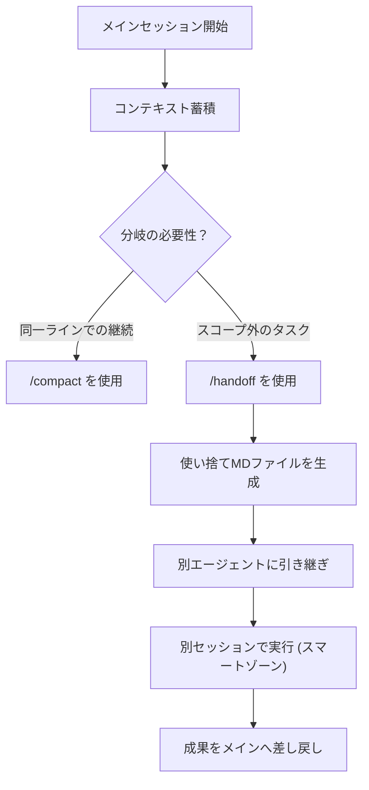

---

tags:
  - type/youtube
  - cat/ai-agent
  - topic/automation
---

# /handoff is my new favourite skill

## タイムライン
| 時間 | セクション | 概要 |
| --- | --- | --- |
| 00:00 | handoff スキルの発見 | 開発者Matt PocockがAIコーディング作業の並行管理を可能にする/handoffスキルを紹介。 |
| 01:36 | コンテキストウィンドウと compact の解説 | LLMのスマートゾーンとダムゾーンの違い、/compactスキルによるコンテキスト維持の仕組み。 |
| 04:49 | handoff が compact と異なる理由 | compactは同一セッションの継続用、handoffは並行するサイドタスク用の分岐ツール。 |
| 06:14 | grilling セッションでの使用 | メインセッションのコンテキストを汚さず、別エージェントに認証問題などの別タスクを渡す。 |
| 07:20 | prototype への handoff | 派生エージェントで作成したプロトタイプの成果を再度handoffして元のプランナーに戻す。 |
| 09:23 | クロスエージェントの利点 | 独自のDIYサブエージェント構成により、複数のコンテキストウィンドウで効率よく作業。 |
| 09:50 | 設計上の決定事項 | ファイル保存先をOSの一時フォルダにすることや、次のセッションに必要なおすすめスキルを自動提示する設計。 |
| 11:44 | まとめとコース情報 | AIエンジニア向け講座の紹介、コミュニティの案内、今後開発されるスキルの展開について。 |

## 文字起こし
[00:00] 皆さんこんにちは。今回は、私の最もお気に入りの新しいスキルである「/handoff」についてご紹介します。AIコーディングセッションを別々のエージェントに引き渡すことで、作業のコンテキストをどのように整理し、並行して進めることができるのかを深く掘り下げていきます。私がこのスキルを構築した理由、そして既存の「/compact」コマンドと何が違うのか、そして実際に複数のAIセッションを同時に管理するための実践的なワークフローパターンをお見せします。現在、私は自身のコーディングプラクティスを再利用可能なスキルとしてパッケージ化しており、公開しているリポジトリは非常に多くのエンジニアに注目されています。

[01:36] まず、この「/handoff」スキルを作った理由と、既存の「/compact」という機能との違いについて、コンテキストウィンドウの観点から解説します。AIとコーディングセッションを進める際、会話を重ね、ツールの実行やファイルの編集を行うにつれて、コンテキストウィンドウはトークンでどんどん満たされていきます。現在、私が使っている「Claude Code」などのツールでは、100万トークンという非常に大きなコンテキストウィンドウが提供されています。しかし、このウィンドウ内には、AIが最も高いパフォーマンスを発揮できる「スマートゾーン（賢い領域）」と、注意（アテンション）の関係性が希薄になり、処理効率が落ちる「ダムゾーン（鈍い領域）」が存在します。トークン数が少なければ少ないほど、AIは正確かつ迅速に処理を行えます。

[04:49] では、このスマートゾーンを維持したまま、会話を長く続けるにはどうすればいいでしょうか。そこで使われるのが「/compact」スキルです。これは会話が長くなり、ダムゾーンに近づいた際、これまでの対話履歴を自動的に要約し、新しいクリーンなセッションに引き継ぐ仕組みです。これにより、スマートゾーンへ戻ることができます。しかし、「/compact」を繰り返すと、過去の要約が層のように重なり、セッションが徐々に非効率になることがあります。また、これは「単一のセッション」を長く続けるためのものであり、セッションの途中で全く別のタスク（リファクタリングなど）を見つけた場合に対応できません。現在のコンテキストに無関係なタスクを混ぜると、AIの賢さが薄れてしまうからです。

[06:14] そこで「/handoff」スキルが活躍します。「/handoff」は、現在のセッションを丸ごと要約するのではなく、新しく分岐させたいタスクに関連する「一部のコンテキスト」だけを抽出し、一時的なMarkdownファイルとして保存します。これにより、元のセッションのコンテキストを一切汚すことなく、新しいクリーンなエージェントを立ち上げてサイドクエストを実行できます。たとえば、設計プランを詰めるための「grilling（質問攻め）」セッションを行っている最中に、認証周りのリファクタリングが必要になったとします。このとき、メインのgrillingセッションをそのまま維持しつつ、認証タスクだけを「/handoff」で別セッションに切り出すことができるのです。

[07:20] このようにして切り出された別セッションのエージェントは、独自のスマートゾーンを維持しながら、特定のタスク（例えばプロトタイプUIの作成）に集中して取り組むことができます。作業が完了したら、その別エージェントが再び「/handoff」を実行して成果を一時ファイルに圧縮します。そして、その成果を元のプランナーセッションへと差し戻し、メインの流れに統合するのです。この「メインセッションからサブセッションへhandoffし、そこでの成果を再度handoffしてメインに戻す」というパターンは、非常に強力なクロスエージェントのコラボレーション手法となります。

[09:23] このアプローチの最大の利点は、コンテキストウィンドウを汚染から守りながら、まるで自分だけの「DIYサブエージェント」を構築しているかのように振る舞える点にあります。1つのタスクに特化した賢いコンテキストウィンドウを一時的に作り出し、その知見を親セッションへと持ち帰ることで、AIエージェントのパフォーマンスを極限まで引き出すことが可能です。特に放置型の「AFK（離席中）自動開発」などにおいて、極めて豊かな開発パターンを実現してくれます。

[09:50] この「/handoff」スキルの設計思想について、いくつかの重要な決定事項をお話しします。まず、生成されるhandoff文書は、開発中のコードベース（ワークスペース）ではなく、ユーザーのオペレーティングシステム（OS）の一時ディレクトリに保存されるように設計しました。これは、gitのコミット対象に含まれないようにするためです。さらに、handoff文書の中には「おすすめのスキル」セクションが自動的に含まれるようになっており、新しいセッションを立ち上げた際に、どのようなコマンド（例えばドキュメントを参照したリファクタリング、デバッグなど）を自動で呼び出せばよいかをAI自身に提案させます。これにより、次のセッションをスムーズに立ち上げることができます。

[11:44] まとめとして、この「/handoff」は、分岐するワークフローや複雑なマルチエージェント開発を整理するための素晴らしい手段です。今回の動画で紹介した技術やアプローチについて、さらに深く学びたい方は、6月1日からスタートする「AI Coding For Real Engineers」のコホート講義をぜひチェックしてください。現在割引も実施しています。また、Discordコミュニティへの参加や、Twitterでのフォローもお待ちしております。今回の内容が皆様のAIコーディングワークフローの効率化に役立つことを願っています。ありがとうございました。

## 概要
開発者のMatt Pocock氏が、AIコーディングの生産性を最大化するためのオープンソーススキルライブラリから、自身の新しいお気に入りである「/handoff」スキルを徹底解説する動画です。大規模言語モデル（LLM）には、トークン数が少ない「スマートゾーン」と、トークンが増えて注意力が低下する「ダムゾーン」があります。従来の「/compact」は同一の対話スレッドを要約して継続するのに適している一方、「/handoff」は全く異なるサイドタスクを元のコンテキストを汚さずに別エージェントへ分岐（ブランチ）させるのに最適です。一時フォルダにクリーンなMarkdown形式でコンテキストを書き出すことで、必要な時だけサブエージェントを立ち上げ、その成果を再度メインセッションにマージし戻すという、高度なマルチエージェント型ワークフローを実現します。

## 構成図 (Mermaid)

