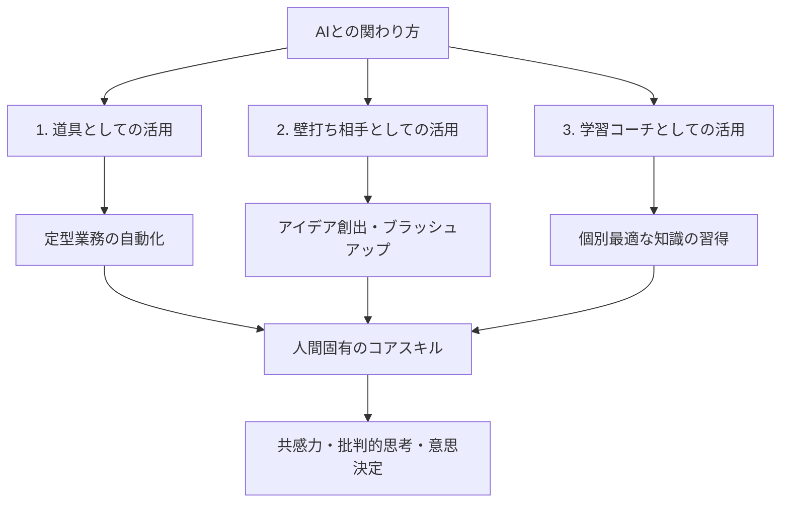

---

tags:
  - type/youtube
  - cat/ai-agent
  - topic/automation
  - topic/mindset
---

# 【AI時代の生存戦略】生成AIと共存するための「AIとの関わり方」とスキル構築

  

## 概要

急速に進化する生成AI時代において、個人が生き残り活躍するための「AIとの関わり方」を体系的に解説した動画です。AIを敵視するのではなく、協働パートナーとして捉え直す重要性を提唱しています。具体的には、AIを「効率化の道具」「アイデアの壁打ち相手」「学習のコーチ」という3つの役割で活用する方法を紹介。一方で、人間独自の強みである「共感力」「批判的思考」「意思決定力」を磨くことの必要性を説き、AIを自らの能力を拡張するツールとして主体的に使いこなす姿勢こそが、これからの時代の生存戦略であると結論づけています。

  

## タイムライン

| 時間 | テーマ | 概要・キーポイント |

| --- | --- | --- |

| 00:00 | オープニング | AIの急速な進化と多くの人が抱える将来への不安 |

| 01:30 | AIと競うのではなく協働する | AIに仕事を奪われるという誤解を解き、共存の道を示す |

| 03:00 | AIとの関わり方：3つの役割 | 道具としての活用、壁打ち相手としての活用、学習コーチとしての活用 |

| 06:00 | 人間にしかできないコアスキル | 批判的思考、共感力、最終的な意思決定力の重要性 |

| 08:30 | まとめとアクションプラン | AIを強力な相棒として迎え入れ、自身の能力を拡張する生存戦略 |

  

## 構成図 (Mermaid)

  

## 文字起こし

皆さん、こんにちは。今回は『AI時代の生存戦略』として、急速に進化する生成AIと私たちがどのように向き合い、共存していくべきか、その具体的な『AIとの関わり方』についてお話しします。最近、ChatGPTやClaudeなどの登場により、自分の仕事が奪われるのではないかと不安を感じている方も多いのではないでしょうか。しかし、これからの時代に重要なのは、AIと競うことではなく、AIをパートナーとしていかに協働するかです。具体的には、AIとの関わり方には3つのレベルがあります。まず1つ目は『道具としての活用』です。定型業務やデータ整理などをAIに任せることで、作業効率を劇的に向上させます。2つ目は『壁打ち相手としての活用』です。新しいアイデアの創出や企画のブラッシュアップの際に、AIに意見を求めることで、思考を深めることができます。そして3つ目は『学習のコーチとしての活用』です。わからない概念や新しい技術を学ぶ際に、AIにパーソナルな先生として質問を重ねることで、効率的にスキルを身につけることができます。このようにAIを使いこなす一方で、人間にしかできない『批判的思考』や『共感力』、そして『意思決定』といったコアスキルの重要性はさらに高まっています。AIを恐れるのではなく、自身の能力を拡張する強力な相棒として迎え入れること。これこそが、これからの時代を生き抜くための鍵となります。それでは、具体的な活用方法を順に見ていきましょう。