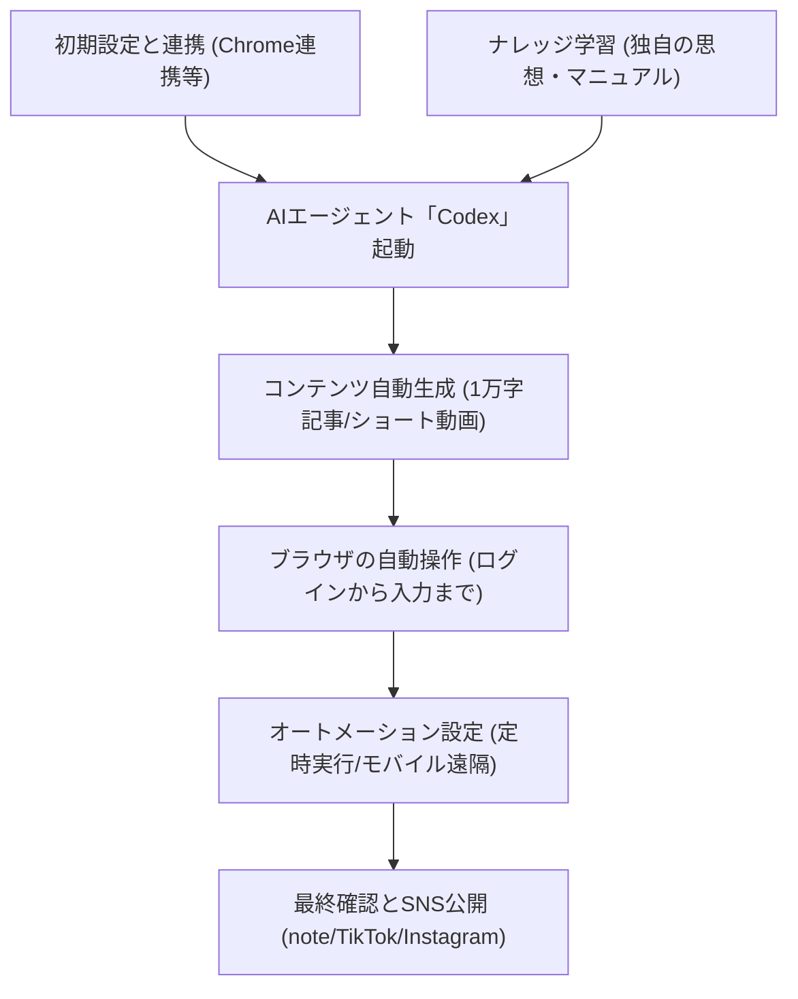

---

tags:
  - type/youtube
  - cat/ai-agent
  - topic/claude
  - topic/chatgpt
---

# 【超有料級】CodexでSNSを完全自動運用した結果がヤバすぎたw【OpenAI】

## タイムライン
| タイムスタンプ | トピック | 内容 |
| :--- | :--- | :--- |
| 00:00 | オープニング・自動化の全体像 | AIエージェント「Codex」を用いたSNS完全自動運用の概要を紹介。 |
| 00:28 | SNS運用の課題と自動化のメリット | 手間や時間のかかるSNS運用を自動化し、稼働時間ゼロにする価値を提示。 |
| 01:44 | 実際の運用実績と自動投稿の事例紹介 | Codexを使って実際に完全自動でフォロワーを増やしリスト獲得した実績を公開。 |
| 05:13 | なぜClaudeCodeではなくCodexを使うのか | コスト面を比較し、無料で手軽に始められるCodexのメリットを解説。 |
| 06:02 | Codexのセットアップ、Chrome連携の手順 | Codexのダウンロードと、ブラウザ操作に必要なChrome連携のセットアップ手順を説明。 |
| 07:19 | noteへの自動投稿デモ（1万文字記事） | Codexが1万字超の記事を自動作成し、noteへ自動ログインして下書き保存する一連の流れを実演。 |
| 10:55 | AIライティングの品質と思想の反映方法 | 自身の思想やマニュアルをAIに学習させ、オリジナリティと高品質を担保する方法を解説。 |
| 13:32 | オートメーション機能で完全無人投稿を設定 | 定期的なスケジュール実行機能により、人間が介在せずに決まった日時に自動投稿する設定を説明。 |
| 15:02 | Codex mobileでスマホからリモート操作 | スマホから遠隔でPC上のCodexに指令を送り、自動化プログラムを実行・監視する方法を実演。 |
| 16:41 | 動画媒体（TikTok、Instagram）への自動投稿 | テキストだけでなく、切り抜き動画やAI動画生成プラグインを使ったショート動画運用の自動化を紹介。 |
| 19:41 | まとめ・SNS自動化で時間とコストを削減 | 導入方法と公式LINEから手に入るプロンプトやガイドブックなどの無料プレゼント情報を案内。 |

## 文字起こし
[00:00] **オープニング・自動化の全体像**
みなさんこんにちは。AIエージェントチャンネルのKawaruです。今回は、OpenAIの強力なAIエージェント「Codex」を使って、SNSを完全自動で運用する恐るべき方法について、実演を交えながら詳しく解説していきます。

[00:28] **SNS運用の課題と自動化のメリット**
多くの方がSNSの毎日投稿や運用の手間、文章作成のコストに悩まされているかと思います。従来であれば、記事の執筆からプラットフォームへのログイン、見出しの装飾、投稿まで人間が行う必要がありましたが、今回の自動化の仕組みを導入することで、人間の稼働時間をほぼゼロにして効率的にリスト獲得や認知拡大ができるようになります。

[01:44] **実際の運用実績と自動投稿 of 事例紹介**
私たちが実際にCodexで運用したアカウントの実績を紹介します。自動投稿によって、私自身の稼働時間はほぼ0分であるにもかかわらず、フォロワーやYouTubeの再生数が着実に増加しています。また、noteでも1万字を超える網羅的な長文記事を太字や見出し、ハッシュタグまですべて自動でフォーマットを整えた状態で生成し、リスト獲得につなげる仕組みを構築しています。

[05:13] **なぜClaudeCodeではなくCodexを使うのか**
よく比較されるAIツールとしてAnthropicの「Claude Code」がありますが、なぜ今回の自動化にCodexを使うのかというと、コストの面が挙げられます。Claude Codeは最低でも月額3,000円ほどのランニングコストが必要になりますが、Codexは無料で始めることができるため、特に初期コストを抑えてSNS運用をスモールスタートしたい方に非常におすすめです。

[06:02] **Codexのセットアップ、Chrome連携の手順**
それでは、Codexのセットアップ方法について説明します。ダウンロードは非常に簡単で、デスクトップアプリ版やエディター、ターミナル連携が可能です。今回はブラウザの操作を行うため、Codex in Chromeの機能拡張を連携させ、AIがブラウザを直接操作できるようにセットアップを行います。詳細な手順や初期設定ガイドは、LINE公式アカウントのプレゼントとして配布しています。

[07:19] **noteへの自動投稿デモ（1万文字記事）**
実際のnote自動投稿のデモをお見せします。あらかじめログイン設定を済ませておいたCodexに対し、「noteに投稿する記事の作成と公開準備」をプロンプトで指示します。Codexは指示を受けると自動的に記事情報を構成し、約30秒ほどで1万字以上の見出し・太字・ハッシュタグ付きの記事を作成します。そして、ブラウザ経由でnoteにログインし、新規投稿画面を開いて自動で内容を流し込みます。最後の「公開」ボタンの手前でAIが処理を一時停止し、人間が最終確認を行ってから投稿できるように設計してあります。

[10:55] **AIライティングの品質と思想の反映方法**
「AIが書いた文章は品質が低いのではないか」という懸念もあるかと思います。しかし、自身の過去の知見やオリジナルな思想をあらかじめナレッジベース（マニュアル）としてCodexに読み込ませておくことで、単なる一般論ではない、魂の込もったクオリティの高い長文記事を量産できるようになります。これにより、信頼性の高い情報を一瞬で構築することが可能です。

[13:32] **オートメーション機能で完全無人投稿を設定**
さらに高度な運用をするために「オートメーション」という機能を紹介します。これを使えば、毎朝決まった時間（例：朝10時や11時）に、人間がパソコンの前にいなくてもAIが自動的に記事を作成し、そのまま配信する「人間不在」の仕組みを完全に構築できます。

[15:02] **Codex mobileでスマホからリモート操作**
また、「Codex mobile」機能を使うことで、外出先からでもスマートフォン経由で、自宅やオフィスにあるPC上のCodexをリモート操作することが可能です。スマホから1タップで自動投稿スクリプトを走らせ、完了ステータスを確認することができます。

[16:41] **動画媒体（TikTok、Instagram）への自動投稿**
さらに、文章だけではなくTikTokやInstagram、YouTubeショートといった動画媒体への自動投稿も可能です。YouTubeの文字起こしデータをCodexに読み込ませ、切り抜き用のスクリプトを実行。HeyGenやHyperframe、Remotionなどの動画生成プラグインを組み合わせることで、自動で字幕やアニメーション、音声が付いた動画を生成し、SNSへ直接公開する仕組みも構築可能です。

[19:41] **まとめ・SNS自動化で時間とコストを削減**
最後にまとめです。Codexを活用すれば、記事の企画・作成から投稿、さらにはショート動画の自動生成までを驚くほどシームレスに自動化でき、マーケティングにかかる時間とコストを劇的に削減できます。今回の動画で紹介した各種プロンプトや、Codex・Claude Codeの導入ガイドといった有料級の特典は、概要欄の公式LINEから無料でプレゼントしていますので、ぜひ登録して受け取ってください！

## 概要
OpenAIの先進的なAIエージェント「Codex」を活用し、SNS運用（noteやTikTok、Instagram等）を完全に自動化・無人化する実践的な手法を解説する動画です。独自の思想やナレッジをAIに読み込ませて1万字超の長文記事を自動執筆する仕組みや、Chrome拡張機能を介したブラウザの自動ログインと記事の入稿、さらにショート動画を自動生成して自動投稿する最新フローまで、デモを交えて実演。無料から開始可能なCodexを活用し、マーケティング業務における人間の稼働時間を実質ゼロにしつつ、効果的に認知やフォロワーを拡大するノウハウを体系的にまとめています。

## 構成図 (Mermaid)

