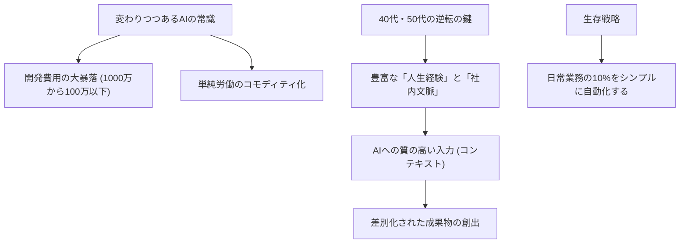

---

tags:
  - type/youtube
  - cat/ai-agent
  - topic/productivity
---

# 【逆転が始まる】AI時代に急に開花する40代と静かに淘汰されていく人の違いを現場目線で話す

  

## 概要

本動画では、生成AIの急速な普及に伴い、ビジネス現場で始まっている「静かで暴力的な淘汰」の実態と、その中で40代・50代のミドルシニア層が劇的な逆転を遂げるための戦略が語られています。かつて1000万円クラスだったシステム開発がAIの活用で100万円以下に下落するなど、価格破壊と知的労働のコモディティ化が進む中、生き残る鍵は「人生経験」と「独自の文脈（コンテキスト）」です。Web上の一般情報ではなく、個人の実務経験や社内の人間関係、独自のデータをAIにインプットすることで、差別化された高い価値を生み出せます。複雑なシステム構築やプロンプト設定は避け、まずは日常業務の10%をシンプルにAI化して時間を浮かせることが推奨されています。

  

## タイムライン

| 開始時間 | テーマ | 概要 |

| --- | --- | --- |

| 0:00 | OP | 動画の趣旨説明とAI時代におけるサバイバルの問題提起 |

| 0:38 | 変わりつつあるAIの常識 | AI前提のコーディングによるシステム開発費用の劇的な変化 |

| 3:35 | 受注金額や売上への影響は？ | 1000万円の案件が100万円以下に下落するなどの価格競争の始まり |

| 4:31 | ホワイトカラー業界は大きく変わる | 単純知的労働の価値が低下し、コモディティ化が進む業界の現状 |

| 7:26 | 「人生経験」が武器になる | 40代以上の持つ生きた実務経験や人間関係の理解がAI活用の最大の強みになる理由 |

| 10:34 | 仕事でAIに強くなるには？ | 複雑な設定ファイルを避け、シンプルに構築することの重要性 |

| 19:55 | AIと融合の本質 | 自身の判断軸と独自の経験をAIに落とし込むアプローチ |

| 21:03 | 「経験がない大人」はどうすればいい？ | 自身の時間の使い方に敏感になり、経験を圧縮して蓄積する方法 |

| 22:52 | AI推奨は「ポジショントーク」？ | ブームに惑わされず、実利的な効果を見極める視点 |

| 26:33 | AIを仕事で使うときのポイント | Webの一般情報ではなく、社内データや個人のコンテキストを入力することの価値 |

| 34:22 | 今から観るべきAI仙人の動画は？ | 実務に即したAI活用をさらに深く学ぶための推奨過去動画の紹介 |

| 36:10 | 「AI仙人流」は本当に正しい？ | 現場での実践に基づいた独自アプローチの妥当性の解説 |

| 39:43 | 視聴者からの質問返し仙人 | AIエージェントや業務効率化に関する視聴者からの質問への回答 |

  

## 構成図 (Mermaid)

  

## 文字起こし

はい、皆さんこんにちは。AI仙人です。今回はですね、『AI時代に急に開花する40代と静かに淘汰されていく人の違い』について、現場のリアルな目線からお話ししていきたいと思います。最近、ビジネスの現場では『静かな、しかし暴力的な淘汰』が始まっています。これまで私たちが信じてきた『仕事の価値』が、生成AIの登場によって根底から覆されようとしているのです。まずは変わりつつあるAIの常識についてお話しします。例えば、これまでは社内用のシステム開発やホームページ作成を見積もると、普通に1000万円ほどかかっていた案件がありました。それが、AI前提のコーディング（UIをシンプルにするなど工夫する）に切り替えるだけで、200万〜300万円程度まで圧縮できるようになりました。さらに驚くべきことに、現在では競合他社が同じ要件を『100万円以下』で提示してくるようなケースが実際に発生しています。AIによる圧倒的な生産性向上を武器に、価格破壊を仕掛ける業者が現れ始めているのです。これはホワイトカラー業界全体に大きな変化をもたらします。今までは『AIを使って業務を効率化し、自分の利益率を上げよう』という段階でしたが、すでに『自分の限界ギリギリの低価格で提案し、競合を潰す』という激しい価格競争のフェーズに突入しています。こうした時代において、長年スキルを磨いてきた30代後半から50代のミドルシニア層は残酷な現実に直面する一方で、実は『強烈な武器』を手に入れたことになります。それが『人生経験』と『独自の文脈（コンテキスト）』です。AIが出力するアウトプットの質は、入力される文脈の深さに依存します。Web上に転がっているような誰でも知っている一般論をAIに渡しても、AIはすでにそれを学習しているため、平凡な回答しか返ってきません。しかし、40代・50代が持つ『長年の実務経験』『社内の人間関係のパワーバランス』『過去の失敗から得た教訓』『業界特有のクローズドなノウハウ』といった生きた文脈をAIに渡すことで、他の誰にも真似できない極めて実用的で解像度の高いアウトプットを生み出すことができるのです。では、仕事で具体的にAIに強くなるにはどうすればよいでしょうか。多くの人がやりがちな失敗として、Claudeの『claude.md』などの設定ファイルを100行も200行も書いて複雑にシステム化しようとすることが挙げられます。しかし、公式すら『難しい設定ファイルは書くな、シンプルにしろ』と推奨しています。複雑にしすぎるとバグの原因になります。大切なのは、手法の難しさにこだわることではなく、シンプルに早く作ること、そして『自分の判断軸を持つこと』『自分の経験を圧縮してAIに渡すこと』です。もし、現在特別な経験がないと感じている大人であっても、悲観する必要はありません。自分の時間の使い方に敏感になり、まずは日常業務の『10％』をAIで効率化することから始めましょう。例えば、簡単なホームページ作成や資料作成の手直しをAIに任せて、月に10時間を浮かせる。AIがさらに進化すれば、同じやり方で30時間、50時間を浮かせられるようになります。自社や自分だけの『独自のコンテキスト（会議の議事録、Slackのログ、自身の喋り方や思考の癖）』をAIに学習させ、自分の分身のように育てていくこと。これこそが、これからのAI時代に静かに淘汰される側から、劇的な逆転を遂げて開花する側へと回るための本質です。流行りの複雑なテクニックに惑わされず、まずは身近な業務の10％をシンプルにAI化していきましょう。