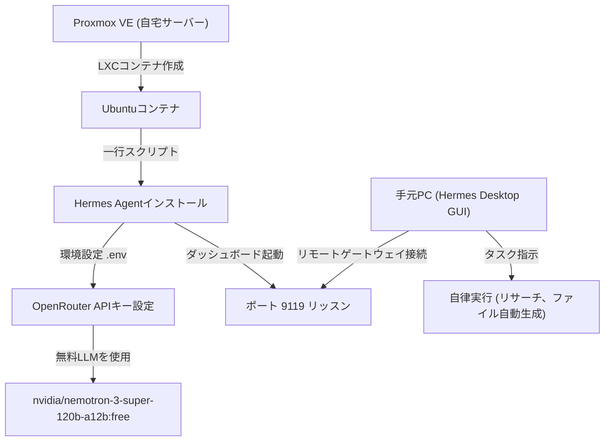

---

tags:
  - type/youtube
  - cat/ai-agent
  - topic/hermes
  - topic/coding
---

# タダで始めるAIエージェント！Hermes Agent入門 | Proxmox x Hermes Agent x Hermes Desktop

## タイムライン
| タイムスタンプ | セクション名 | 概要・解説内容 |
| :--- | :--- | :--- |
| [00:00] | はじめに | 自宅サーバーと自律AIエージェント「Hermes Agent」を組み合わせる意義や動画の全体像について解説 |
| [01:39] | Hermes Agentって | Nous Research開発の自律型AIエージェントの概要、Web検索・ファイル操作・コード実行等の機能を紹介 |
| [04:11] | システム構成 | Proxmox LXC、無料API（OpenRouter）、Hermes Desktopを連携させるネットワーク構造と全体設計を提示 |
| [06:29] | Hermes Agent 専用コンテナーの作成 | Proxmox上でUbuntuコンテナ（LXC）を新規作成し、固定IPや最小限のリソース設定を行う手順を解説 |
| [08:12] | Hermes Agentのセットアップ | LXCコンテナでの一鍵インストール、OpenRouter無料モデルの紐付け、ポート9119を用いた外部通信用ダッシュボード起動手順を解説 |
| [25:29] | Hermes Desktopのセットアップ | メインPC側へのGUIアプリ導入と、サーバー上のHermes Agentとのリモート接続・認証手順について解説 |
| [37:15] | AI部下に仕事を依頼する | Web上の情報収集からMarkdownレポートの保存まで、AIエージェントが自律的にタスクを完了する実演と挙動確認 |
| [43:08] | おわりに | 自宅サーバー型AIエージェント環境のメリットまとめと、チャンネル登録・高評価の挨拶 |

## 文字起こし
[00:00] 皆さんこんにちは、このはな技術室です。最近AIエージェントがとても話題ですよね。なかでも、自分の代わりに調べ物をしてくれたり、コードを写したり、自律的に動いてくれる「Hermes Agent」に注目が集まっています。しかし、これを常時稼働させようとすると、手元のPCの電気代が気になったり、起動しっぱなしにするのが難しかったりしますよね。今回は、自宅の小型PCにインストールしたProxmoxのLXC（Linuxコンテナ）環境を利用して、完全無料のLLMモデルも使いながら、タダでAIエージェントサーバーを構築する方法を詳しく解説します。さらに、新しくリリースされたデスクトップアプリ「Hermes Desktop」を使って、美しいGUIからリモートのAIエージェントに仕事を指示できるようにしていきましょう！

[01:39] ではまず、そもそも「Hermes Agent」とは何なのかについてお話しします。Hermes Agentは、Nous Researchが開発した、自分で課題を解決していく非常に強力なオープンソースの自律型AIエージェントです。ユーザーがチャットで大雑把な仕事を依頼すると、AI自身が考えて必要なツール（MCPなど）を呼び出し、Webで検索し、ファイルを読み書きし、さらにはプログラムを実行して結果を検証するという一連の作業を、裏で自律的に行なってくれます。まさに「AIの部下」を一人雇うような感覚で、複雑なリサーチや自動化タスクを24時間任せることができます。

[04:11] 今回のシステム構成を確認してみましょう。まず、自宅サーバーであるProxmox VEの上に、軽量なLXCコンテナとしてUbuntu 24.04環境を1つ立ち上げます。その中でHermes Agentのバックエンドを常に常駐動作させておきます。AIモデル（LLM）には、OpenRouterやNVIDIA NIMなどを利用して、無料で公開されている高性能なモデルを設定します。これにより、自宅サーバー側に高価なGPUを持っていなくても、API経由で完全に無料で自律AIを稼働させることが可能です。そして、私たちが普段使っているメインPC（WindowsやMac）に「Hermes Desktop」アプリをインストールし、ローカルネットワーク経由でLXCコンテナ上のダッシュボードに接続して、快適にGUI操作を行えるようにします。

[06:29] それでは実際に構築を始めていきましょう。ProxmoxのWeb管理画面を開き、Ubuntu 24.04のテンプレートをダウンロードして「LXCコンテナの作成」を行います。Helper Scriptなどを利用しても構いません。エージェントサーバー自体は非常に軽量に動作するため、リソース割り当てはCPU 2コア、メモリ 2GB〜4GB、ディスク容量は20GBもあれば十分に動きます。ネットワーク設定は、自宅のルーターからローカルIPを固定で割り当てられるようにブリッジ（vmbr0）を設定します。コンテナが立ち上がったら、SSHでコンテナに接続します。

[08:12] LXCコンテナにログインしたら、Hermes Agentのセットアップを行います。まずは公式のインストールコマンドを実行します。「curl -fsSL https://hermes-agent.nousresearch.com/install.sh | bash」を入力すると、Python、Node.js、ripgrep、ffmpegなどの依存パッケージと仮想環境が自動で一発構築されます。完了後、「hermes setup」を実行してセットアップウィザードを起動します。モデルプロバイダーの選択では「OpenRouter」を選び、事前に取得した無料のOpenRouter APIキーを入力します。モデルには「nvidia/nemotron-3-super-120b-a12b:free」などの優秀な無料モデルを選択します。次に、環境変数ファイル（~/.hermes/.env）を編集し、リモート接続用のセッショントークン（HERMES_DASHBOARD_SESSION_TOKEN）を任意の値で固定します。そして「hermes dashboard --host 0.0.0.0 --port 9119 --insecure」を実行して、外部からの接続用ダッシュボードポートをリッスン状態で起動させます。

[25:29] 次に、私たちが普段使用している手元のPC側のセットアップです。公式サイトからOS（WindowsやMac）に対応した「Hermes Desktop」をダウンロードします。以前はブラウザからアクセスするか複雑なSSHトンネルを掘る必要がありましたが、最新のHermes Desktopを使えば簡単にリモート接続が可能です。アプリの設定（Settings）の「Remote Connection（リモートゲートウェイ接続）」を開き、接続先URLに「http://<LXCコンテナのIPアドレス>:9119」を入力します。そして、コンテナ側の設定で決めたセッショントークンを貼り付けます。「Test connection」を押して問題なく接続できたら設定を保存します。これで、デスクトップアプリの美しい画面上で、自宅サーバー上で動いているHermes Agentと通信ができるようになります。

[37:15] セットアップが完了したので、実際に「AI部下」に仕事を依頼してみましょう！チャット欄から「今週の最新のAIニュースを日本語でリサーチし、まとめをニュースレター風のMarkdownファイルとして作成して」と指示を出します。すると、LXCコンテナ内のHermes Agentが動き出し、検索ツールを駆使して自律的にWebブラウジングを開始します。情報が載っているブログや記事に直接アクセスして要約し、内容に矛盾がないか検証した上で、コンテナ内の作業ディレクトリに綺麗な日本語のMarkdownファイルを自動生成してくれます。作業中のAIの思考プロセスやコマンド実行ログは、すべてリアルタイムでHermes Desktopの画面に流れていくため、進捗を眺めているだけでタスクが自動で完了します。

[43:08] いかがでしたでしょうか。今回は、自宅サーバーであるProxmox環境のLXCコンテナにHermes Agentをデプロイし、OpenRouter等の無料LLMを活用して、完全無料で自律AIアシスタントを常時稼働させる環境を構築しました。手元のPCの電源を切っても、サーバー側で重たい調べ物やプログラム作成をバックグラウンドで処理し続けてくれるため、非常に実用的です。皆さんもぜひ、自分だけの頼もしいAI部下を自宅サーバーに導入して、生産性を爆上げしてみてください。本日の動画が役に立ったという方は、ぜひチャンネル登録と高評価をよろしくお願いいたします。それでは、また次回の動画でお会いしましょう！

## 概要
本動画は、自律型AIエージェント「Hermes Agent」を自宅のProxmox VE上のLXC（Linux Container/Ubuntu）環境へデプロイし、無料LLMモデルをバックエンドに組み合わせて、手元のメインPCにインストールしたデスクトップアプリ「Hermes Desktop」からリモート操作する構成を解説した入門ガイドです。
主なポイントは以下の通りです：
1. 自律AIエージェントの常時稼働環境を、軽量なLXCコンテナ上に低リソース（CPU 2コア/メモリ 2〜4GB）で構築。
2. バックエンドLLMにはOpenRouterの無料枠（NVIDIA Nemotronモデル等）を活用し、高価なローカルGPUを持たずとも完全タダでエージェントを運用可能。
3. 「Hermes Desktop」のリモート接続機能（ポート9119経由）により、SSHトンネル等の複雑な設定をすることなくGUIから直感的に指示を出し、リアルタイムな自律ログを監視可能。
4. Webブラウジング、スクレイピング、要約、Markdownファイルの自動生成などの自律的なリサーチ作業の実演を行い、AI部下としての高い有用性を示しています。

## 構成図 (Mermaid)

