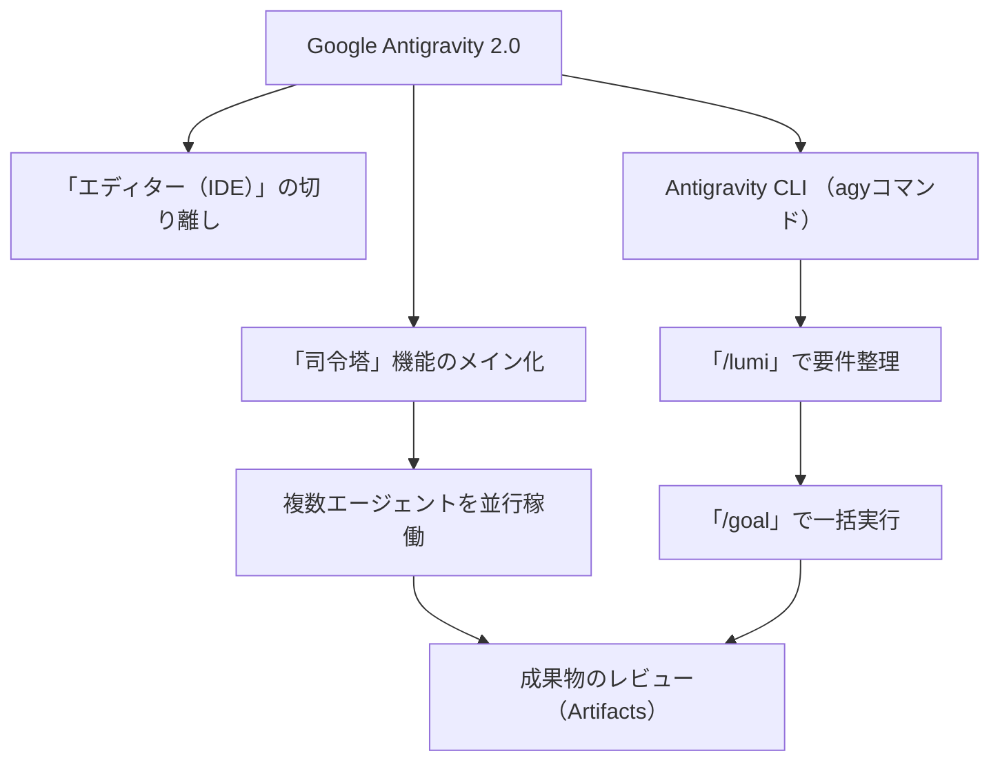

---

tags:
  - type/youtube
  - cat/antigravity
  - topic/claude
  - topic/gemini
---

# Introduction to Antigravity 2.0! A Step-by-Step Guide to Using Google's Evolved Antigravity 2.0 With CLI Commands

  

## タイムライン

| タイムスタンプ | セクション名 | 主な内容 |
| --- | --- | --- |
| 00:00 | オープニング | 進化したAIエージェント「Antigravity 2.0」の概要とClaude Fable 5を使用したスライド作成の紹介。 |
| 01:46 | Antigravity 2.0はどう変わったの？ | 従来のIDE（コードエディター）から「AIチームの司令塔」へ役割がシフト。エディター部分を分離し、複数エージェントの並行稼働によるプロジェクト中心の業務フローへ。 |
| 10:12 | コマンドで作業を効率化 | Gemini CLIの終了に伴う新しいAntigravity CLI（agyコマンド）への移行。初期設定から、「/lumi」や「/goal」を用いた要件定義とタスクの自動実行手順の実演。 |
| 21:20 | まとめ | ツール進化の総括と、AIプログラミングや業務自動化をさらに深く学ぶためのLINE登録特典（AI Studio、用語解説など）のお知らせ。 |

  

## 文字起こし

[00:00] みなさんこんにちは、いまにゅです！本日はGoogleが提供する進化したAIエージェント「Antigravity 2.0」について徹底解説していきます。今回のスライド資料は、最新のClaude Fable 5を活用して作成しました。以前よりもさらにデザインのクオリティが上がっており、視覚的にもわかりやすくなっています。

[01:46] 「Antigravity 2.0はどう変わったのか？」という点からお話しします。従来のAntigravityは、VS Codeなどをベースとした「コードエディター（IDE）」としての役割が中心でした。しかし、今回のバージョン2.0からは「AIチームの司令塔（エージェント管理ツール）」へとコンセプトが大きく変化しました。コードを書く作業場としてのエディター部分（Antigravity IDE）は別アプリとして切り離され、2.0本体は複数のAIエージェントを並行して動かし、ハンドリングするための「司令室」のような役割を担っています。プロジェクトを中心にチャットで指示を出し、エージェントが自動で動いて成果物を報告してくれる環境となっています。

[10:12] 続いて「コマンドで作業を効率化」するCLI（コマンドラインインターフェース）の活用方法について解説します。実はGoogleは2026年6月18日をもって「Gemini CLI」のサポートを終了しており、現在は新しい「Antigravity CLI」（agyコマンド）への移行が推奨されています。このCLIを使用することで、ローカル環境での動作検証や、デプロイスクリプトとの連携が非常にスムーズになります。動画内では初期設定や具体的なコマンド実行手順を実演しています。「/lumi」コマンドで質問を重ねて要件を整理し、最終的に「/goal」で一気にタスクを走らせる実用的なワークフローを紹介しています。

[21:20] 最後に全体の「まとめ」です。今回のAntigravity 2.0へのアップデートは、単なる機能追加ではなく、エディターから「エージェントの並行稼働プラットフォーム」への完全なシフトを意味しています。また、より深くAIコーディングや業務自動化を学びたい方向けに、LINE登録特典（Google AI Studioの使い方やAIコーディング用語集、勉強会への案内など）についてもご紹介しています。ぜひこの進化したツールを日々の業務効率化に役立ててください。

  

## 概要

Googleの進化したAIエージェント「Antigravity 2.0」と、そのコマンドラインツール（CLI）の使い方を徹底解説した動画です。

### 主な内容
1. **エディターから司令塔への進化**: 従来のコードエディター（IDE）としての役割から、複数のAIエージェントを管理・並行稼働させる司令塔としての役割へ大きくシフト。エディター機能は「Antigravity IDE」として別アプリに分離。
2. **Antigravity CLI（agyコマンド）への移行**: サポート終了したGemini CLIに代わり、現在推奨されている新しいCLIコマンドの使い方や初期設定を解説。
3. **実践的ワークフロー**: 「/lumi」で要件定義や対話を進めて情報を整理し、「/goal」で一気にエージェントに成果物（Artifacts）を作成させる一連の手順を実演。

  

## 構成図 (Mermaid)

