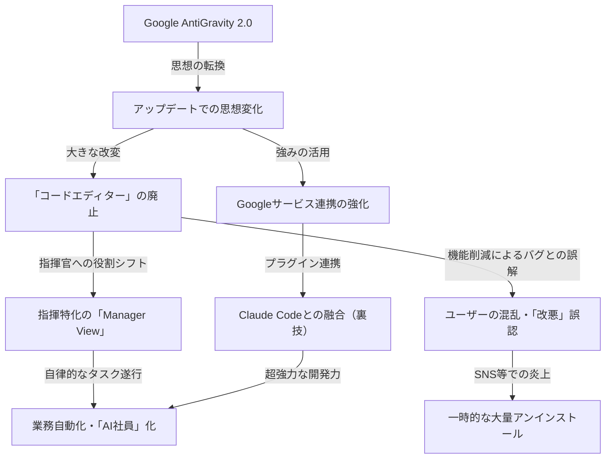

---

tags:
  - type/youtube
  - cat/antigravity
  - topic/claude
  - topic/gemini
---

# 【Google炎上】話題のAntigravityで全作業を自動化させる方法を教えます【Gemini / Spark】

## タイムライン
| 時間 | トピック | 主な内容・要点 |
| :--- | :--- | :--- |
| 00:00 | オープニング | Googleの最新AIエージェント「AntiGravity 2.0」の概要と、アップデートに伴う炎上騒動の導入 |
| 00:54 | AntiGravity 2.0の革命的変化 | アップデートにより従来の使い方や思想が根本から変わったことを解説 |
| 02:43 | そもそもAntiGravityとは何か | GeminiやSparkをベースにした、Googleの提供するAIエージェントの基礎概念 |
| 04:54 | 1.0から2.0で何が変わったか | デスクトップアプリへの完全移行と、CodexやClaude Codeに並ぶUIへの変化 |
| 06:32 | コードエディター廃止とAI指揮特化への転換 | 直接コードを書く「Editor View」を廃止し、AIに指示を出す「Manager View（指揮官）」へ特化した思想 |
| 09:21 | 炎上の経緯と大量アンインストールの背景 | 機能が消えたと誤解したユーザーが「改悪」「バグ」として批判し、SNSを中心に炎上、大量離脱が起きた経緯 |
| 14:35 | Google連携の強みとアップデートの恩恵 | Gmail、カレンダー、スプレッドシートなどのGoogle製品とワンクリックで強力に連携 |
| 15:23 | 初期設定の手順とプロジェクトファイルの作り方 | エージェントを動作させる指示書（プロジェクトファイル）作成の重要性と手順 |
| 17:37 | 料金プランの選び方 | 無料から200ドルまでのプラン展開と、まずは月20ドルのプロプランから始めるのが推奨される理由 |
| 19:30 | Claude Codeと組み合わせる裏技的な使い方 | 拡張機能プラグインを利用し、AntiGravity内でClaude Codeを実行してAIを協調させる裏技 |
| 21:17 | まとめ | 全体のおさらいと、株式会社エヌイチ（N1 Inc.）によるAI社員構築サービスや公式LINEの紹介 |

## 文字起こし
[00:00] みなさんこんにちは！AIエージェントチャンネルの河村です。本日は、Googleから発表され大きな話題となっている「AntiGravity 2.0」について解説します。実はこのツール、最近のアップデートで非常に大きな炎上騒ぎを起こしてしまいました。なぜ炎上したのか、そしてこの2.0を使うことでどのように全作業を自動化できるのか、その具体的な方法について詳しくお伝えしていきます。

[00:54] まず、AntiGravity 2.0がもたらした革命的な変化について解説します。今回のアップデートは、単なる機能追加ではなく、ツールの根本的な思想自体がガラリと変わるという、非常に大胆なものでした。これによって、僕たちの仕事の進め方やAIの使い方そのものが180度変わるような、まさに革命的なレベルの進化を遂げています。

[02:43] それでは、そもそもAntiGravityとは何なのかという基本から説明しましょう。AntiGravityは、Googleが開発したAIエージェントツールです。GeminiやSparkといった高性能なモデルをバックエンドに搭載し、開発作業や日常業務を自動化するために設計された、次世代のプラットフォームです。これまでは主にエンジニア向けに提供されていました。

[04:54] では、1.0から2.0になって、具体的に何が変わったのでしょうか。一言で言えば、「エディター機能の廃止」と「デスクトップアプリへの完全移行」です。これにより、UIも大きく変わり、OpenAIのCodexやAnthropicのClaude Codeに非常に近い、洗練された操作画面へと進化しました。より自律的なエージェントとしての動きが強化されています。

[06:32] なぜコードエディターが廃止されたのでしょうか？それは、Googleが「AIエージェントの指揮に特化する」という明確な思想に転換したからです。人間が直接コードを書く「Editor View」から、複数のAIエージェントに役割を割り振って統括する「Manager View」へとフォーカスが移ったのです。まるで自分がCEO（代表取締役）になり、AI社員たち（COO、マーケター、エンジニアなど）に指示を出して業務を自動化するような概念です。

[09:21] しかし、このコードエディターの廃止が大きな波紋を呼び、炎上することになります。これまでAntiGravityで直接コードを書いていたユーザーたちが、アップデート後にエディター機能が消えたことに混乱し、「バグで機能が消えたのではないか」「改悪だ」と不満を爆発させました。XなどのSNSを中心に炎上し、原因が分からない多くのユーザーによって一時的に大量のアンインストールが行われる事態にまで発展してしまいました。

[14:35] とはいえ、2.0には非常に強力なメリットもあります。それが、Google製品とのネイティブな連携機能です。Gmail、Googleカレンダー、Googleドライブ（ドキュメントやスプレッドシート）といったツールとワンクリックで統合でき、非常にスムーズな業務自動化が可能になります。Googleの環境をメインで使っている企業やユーザーにとっては、これ以上ない強力な恩恵です。

[15:23] 続いて、初期設定の手順とプロジェクトファイルの作り方を解説します。AntiGravityをインストールしたら、まずプロジェクトフォルダに設定ファイル（指示書）を作成する必要があります。これはClaude Codeでいう「cloudcode.md」のようなもので、AIエージェントが自律的に動くための大元の指示書です。弊社エヌイチがまとめたドキュメントなどを読み込ませることで、初期設定から高度なタスク指示までをすべて自動で行わせることが可能です。

[17:37] 料金プランの選び方についても説明します。料金体系は、無料のフリープランから、プロ（月額20ドル）、ウルトラ（100ドル）、ウルトラプレミアム（200ドル）まで段階的に用意されています。初心者の方は、まずはフリープランや、月額20ドルのプロプランから始めてみることを強くお勧めします。実際に使いこなせるようになってから、徐々にプランをアップグレードしていくのが最もコスパの良い方法です。

[19:30] ここで、Claude Codeと組み合わせる裏技的な使い方をご紹介します。実は、AntiGravityのIDE（拡張機能/プラグイン）内でClaude Codeを呼び出して動かすことができます。これによって、Googleの強みであるツール連携力と、Claude Codeの持つ超強力なコード生成・デバッグ能力を融合させることができ、最強のマルチエージェントチームを構築することが可能になります。

[21:17] 最後にまとめです。今回は、Google AntiGravity 2.0の思想転換と、炎上した背景、指示書の重要性や実際の活用法について解説しました。AI社員を自社に導入して業務を圧倒的に効率化したい方は、ぜひこのツールを活用してみてください。なお、株式会社エヌイチでは、AI社員の構築代行やClaude Code、Codexの研修、さらに公式LINEでの特別ノウハウ資料の配布なども行っております。興味のある方は、ぜひ概要欄のリンクから公式LINEにご登録ください。チャンネル登録と高評価もよろしくお願いします！

## 概要
Googleの次世代AIエージェントツール「AntiGravity 2.0」へのメジャーアップデートに関する解説動画です。今回の変更では、これまでのコードエディター（Editor View）が廃止され、AIエージェントを指揮・統括するプラットフォーム（Manager View）へと根本的な思想転換が行われました。事前情報の不足により、エディターの消失を「バグ」や「改悪」と誤認したユーザーから批判が相次ぎ一時的に炎上・大量アンインストールが発生。しかし実際には、GmailやドライブなどのGoogleワークスペースとのシームレスな連携、さらにはClaude Codeを内部で動作させる高度な裏技など、強力な業務自動化・「AI社員」チーム構築を可能にする圧倒的なポテンシャルを秘めています。

## 構成図 (Mermaid)

