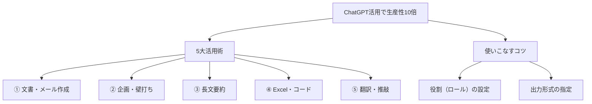

---

tags:
  - type/youtube
  - cat/antigravity
  - topic/chatgpt
  - topic/antigravity
---

# 【保存版】ChatGPTで仕事の生産性を10倍にする最強の活用術5選

## タイムライン
| 時間 | セクション名 | 主な内容 | キーポイント |
|---|---|---|---|
| 00:00 | イントロダクション | ChatGPT活用の重要性と概要 | 現代ビジネスにおけるAIの必要性と、使いこなすことのメリットを提示します |
| 01:15 | ① ビジネス文書・メール作成 | 作成作業の圧倒的なスピードアップ | 敬語表現の調整や、トーンの変更、多言語対応などを瞬時に実行します |
| 03:30 | ② 企画の壁打ちとアイデア出し | 思考の整理と発想の拡張 | 複数のアイデア出しから段階的な深掘りまで、優秀な相談役として活用します |
| 05:45 | ③ 長文資料の要約 | 情報インプットの超高速化 | 膨大な報告書や議事録を、瞬時に指定した文字数や箇流書きでまとめます |
| 08:00 | ④ Excel関数・コードの作成 | 非エンジニアの実務サポート | 複雑な数式の生成からエラーのデバッグまで、実用的なアドバイスを提供します |
| 10:15 | ⑤ ビジネス翻訳と表現推敲 | グローバル対応力の向上 | 単なる直訳を超え、失礼のない自然で洗練された多言語表現へ翻訳・推敲します |
| 12:30 | アウトロと活用のコツ | プロンプトのコツとまとめ | 役割設定や出力フォーマットの指定が最大の鍵です |

## 文字起こし
[00:00] 皆さん、こんにちは。今回は、ChatGPTを使って仕事の生産性を劇的に向上させる方法についてお話しします。現代のビジネスにおいて、AIを使いこなせるかどうかは、業務効率化の最大の鍵となっています。しかし、多くの人が「どう使えばいいかわからない」と悩んでいます。そこで今回は、すぐに実践できる最強の活用術を5つ厳選してお届けします。

[01:15] まず1つ目の活用術は「メールやビジネス文書の自動作成」です。日常のメール作成は、意外と時間を消費する作業です。ChatGPTに「〇〇の件で取引先に送る丁寧な謝罪メールを作って」と指示するだけで、適切な敬語を使った文章が数秒で完成します。さらに、「もう少しフランクにして」や「英語で翻訳して」といった追加の指示も瞬時に反映されます。これにより、作成時間を大幅に短縮できます。

[03:30] 2つ目は「アイデア出しと企画の壁打ち」です。新規プロジェクトやブログのネタに困ったとき、ChatGPTは最高の相談相手になります。「新商品のプロモーション案を10個出して」と伝えるだけで、多角的なアイデアがすぐに得られます。さらに、「その中の3番目のアイデアを深掘りして、ターゲット層を設定して」と重ねて質問することで、アイデアがより具体的な企画へとブラッシュアップされていきます。

[05:45] 3つ目は「長文テキストや会議資料の要約」です。膨大なレポートや会議の議事録を読むのは大変な労力がかかりますが、ChatGPTを使えば一瞬で要点を掴むことができます。長い文章をコピーして「以下の文章から重要なポイントを3つに要約して」と入力するだけで、要点が整理された状態で出力されます。これにより、情報インプットのスピードが驚くほど向上します。

[08:00] 4つ目は「プログラミングコードやExcel関数の作成」です。非エンジニアであっても、Excelの複雑な関数やVBAマクロ、PythonのコードをChatGPTに作ってもらうことができます。「A列とB列を比較して重複を削除するExcelの関数を教えて」と尋ねれば、数式とその使い方の解説まで丁寧に出力してくれます。エラーが起きた際も、そのエラー文をそのまま貼り付けるだけで解決策を提案してくれます。

[10:15] 5つ目は「外国語の翻訳と表現の推敲」です。ChatGPTの翻訳精度は非常に高く、単なる直訳ではなく、文脈に合わせた自然な表現に仕上げてくれます。例えば、英語で送るメールを作成する際、「以下の日本語メールを、失礼のないビジネス英語に翻訳して」と頼むことで、プロが書いたような洗練された英文が完成します。海外とのやり取りがスムーズになり、自信を持って発信できるようになります。

[12:30] 最後に、ChatGPTを上手に使いこなすための共通のコツをお伝えします。それは「役割を明確に与えること」と「出力形式を指定すること」です。例えば「プロのマーケターとして振る舞ってください」と指示を加えたり、「表形式で出力してください」と指定することで、驚くほど高品質な回答が得られます。ぜひ今日から試してみてください。チャンネル登録と高評価もよろしくお願いします。それではまた次回お会いしましょう！

## 概要
本動画では、ChatGPTを活用して日常業務の生産性を劇的に向上させるための5つの実践的な活用術（ビジネス文書作成、企画の壁打ち、長文要約、Excel・プログラミング支援、ビジネス英語翻訳）を分かりやすく解説しています。AIを単なるチャットツールとしてではなく、優秀な専属アシスタントとして使いこなすためのプロンプトのコツ（役割設定や出力形式の指定）についても詳しく紹介しています。

【キーポイント】
1. メールや報告書作成：迅速かつ丁寧な文章作成やトーン調整が可能になり、作成時間を大幅に削減。
2. 企画の壁打ち：複数視点からのアイデア出しや、段階的な深掘りにより新規事業の創出を加速。
3. 情報の要約：長文テキストを一瞬で整理された要点にまとめ、インプット業務を効率化。
4. 実務への応用：Excel関数やコード生成、エラー対処など、非エンジニアの実務も強力にサポート。
5. 翻訳・語学：文脈を考慮した自然で洗練された多言語翻訳に対応。

## 構成図 (Mermaid)

