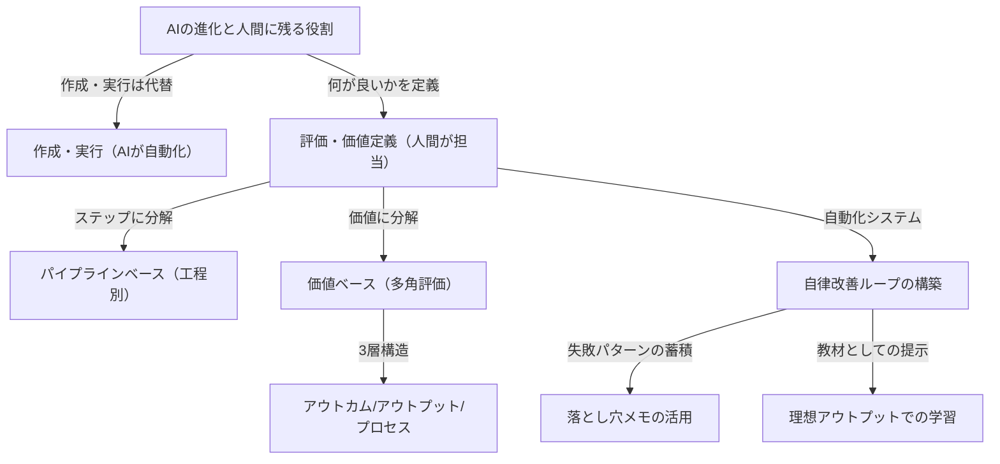

---

tags:
  - type/youtube
  - cat/google
  - topic/automation
---

# AIがどれだけ進化しても、人間に残り続ける最後の仕事

## タイムライン
| 時間 | トピック | 詳細 |
|---|---|---|
| [00:00] | イントロ | AIがどれだけ進化しても人間に残り続ける最後の本質的な仕事が「評価（Evaluation）」であると提示します。 |
| [01:41] | 評価って何？ | AIの出力の良し悪しを判定するプロセスの定義、汎用的なベンチマークが個別ビジネスにフィットしない限界を解説します。 |
| [04:50] | 評価が重要な理由 | 調整に伴う先祖返り（デグレード）の防止や、AIエージェントが自身の行動を振り返って品質を高める仕組みに不可欠な理由を説明します。 |
| [06:18] | 評価の進め方と前提 | 評価基準は事業の状況により常に移り変わるものであり、完璧を求めず「まずは小さく始めること」の重要性を説きます。 |
| [08:00] | 比較から始める言語化 | 人間の理想的な成果物とAIの出力を並べて見比べることで、不足や過剰を明確にし、評価基準のタネを言葉にする手順を提案します。 |
| [09:45] | 評価観点の構造化の2軸 | 各業務フローに沿った「パイプラインベース」と、成果を立体分解する「価値ベース（アウトカム、アウトプット、プロセス）」の整理法を詳解します。 |
| [13:50] | 自動評価の構築と連携 | 整理した基準をLLMなどを利用した「評価器（Evaluator）」に組み込み、開発テストやプロンプト修正を自動かつ高速化する手法を伝授します。 |
| [16:00] | 自律改善の仕組み化 | AIにエラーの蓄積を読み込ませる「落とし穴メモの蓄積」や、理想のアウトプット学習を通じた、自律的なワークフロー改善を解説します。 |
| [18:11] | なぜ最後の仕事であり続けるのか | 作成作業が自動化されても、「何が良いか（価値基準）」を定義する主観的な領域は人間特有の意思決定であり、残り続けると結論づけます。 |

## 文字起こし
[00:00] 皆さんこんにちは。「AIでサボろうチャンネル」です。AIの進化スピードは凄まじく、日々新しいツールや自動化モデルが登場しています。プロンプトエンジニアリングなどの複雑なテクニックは、AI自体の基礎的な理解力やパラメーター数の向上によって、今や特別な工夫をしなくても高精度な回答が得られる時代になりつつあります。このような変化の中で、「AIがどれだけ進化しても、最後に人間に残り続ける仕事とは一体何なのか？」という疑問を抱く方は非常に多いはずです。結論からお伝えしますと、その人間のための最後の砦となる仕事こそが「評価（Evaluation）」です。

[01:41] それではまず、「評価」とは何なのかについて具体的に解説していきましょう。評価とはシンプルに言えば「AIの仕事ぶりが良いかどうかを客観的に判定する行為」です。これまでは、この概念はAIモデルを開発する側の人々や、高度なAIアプリケーションを構築する一部の専門エンジニアにしか縁がないものと考えられていました。しかし、近年AIエージェントの爆発的な普及や、多くの人が「Skills」を活用するようになった潮目の変化により、一般ユーザーや業務現場のチームにとっても極めて身近で重要な概念となっています。

[03:15] 皆さんもOpenAIやAnthropicが新モデルを発表した際、様々な汎用テストに対する「ベンチマークスコア表」を目にしたことがあるかと思います。これらはAI全体の知的能力を測る指標としては優秀ですが、実務の固有コンテキストにおいては、汎用スコアが高くても「自社の業務で使うと出力のクオリティがなぜか微妙」という現象が多発します。ビジネスの現場では、その企業のターゲット顧客の特性やブランドポリシーに合致しているかなど、極めて個別具体的な難しさに応じた「独自の評価基準」が不可欠になるのです。

[04:50] 現場においてAIの評価体制を整えることが重要なのには、大きく分けて2つの理由があります。1つ目は、AIのワークフローを着実に改善するためです。AIの出力は柔軟であるがゆえに、場当たり的なプロンプトの修正を繰り返すと、新しい問題は解決したものの「これまで問題なくできていた別のことができなくなる」という「デグレード（先祖返り）」が頻繁に発生します。評価基準を定義することでこれを防ぎます。2つ目は、AIエージェントに自律的に働いてもらうためです。AI自身が成果物の良し悪しを自分で判断し、ダメなら直すという自律的なループ（自己検証ループ）を回すためには、その拠り所となる「正しい評価基準」を人間が与えてあげる必要があります。

[06:18] では、具体的な評価の進め方について解説します。まず踏まえておくべき重要な前提が2つあります。1つ目は、評価基準は決して固定されたものではなく、事業や顧客の状況に応じて「常に移り変わるものである」ということ。2つ目は、最初から100点満点の完璧な評価システムを作ろうとせず、「とにかく最初は小さく始めること」です。

[08:00] 最初の一歩としておすすめなのが、「人間が作った理想の成果物と、AIが作ったものを直接並べて比較すること」です。例えば、顧客対応メールの下書きであれば、人間のベテラン担当者が書いた手紙とAIが一度に出した出力を比較します。それらを対比させることで、「AIのトーンは冷たく見えないか」「ポリシーに則った丁寧さが足りているか」など、良し悪しの違いを容易に言語化できるようになります。これが評価基準を言葉にする最初のステップです。

[09:45] こうした評価観点がある程度溜まってきたら、体系的に整理・構造化していきます。整理の軸には「パイプラインベース（工程別）」と「価値ベース（価値分解）」の2つが存在します。パイプラインベースの整理では、業務全体を複数の明確な工程（ステップ）に分解し、各ステップごとに「評価」を当てはめていきます。業務のどの段階に品質のボトルネックがあるかを可視化するのに非常に有効です。

[11:30] もう一方の「価値ベース」での整理では、仕事が生み出す全体の価値を「アウトカム（Outcome）」「アウトプット（Output）」「プロセス（Process）」の3つの段階に分けて評価を構築します。アウトカムとは、成果物を通じて世の中に生まれた最終的な価値やビジネス上の成果（例：提案資料がきっかけで契約に至ったか、等）を指します。アウトプットは作られたもの単体の評価（例：スライドのデザイン、文字数の適正さ等）です。そしてプロセスは、AIがその成果物を生成するに至った手順や思考プロセスの評価です。この3層構造で整理することで、多角的な品質向上が可能になります。

[13:50] 評価基準を整理できたら、次にその評価をAIのワークフローに組み込んで「自動化・システム化」していきます。最初はスプレッドシートへの手動記録などでも構いませんが、徐々に別のLLMを「評価器（Evaluator）」として利用し、出力された品質を自動的に点数化して確認する仕組みへと移行させます。これにより、プロンプトの一部を変更した際に、全体の品質スコアが改善したか、あるいはデグレードしていないかを瞬時にテスト・測定できるようになります。

[16:00] さらに発展した自律改善の手法として、AIに自分自身の成果を振り返らせる「落とし穴メモの蓄積」や「理想アウトプットでのチューニング」が挙げられます。落とし穴メモの蓄積とは、過去の分析で発生したエラーパターンや、絶対にやってはいけない失敗事例をまとめたファイルを作成し、AIエージェントに業務を開始する前に毎回読み込ませる極めて手軽な改善方法です。この検証と改善のサイクルを回すことこそ、AI時代における究極のマネジメント手法となります。

[18:11] 最後に、なぜこの「評価」が未来永劫にわたって「人間に残り続ける最後の仕事」であり続けるのかについてお話しします。AIの急速な進化により、これまでの「コンテンツを作る、文章やコードを書く、スライドを構成する」といったクリエーション（作成プロセス）の大部分は完全に自動化され、コモディティ化していきます。しかし、「作られたものが、本当に届けたい相手にとって良いものなのかどうか」を主観や文脈を踏まえて最終定義する「評価」は、人間の感情や意思決定、文化的合意に強く依存する部分です。

[20:30] 市場のトレンドや顧客の心境は常に揺れ動くため、「良さ」の普遍的な絶対解をAIが自律的に発見することは不可能です。だからこそ、人間が「この文脈において何が良い成果物か」という基準を定め、AIをコントロールする責任を持ち続ける必要があります。それこそが、人間に残り続ける最後の、そして最もクリエイティブな役割です。皆さんも、単なるプロンプト調整に留まらず、AI出力を客観的に改善する「評価」をシステムに組み込むステップへぜひ進んでみてください。ご視聴ありがとうございました。

## 概要
本動画は、AIエージェントが高度化・普及する現代において、人間に残り続ける本質的な役割が「評価（Evaluation）」であると指摘し、その具体的な実践手法と重要性を解説しています。

主要なポイントは以下の通りです：
1. **「評価（Evaluation）」の定義と価値**: AIの出力が期待通りか、客観的に良し悪しを判断する行為。画一的な汎用ベンチマークでは自社固有のビジネス文脈をカバーできないため、現場に合わせた個別評価基準の設計が不可欠です。
2. **評価が必要な2つの理由**: 場当たり的なプロンプト調整による先祖返り（デグレード）を防ぎ、「AIが自分で自分の成果物を検証して改善する」という自律稼働ループを回すために必要とされます。
3. **評価を構築するアプローチ**: 最初は「人間とAIの成果物の直接比較」から小さく始め、溜まった評価観点を「パイプライン別（工程別）」および「価値ベース（アウトカム、アウトプット、プロセス）」に整理・構造化します。
4. **自律改善の実践**: 過去のエラーパターンをまとめた「落とし穴メモ」を事前に読み込ませる等の仕組みにより、手軽にAI自身の出力精度を自動改善させます。
5. **人間に残る「最後の仕事」たる理由**: 作成（クリエーション）はAIが代替できても、環境や感情に左右される「何が良い成果物か（価値基準）」を判断する意思決定は、主観や文脈を持つ人間にしかできないため、未来永劫この役割が人間の仕事として残り続けます。

## 構成図 (Mermaid)

