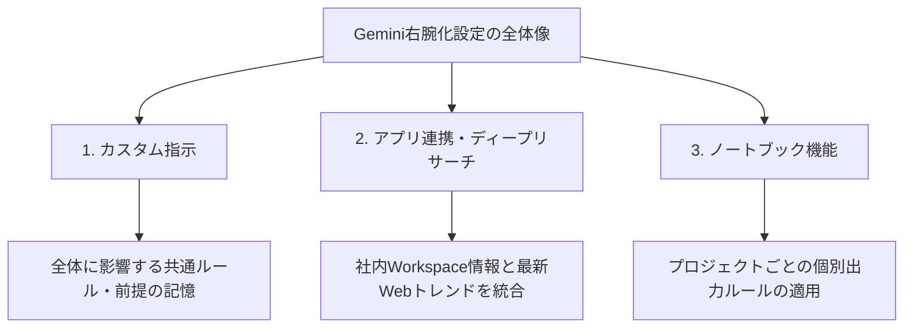

---

tags:
  - type/youtube
  - cat/google
  - topic/gemini
---

# Geminiがより最強になる！「右腕」として使い倒すための必須設定3選

## タイムライン
| 開始時間 | トピック | 説明 |
| :--- | :--- | :--- |
| 00:00 | オープニング | Geminiを単なるチャットツールから「最強の右腕（自分専用アシスタント）」に変えるための3つの必須設定について全体像を解説します。 |
| 01:10 | 設定①：カスタム指示（自分を覚えさせる） | Geminiに自分のプロフィール（職種や役割）や汎用的な回答ルール（結論ファースト、前置き・お世辞を省く等）を設定し、プロンプトの入力効率を向上させます。 |
| 05:30 | 設定②：アプリ連携とディープリサーチ（情報を接続・収集する） | Google Workspace（Gmailやドライブ）との連携により社内情報を、さらにディープリサーチ機能で最新の業界・市場動向を自動収集し、多角的な情報を材料として整理します。 |
| 11:15 | 設定③：ノートブック機能（案件ごとに型化する） | プロジェクトごとに専用のノートブックを作成し、個別ルール（出力構成や分量制限）や過去データを保持させることで、雑な指示から一発で高品質な資料を生成します。 |
| 17:30 | エンディングとまとめ | 汎用的な設定（カスタム指示）と、個別案件の設定（ノートブック）の使い分け方、さらにLINE公式での特典（右腕化設定シート）の受け取り方を案内します。 |

## 文字起こし
[00:00] みなさん、こんにちは。AI活用専門家のダイさんです。今日は、Googleの最強AIであるGeminiを、単なる普通のチャットツールから、あなたのビジネスにおける「最強の右腕」や「専属アシスタント」に変えるための必須設定3選をご紹介します。これらの設定を行うことで、プロンプトに長々と前提条件を書く必要がなくなり、たった一言指示を投げるだけで、すぐに取引先に出せるレベルの高品質な資料を1発で出力できるようになります。

[01:10] まず1つ目の必須設定は、Geminiに自分自身の情報や前提条件をあらかじめ覚えさせておく「カスタム指示」の設定です。通常、Geminiに仕事を依頼する際、「私はSaaS企業の営業マネージャーで、今回は〇〇社の振り返りレビューを作りたい」といった自分の立ち位置や前提条件を毎回入力している方も多いのではないでしょうか。しかし、毎回これらを入力するのは非常に面倒ですし、入力し忘れると仕事に使えない一般的な回答が返ってきてしまいます。そこで、Geminiの画面左下にある「歯車マーク」から「パーソナルインテリジェンス」に進み、「カスタム指示」を設定しましょう。

[03:30] カスタム指示に入力する内容は非常にシンプルですが効果的です。例えば、自分がどのような役割を持っているか（例：SaaS企業の営業マネージャーであること）、そして回答に求めるスタイル（必ず結論から書くこと、前置きやお世辞などは省くこと、Googleドキュメントにコピーしやすい構成にすることなど）を記述します。これにより、Geminiが不必要に褒めてきたり、「それは素晴らしい取り組みですね」といった無駄なお世辞を並べることがなくなり、仕事でそのまま使いやすい簡潔なアウトプットが一発で得られるようになります。全体に共通させたい汎用的なルールは、このカスタム指示に記述しておくのがベストです。

[05:30] 続いて2つ目の設定は、社内情報と外部の最新情報を自動で統合して調べるための「アプリ連携（Workspace連携）」と「ディープリサーチ（Deep Research）」機能です。1つ目のトピックで設定した自分自身の役割を踏まえた上で、次は業務に必要な「材料」を集めます。Geminiの歯車マークから「アプリ連携」をオンにすると、お使いのGmailやGoogleドライブ内の資料とGeminiが直接連携できるようになります。

[07:45] これによって、特定の取引先である「A社」との過去のメール履歴や、以前に提出した提案書データを自動的にGeminiが引っ張ってこれるようになります。さらに、個人アカウントでも利用可能な「ディープリサーチ」機能を使用することで、Web上の最新の市場動向やサース業界のトレンドまでも合わせて自動でリサーチしてくれます。この設定をしておくだけで、社内の過去の状況と、インターネット上の最新情報の両方を網羅した、極めて精度の高いリサーチ結果が自動で手に入るようになります。

[11:15] そして3つ目の設定が、集まった情報や個別の案件ルールを形にするための「ノートブック機能」です。カスタム指示はすべてのチャットに影響を及ぼすため、あまりにも特定の案件（例：A社専用のフォーマット）に特化した設定を書き込んでしまうと、別の一般的な作業をしたい時に邪魔になってしまいます。そこで、案件やプロジェクトごとに異なるルールを設定したい場合は、Geminiの新機能である「ノートブック」を活用します。

[13:40] このノートブックを新規作成し、タイトルを「A社向けレビュー」などに設定します。そこへ、先ほどディープリサーチで得た結果や、Google Workspaceから抽出したメール履歴などを「ソース」として追加します。さらに、ノートブック専用の設定欄を開くことで、この案件に限定した「個別ルール」（例：A4横1枚に収まる分量にすること、実績・課題・リスク・ネクストアクションの4構成にすること、箇条書きは1項目につき3点以内にすること等）を覚えさせておきます。こうすることで、全体のカスタム指示を汚すことなく、このプロジェクトに最適化された専用のアシスタントが構築できます。

[16:20] 準備が整ったら、あとは「ノートブックの資料を基に、レビュー用資料を作成してください」と一言指示を出すだけです。さらに「キャンバスモード」を選択して指示を実行すれば、指定した完璧な構成（サマリー、実績、課題、次のアクション）で、美しいドキュメント形式の資料が一瞬で立ち上がります。内容に問題がなければ、そのままGoogleドキュメントとして保存して社内や取引先に共有することも可能です。これこそが、Geminiを単なる対話相手ではなく「自分の仕事を代わりに進めてくれる右腕」にする究極の方法です。

[17:30] 今回ご紹介した「カスタム指示」「アプリ連携＋ディープリサーチ」「ノートブック機能」の3つは、単体で使うのではなく、仕事の流れ（自分の前提の記憶、情報の接続・収集、案件に特化した型化）に沿って組み合わせることで最大の効果を発揮します。全体の共通ルールはカスタム指示に設定し、案件ごとの個別ルールはノートブックで定義するという使い分けが業務効率化の鍵となります。さらに、今回の動画で解説した設定内容をご自身の業務にすぐに適用して作成できる「Geminiを右腕にする設定シート」を、LINE公式アカウントに登録して「右腕」とメッセージを送ってくれた方限定で無料配布しています。ぜひ設定を実践して、生産性を爆上げしてください。本日もご視聴ありがとうございました。

## 概要
本動画は、Googleの生成AI「Gemini」を単なるチャットツールとしてではなく、ビジネスにおいて自身の役割や社内状況を最適に理解する「右腕（専属アシスタント）」として使いこなすための3つの必須設定を解説しています。主なポイントは以下の3点です。

1. **設定①：カスタム指示（自分を覚えさせる）**
ユーザーの職種や前提条件（例：営業マネージャー等）と、回答に求める基本スタイル（結論ファースト、お世辞や無駄な挨拶の排除等）を事前に登録し、毎回プロンプトに入力する手間をなくします。

2. **設定②：アプリ連携＋ディープリサーチ（情報を接続・収集する）**
Google Workspace（Gmailやドライブ）との連携により社内データを引き出し、ディープリサーチ機能でWebの最新トレンド・市場動向を自動的にリサーチします。これにより、社内外の正確な「材料」を自動で手に入れます。

3. **設定③：ノートブック機能（案件ごとに型化する）**
汎用的な設定はカスタム指示に任せつつ、特定の案件やプロジェクト（例：A社向けの資料作成）に必要な個別の出力形式ルール（フォーマットや構成、箇条書きの制限）を「ノートブック」機能で指定します。これにより、一言の雑な指示から完璧な構成の資料を一発で出力できます。

## 構成図 (Mermaid)

