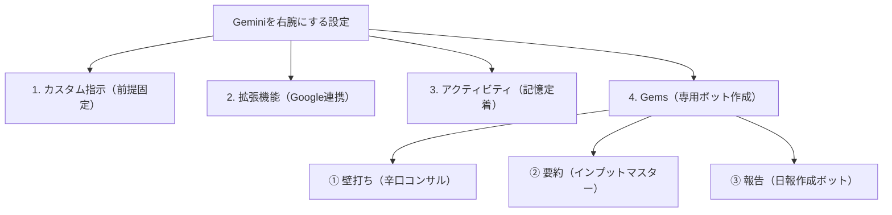

---

tags:
  - type/youtube
  - cat/google
  - topic/gemini
  - topic/automation
---

# Geminiを「右腕」として使い倒すための必須設定4選

## タイムライン
| タイムスタンプ | セクション | 内容解説 |
|---|---|---|
| [00:00] | オープニング | 初期設定のままで使用するとGeminiの効率が落ちる理由と、右腕に育てるべき重要性。 |
| [01:08] | 設定①：Geminiへの指示 | カスタム指示機能を使って職種や「前置き不要」などの絶対的な出力ルールを固定化する方法。 |
| [04:12] | 設定②：拡張機能 | Google Workspace（Gmail、ドライブ等）との連携による、手動データ探しの自動化。 |
| [07:38] | 設定③：アクティビティ設定 | 対話履歴を保存する設定と、好みの回答を長期記憶させる「記憶の杭打ち」テクニック。 |
| [09:12] | 設定④：Gems（3種の神器） | 辛口コンサル、3行要約くん、日報作成ボットというビジネス向け専用AI構築の解説。 |
| [11:17] | 応用：自動リサーチ | アウトプットの精度を劇的に高めるために自動で調査材料を増やす応用テクニック。 |
| [12:08] | エンディング | 毎日リセットされる関係から積み上がる関係へと変革し、相棒にするロードマップのまとめ。 |

## 文字起こし
[00:00] みなさんこんにちは！トモミツの即実践AI活用術チャンネルへようこそ。仕事を効率化するためにせっかく話題のAI「Gemini」を導入したのに、なぜか以前より仕事が楽になっていない、あるいはむしろ毎回同じような指示を送るのに手間取って仕事効率が下がってしまっている、と感じることはありませんか？その原因は、Geminiを初期設定のまま使ってしまっているからです。デフォルト状態のGeminiは、あなたの仕事内容も、文章の好みも、判断基準も毎回理解していません。そのため、やり取りのたびに背景説明に時間がかかったり、出力が微妙にずれたりしてしまいます。今回は、Geminiをただ使い捨てる便利ツールから、あなたの仕事を支える頼もしい「右腕」へと育てるための必須設定4選を具体的に解説します。[01:08] 1つ目の必須設定は「Geminiへの指示（カスタム指示）」です。これは、いわばあなたの「取扱説明書」を事前にGeminiに叩き込んでおく機能です。パソコンの場合は画面の左下にある設定（歯車アイコン）、スマホの場合は左上のメニュー内にある設定から「Geminiへのカスタム指示」を選択します。ここで「＋追加」ボタンを押し、あなたの職種、普段の業務内容、そして出力における絶対ルール（挨拶を省く、結論ファースト、平易な言葉を使うなど）を設定します。特に重要なのが「前置きや挨拶は一切不要」というルールです。Geminiは放っておくと素晴らしい回答を返そうとして丁寧な社交辞令を並べがちですが、スマホの通知で結論を確認したい時などにこれがあると非常に不便です。一度この設定を済ませてしまえば、短い一言を投げるだけで、いつでもあなた好みのフォーマットで一発回答が返ってくるようになります。[04:12] 2つ目の必須設定は「拡張機能（Google Workspace連携）」です。この設定をオンにすると、GeminiがあなたのGmail、Googleドライブ、Googleドキュメントに直接アクセスできるようになります。同様に設定項目から拡張機能を開き、Google Workspaceの連携をONにしましょう。もし会社用のアカウントでオフになっている場合は、IT管理者が制限している可能性があるので個人アカウントで試してみてください。この連携を行うことで、重要な会議の5分前や焦っている朝などに、「〇〇プロジェクトに関するGoogleドライブ内の最新資料と関連メールを調べて、私が次にやるべきタスクを3つ教えて」と指示するだけで、Geminiが複数のデータを瞬時に巡回・分析し、必要なタスクだけを整理して出力してくれます。自分でファイル名やメール履歴を探し回る無駄な時間は、これで完全にゼロになります。[07:38] 3つ目の必須設定は「アクティビティ設定（長期記憶の定着）」です。Geminiは検索エンジンではなく、あなたに合わせて育てていくパートナーです。アクティビティの保存をオンにしておかないと、過去の会話データを記憶することができず、毎回リセットされた関係に戻ってしまいます。設定からアクティビティの保存がオンになっていることを確認しましょう。さらに、記憶を確実に定着させるテクニックとして「記憶の杭打ち」を紹介します。Geminiが完璧なメールや文章を作成してくれた際、すかさず「今の回答は完璧です。この丁寧なトーンと構成を覚えておいてください。次回から『丁寧なメール』と指示したら、このパターンを使って作成して」とチャットで指示を投げます。これにより、Geminiの記憶に好みのパターンが深く刻み込まれ、次から「あ・うんの呼吸」で作業をしてくれるようになります。[09:12] 4つ目の必須設定は「Gems（ジェム）」による専用分身ボットの作成です。Gemsは、特定の専門タスクに特化した自分だけのオリジナルAIを構築できる機能です。ビジネスパーソンに必ず用意してほしい「3種の神器」となるジェムを紹介します。1つ目は「壁打ちパートナー（辛口コンサルタント）」です。あえて批判的かつ厳密なフィードバックをしてもらうことで、企画書を上司に提出する前に弱点を洗い出し、完成度を圧倒的に高めます。2つ目は「インプットマスター（3行要約くん）」です。長文レポートや読みにくいメールを貼り付けるだけで、要点を3行でまとめ、最後に自分が今取るべきネクストアクションを教えてくれます。3つ目は「日報作成ボット」です。一日の終わりに「A社訪問、好感触、見積もり依頼あり」といったラフなメモを投げるだけで、上司が納得するやる気に満ちた丁寧な日報へ一瞬で仕上げてくれます。[11:17] さらに生産性を向上させる応用テクニックとして、「自動リサーチで“材料”を増やす」方法も有効です。AIにゼロからアイデアを考えさせるのではなく、まずはDeep Research機能などを駆使し、関連するファクトや最新の動向を自動で幅広く収集させておくことで、AIがアウトプットを生成するための良質な「材料」をあらかじめ大量に用意することができます。これにより、内容の厚みが劇的に増し、より実践的なビジネス文書が爆速で完成するようになります。[12:08] いかがでしたでしょうか。Geminiを使っているのに仕事が楽にならないと感じていた人は、ツールが悪いのではなく、Geminiにあなたの状況やルールを教えていなかったことが原因かもしれません。今回紹介した4つの設定は、一度設定してしまえばその効果はずっと続きます。対話のたびに情報がリセットされる使い捨ての関係を卒業し、毎日ノウハウが積み上がっていく最高のビジネスパートナーを育て上げましょう。もし今回の動画が役に立った、実践してみたいと思った方は、ぜひチャンネル登録と高評価をよろしくお願いします！それでは、また次回の動画でお会いしましょう！

## 概要
Googleの提供するAI「Gemini」を、ただの検索ツールではなく、自分専用の優秀なビジネスパートナー（右腕）へと変貌させるための「4つの必須設定」について詳しく解説している動画です。

### 主な解説内容
1. **設定①：Geminiへの指示（カスタム指示）**
   - 自分の職種や業務目標を事前に登録し、出力スタイル（「挨拶・前置きは一切不要」「結論ファースト」など）をあらかじめ固定する。これによって、毎回のコンテキスト説明の手間を省き、スマホ通知でも瞬時に要点が伝わる出力にパーソナライズします。
2. **設定②：拡張機能（Google Workspace連携）**
   - Gmail、Googleドライブ、GoogleドキュメントとGeminiを紐付けます。手動でファイルを探し回る必要がなくなり、「特定プロジェクトの最新資料とメールを調べてタスクを整理して」と指示するだけで、関連情報を自動で巡回して整理させることが可能になります。
3. **設定③：アクティビティ設定（記憶の杭打ち）**
   - アプリのアクティビティ保存をオンにすることで過去の好みを記憶。さらに、質の高い出力が得られた際には「この構成とトーンを覚えておいて。次からは『丁寧なメール』という指示でこれを再現して」と指示（記憶の杭打ち）することで、AIを教育します。
4. **設定④：Gemsによる専用ボット作成（3種の神器）**
   - 特定の役割に特化したボットを作るGems機能を推奨。企画の抜け漏れをあえて厳しく突っ込む「壁打ちパートナー（辛口コンサルタント）」、長文を一瞬で要約する「インプットマスター（3行要約くん）」、ラフなメモから丁寧な報告書を仕上げる「日報作成ボット」のプロンプトと活用術を解説しています。

### 結論
AIをデフォルトの使い捨て設定で使用するのをやめ、取扱説明書を渡し、アプリと連携し、記憶を定着させる設定を行うことで、日々使うほどに生産性が累積向上する「最高の右腕」に育て上げることができます。

## 構成図 (Mermaid)

