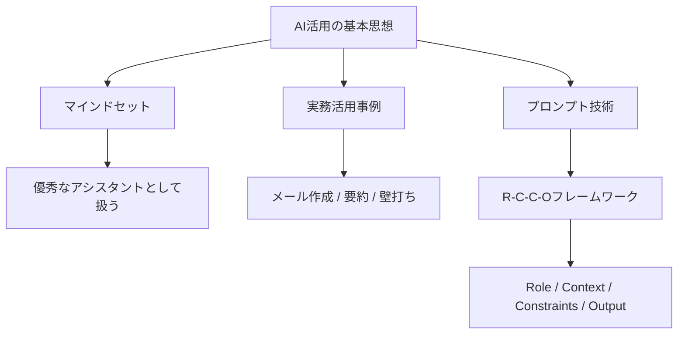

---

tags:
  - type/youtube
  - cat/google
  - topic/chatgpt
  - topic/mindset
---

# 【ChatGPT活用術】プロが教える！生成AIを実務に導入して生産性を10倍にする方法

## タイムライン
| タイムスタンプ | 項目 | 内容の要約 |
| :--- | :--- | :--- |
| [00:00] | 導入＆ビジネスにおけるAIの現状 | AIを実務に導入して生産性を10倍にするための全体像と動画の趣旨を説明。 |
| [01:30] | AI活用のマインドセット | AIを「魔法の検索エンジン」ではなく「優秀なアシスタント（新入社員）」として扱う重要性を解説。 |
| [03:00] | 3つのビジネス活用事例 | メール・議事録作成、長文の要約、アイデアの壁打ちにおける具体的な実践例を紹介。 |
| [05:30] | R-C-C-Oフレームワーク | 高品質な回答を引き出すプロンプト作成手法（Role、Context、Constraints、Output）を解説。 |
| [08:00] | まとめとアクションプラン | AIを使いこなす側になるための心構えと、今日から実践できるアクションプランを提示。 |

## 文字起こし
[00:00] 皆さんこんにちは。今回は、日々の仕事を劇的に効率化するための、ChatGPTや生成AIの具体的な活用術についてお話しします。今やAIは単なるおもちゃではなく、実務に欠かせない強力なパートナーとなっています。しかし、「具体的にどう使えばいいか分からない」「プロンプトの書き方が難しい」と感じている方も多いのではないでしょうか。この動画を最後まで見れば、明日から実務で使える具体的なプロンプトのテクニックと、生産性を10倍にするための思考法が完全に身につきます。ぜひ最後までご覧ください。

[01:30] まず最初に、AIを使いこなす上で最も重要な「マインドセット」について解説します。多くの人が、AIを「何でも答えてくれる魔法の検索エンジン」だと思っていますが、これは大きな間違いです。正しい捉え方は「優秀な新入社員（アシスタント）」として扱うことです。新入社員に対して、ただ「企画書を作って」と指示しても、良いものは上がってきませんよね。それと同じで、AIにも明確な役割、背景、制約条件、そして出力フォーマットを与えることが重要です。この「協働モデル」の意識を持つだけで、出力される回答のクオリティは劇的に向上します。

[03:00] それでは、具体的な3つのビジネス活用事例を見ていきましょう。1つ目は「メールや議事録の作成・添削」です。箇条書きで伝えたい要点を入力し、「丁寧なビジネスマイルに変換してください」と指示するだけで、一瞬で完璧な文章が作成されます。2つ目は「長文の要約」です。長いニュース記事や社内資料を貼り付け、「以下の文章を3つの要点にまとめて、それぞれ30文字以内で要約してください」と指示することで、情報収集のスピードが圧倒的に上がります。3つ目は「アイデアの壁打ち」です。新規事業のアイデア出しなどで、「あなたはプロのマーケターです。〇〇というサービスのターゲット層に響くキャッチコピーを10個提案してください」といった使い方が非常に効果的です。

[05:30] ここからは、最もクオリティの高い回答を引き出すための「プロンプトフレームワーク」をご紹介します。これを私は「R-C-C-O（ロッコ）フレームワーク」と呼んでいます。RはRole（役割の定義）、CはContext（背景や文脈）、CはConstraints（制約条件）、OはOutput（出力フォーマット）です。例えば、「あなたは優秀なコンサルタントです（Role）。新規事業の提案に向けた市場調査を行っています（Context）。専門用語は使わず、箇条書きで3点にまとめてください（Constraints）。フォーマットは以下の通りです（Output）。」このように整理して伝えることで、AIは私たちの意図を完璧に汲み取った高精度な回答を出してくれます。

[08:00] まとめです。本日はAIを「優秀なアシスタント」として扱うマインドセット、3つのビジネス活用例、そして「R-C-C-Oフレームワーク」について解説しました。AIは道具に過ぎませんが、使いこなす人とそうでない人の格差は今後さらに広がっていきます。まずは今日のメール作成からでも構いませんので、実際にChatGPTを開いて試してみてください。このチャンネルでは、これからもビジネスに役立つ最新のAI情報をお届けします。高評価とチャンネル登録をよろしくお願いいたします。それではまた次回の動画でお会いしましょう。

## 概要
この動画では、ChatGPTをはじめとする生成AIをビジネス実務に導入し、生産性を劇的に向上させるための具体的な活用術を解説しています。主な内容は、AIを「検索エンジン」ではなく「優秀なアシスタント」として捉えるべきというマインドセットの転換、メール作成・長文要約・アイデア出しという3つの実用的なビジネス活用事例、そして高精度な出力を引き出すためのプロンプト作成フレームワークである「R-C-C-O（Role, Context, Constraints, Output）フレームワーク」の紹介です。AIとの適切な協働により、業務効率化を実現する方法を体系的に学ぶことができます。

## 構成図 (Mermaid)

