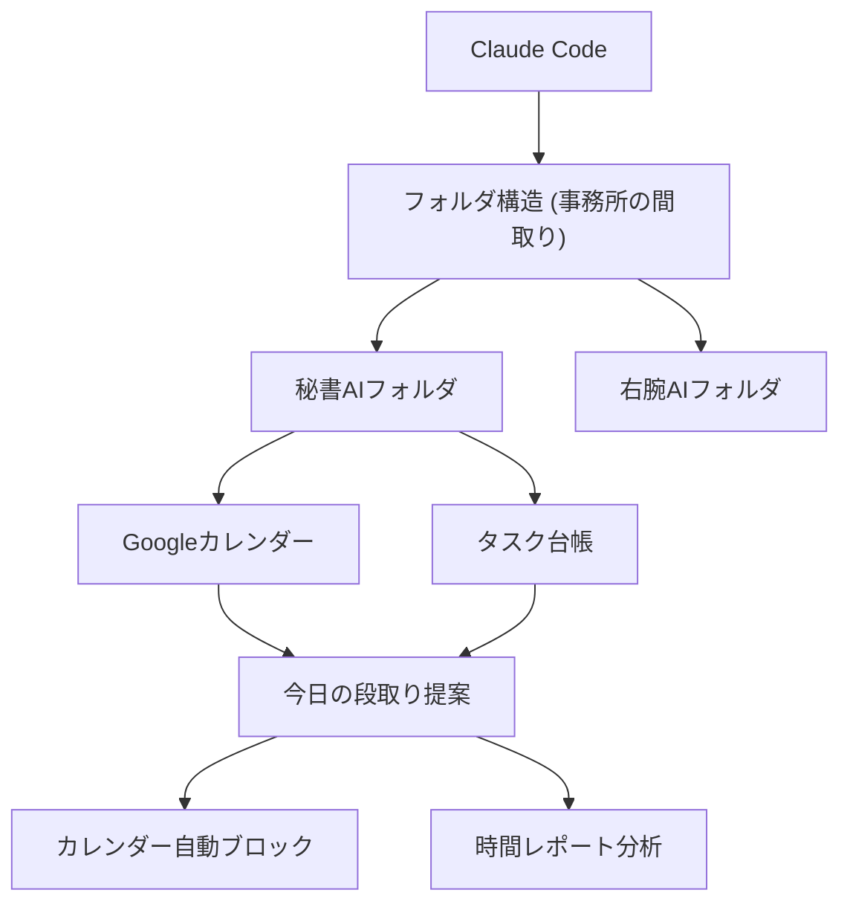

---

tags:
  - type/youtube
  - cat/google
  - topic/claude
---

# 【Claude Codeで実現】予定とタスクが繋がらない問題を解決！社長の段取りを丸投げできる「秘書AI」を作ってみた

  

## タイムライン

| タイムスタンプ | セクション | 主な内容 |

| :--- | :--- | :--- |

| 00:00 | イントロダクション | 社長が抱える「予定とタスクが連動しない問題」をClaude Codeで解決する趣旨を説明。 |

| 02:15 | 仕組み：事務所の間取り理論 | フォルダ構造を切り替えることで、同じClaude Codeに「右腕」や「秘書」の異なる役割を持たせる本質を解説。 |

| 05:30 | デモ1：今日の段取り提案 | Googleカレンダーとタスク台帳をAIが自動で読み込み、今日の最適な行動スケジュールを提案する実演。 |

| 08:45 | デモ2：作業時間の自動確保 | 特定のタスクの作業枠をAIが判断し、Googleカレンダーに自動で予定をブロックする流れをデモ。 |

| 12:10 | デモ3：来週の先読み | 翌週の出張スケジュールや締切タスクの混雑具合を予見し、事前に調整する使い方を実演。 |

| 15:20 | デモ4：過去3ヶ月の時間レポート | 過去3ヶ月のカレンダーや実績データを集計し、社長の時間の使い方を客観的にレポート化する振り返り機能。 |

| 18:40 | システム連携と環境構築 | GoogleカレンダーAPI等との公式連携、フォルダ内のMarkdown形式のタスク管理について解説。 |

| 21:15 | エンディング＆メンバーシップ紹介 | 毎日の活用方法のまとめと、実践的なプロンプトや試行錯誤を共有する「AIビジネス実装ラボ」の案内。 |

  

## 文字起こし

[00:00] 皆さんこんにちは、眼から鱗の長島です。今回は「Claude Code」を使って、社長の永遠の悩みである「予定とタスクが繋がらない問題」を丸ごと解決する、自作の「秘書AI」の作り方と実際のデモをお届けします。経営者である皆さんは、カレンダー上のスケジュール管理と、頭の中やメモにあるタスク管理がバラバラになっていて、「今日何をすべきか」が朝一でパッと見えないということはありませんか？今回の動画を見れば、Claude Codeに朝話しかけるだけで、今日の予定とタスクを統合し、最適な段取りを提案してくれる「AI秘書」の利便性が具体的にイメージできるようになります。

  

[02:15] まず、Claude Codeを動かすための本質的な仕組みについて解説します。私はこれを「事務所の間取り」と呼んでいます。同じClaude Codeでも、フォルダを変えることで、異なる設定書や資料を読み込ませることができます。例えば、「右腕AI」のフォルダには参謀としての設定を、「秘書AI」のフォルダにはスケジュール調整やタスク分析の設定を入れておきます。このようにフォルダを「事務所の間取り」のように切り替えることで、同一の非常に優秀なAIスタッフが、別の役割として機能するのです。秘書AIのフォルダには、業務マニュアルとしての設定書、タスク台帳、カレンダー連携ファイルなどが引き出しに格納されています。

  

[05:30] それでは、実際のデモに入りましょう。まずは毎朝のルーティンである「今日どう動く？」のシーンです。Claude Codeの秘書AIに「今日の段取りを教えて」と話しかけます。すると、AIは登録されているGoogleカレンダーの予定と、タスク台帳に記載されている締切間近のタスクを自動で読み込みます。例えば、「今日は午後に3件のアポがありますが、午前中は2時間空いています。締切が明日に迫っている山田製作所様の提案書作成にこの午前中の空き時間を充てるのはいかがでしょうか？」といったように、スケジュールとタスクを繋げた具体的な段取りを瞬時に提案してくれます。

  

[08:45] 次に、2つ目のシーンである「このタスク、いつやればいい？」のデモです。社長は突発的なタスクが入ると、いつ作業時間を確保すればいいか迷いがちです。AIに「山田製作所様の提案書作成タスクはいつやればいい？」と尋ねると、AIは「今日の午前中の空き時間10:00〜11:00に提案書作成の作業時間をブロックしますか？」と聞いてきます。「ブロックして」と指示を出すだけで、自動でGoogleカレンダーに『提案書作成作業』という予定を書き込み、作業枠を確保してくれます。これにより、タスクを処理するための時間がカレンダー上で視覚的に確保され、タスク漏れを防ぐことができます。

  

[12:10] 3つ目のシーンは「来週どんな感じ？」という先読みの使い方です。週の後半や週末に、翌週のスケジュールをAIに見通してもらいます。AIは「来週は火曜日と木曜日に長時間の移動を伴う出張予定が入っています。また、週の後半にはホームページリニューアルプロジェクトの進捗確認タスクの締切が控えています」といったように、重要な予定と締切を一覧化します。さらに、「火曜日の出張前後の時間は移動に充てられるため、デスクワークが必要な作業は月曜日か水曜日に寄せることをお勧めします」と、現実的な時間配分をアドバイスしてくれます。

  

[15:20] 4つ目のシーンは「過去3ヶ月の時間レポート」という振り返りの分析です。秘書AIは、ただ予定を調整するだけでなく、過去の行動データを蓄積してレポートを作成できます。AIに「過去3ヶ月の時間の使い方を分析して」と指示すると、「全体の40%が顧客への提案活動、30%が事務や経理作業、20%が新規事業の構想、10%が社内会議に使われています」といった形で、時間を何に費やしたかを客観的な事実データとして集計・ビジュアル化して提示してくれます。これにより、「事務作業に時間を取られすぎているので外注しよう」といった経営判断を客観的に下すことが可能になります。

  

[18:40] このように非常に便利な秘書AIですが、どのようにセットアップしているのかというと、Anthropicが公式に提供しているClaude Codeの連携機能とGoogleカレンダーのAPIを利用しています。タスク台帳はMarkdownなどのテキストファイルで同じフォルダ内に配置しておくだけで、Claude Codeがコンテキストとして容易にアクセス・編集できるようになっています。0から自分で構築するのは最初は少し難易度が高いかもしれませんが、一度この「秘書AIの事務所」をフォルダ構造として構築してしまえば、あとは毎朝ターミナルからClaude Codeを立ち上げて「今日どう？」と話しかけるだけです。

  

[21:15] 今回はClaude Codeを秘書AIとして活用し、スケジュールとタスクをシームレスに繋ぐ手法を解説しました。このような泥臭いAIのシステム構築や、実際に現場で格闘しながら得られた検証データは、私が運営するメンバーシップ「AIビジネス実装ラボ」で共有しています。毎月のライブセッションでは、具体的な設定ファイルの記述法や失敗談も包み隠さずお話ししていますので、ご興味のある方はぜひ概要欄のリンクからチェックしてみてください。それでは、また次回の動画でお会いしましょう。眼から鱗の長島でした。ありがとうございました。

  

## 概要

本動画は、社長が抱える永遠の課題である「スケジュール予定とタスクが連動しない問題」を、AI開発者向けCLIツール「Claude Code」を用いた自作の「秘書AI」で解決する実践デモ動画です。主な要点は以下の通りです。

1. 「事務所の間取り理論」として、フォルダ構造を切り替えるだけで、同一の優秀なAIエンジン（Claude Code）に「右腕AI」や「秘書AI」など別の役割を簡単に担わせることができる。

2. 秘書AIフォルダにGoogleカレンダーやMarkdown形式のタスク台帳を配置・連携させることで、AIが自律的にスケジュールと未処理タスクを突合。

3. 毎朝「今日の段取りは？」と聞くだけで最適なスケジュールを提案し、「このタスクはいつやる？」と指示すれば空き時間を判断してカレンダーに自動で作業枠をブロックする。

4. 来週の予定を見据えた先読みアドバイスや、過去3ヶ月のカレンダー実績から社長自身の「時間の使い方レポート」を集計する機能も実演。

  

## 構成図 (Mermaid)

