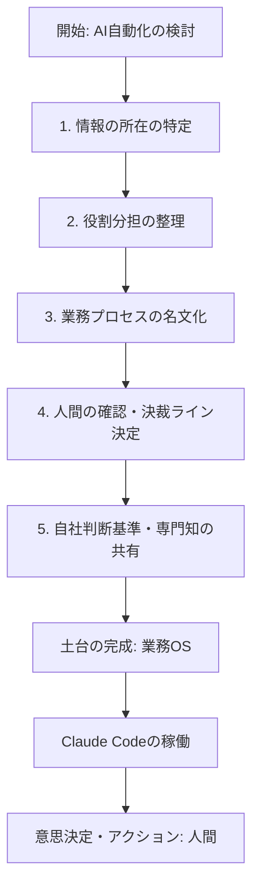

---

tags:
  - type/youtube
  - cat/google
  - topic/claude
  - topic/automation
---

# 【Claude Code徹底活用】ビジネスで使う前に準備すべき５つのポイント教えます

  

## タイムライン

| 時間 | セクション | 主な内容 |

| :--- | :--- | :--- |

| 00:00 | オープニング | AI活用を成功させるための鉄則「まず土台、次に自動化」の重要性を提示 |

| 02:15 | Claude Codeの注目理由 | MCPやAPIの進歩により、各種業務アプリと接続して自律的な業務代行が可能になった技術背景を解説 |

| 05:30 | いきなり自動化が失敗する理由 | データの未整理、役割分担の曖昧さ、デジタル化の不足という3つの大きな障壁を解説 |

| 09:15 | 業務OSという考え方 | 優秀な新入社員を「マニュアルなしで空の机に放置する」例えを用いて、ルール整備（土台）の必要性を説明 |

| 12:30 | 準備すべき5つのポイント | データの所在明確化、役割分担、手順名文化、人間のチェックライン策定、判断基準の共有という5要件の解説 |

| 16:45 | 「部門長の右腕」デモ実演 | 部門長AIが自律的にルールファイルや1on1記録等を読み込み、小林さんの育成課題を抽出する様子を実演 |

| 21:15 | 人間の決裁とAIの役割 | AIは整理・提案を行う最高級の道具であり、最終的な意思決定・判断を下すのは人間（社長）であると定義 |

| 22:15 | 最初に始める3つの問い | 任せる業務の特定、データの棚卸し、確認ラインの策定という、今日からすぐできる3ステップの問いかけ |

| 23:00 | エンディング | オンラインメンバーシップ「AIビジネス実装ラボ」の紹介とチャンネル登録の案内 |

  

## 文字起こし

[00:00] 皆さんこんにちは。自分らしい生き方で元気で幸せな経営をする「あり方社長」を5万人にする、経営コンサルタントの長島です。「社長のためのAI活用実践講座シリーズ」、本日のテーマは「Claude Code（クロードコード）を生かすには順番がある。まず土台、次に自動化」という内容でお届けします。最近、Claude Codeに関する情報が増え、非常に大きな注目が集まっています。

  

[01:15] 今回は、まず「Claude Codeが一体何がどう良いのか」という基本的な話から解説し、その後、自社でClaude Codeを活用する際に「絶対に外してはいけない準備の順番」について詳しくお伝えします。この順番を理解しているかどうかで、Claude Codeが「ただのコスト」になるか「強力な経営の道具」になるかが大きく変わりますので、ぜひ最後までご覧ください。

  

[02:15] まず、Claude Codeとは何かを整理しましょう。これは、Anthropic（アンソロピック）社が開発したAIエージェントです。単にテキストを生成するだけでなく、コンピューターを自分で操作しながら必要なファイルを読み書きし、作業を進められる点が大きな特徴です。開発者向けのツールだと思われがちですが、最近ではMCP（Model Context Protocol）やAPIといった仕組みが整い、カレンダー、スプレッドシート、チャットツールなどの各種業務アプリと直接繋いで連携させることが可能になりました。

  

[04:00] つまり、社内の情報を自動で読み込み、状況を判断して、必要なアプリに書き込むといった自律的な動きが技術的に可能になったのです。たとえば、「先週の売上データを集計してチャットに報告する」「問い合わせの内容から担当者を自動で振り分け、返信の下書きを作る」といった細かい日常業務を、Claude CodeのようなAIエージェントが肩代わりしてくれる可能性が出てきました。毎日のルーティン業務が自動化されれば、社長自身や社員の大切な時間を、もっと価値の高いクリエイティブな仕事に使えるようになります。

  

[05:30] しかし、ここで非常に重要な注意点があります。「便利そうだから、うちの会社もさっそく自動化を導入しよう！」といきなり飛びついてしまうと、ほとんどの場合は失敗します。なぜなら、自動化を進める前に、乗り越えなければならないいくつかの大きな課題があるからです。

  

[07:15] なぜ、いきなり自動化を始めるとうまくいかないのでしょうか。その原因は大きく分けて3つあります。1つ目は、社内のあらゆるデータや情報がどこにあるかが不明確であること。2つ目は、誰が何を担当し、AIに何を任せるのかという役割分担が整理されていないこと。そして3つ目は、そもそも必要なデータがデジタル化されていなかったり、人の頭の中や紙の資料のまま眠っていたりして、AIが読み込める状態になっていないことです。

  

[09:15] そこで重要となるのが、Claude Codeが迷わずに働けるための土台、すなわち「業務OS（オペレーティング・システム）」という考え方です。これは、新しく入ってきた非常に優秀な新入社員をイメージすると分かりやすいでしょう。いくら頭が良くてやる気があっても、初日に案内されたのが空の机だけで、「さあ自由に仕事をしてください」と言われても、何から手を付ければいいか分かりません。

  

[11:00] どこに何の情報があるのか、誰に相談すればいいのか、どのような手順で仕事を進め、どの段階で社長に報告や決裁を仰げばいいのか、それらのマニュアルやルールが全くない状態では、どんなに優秀な人材であっても成果を出せません。これはAIエージェントであるClaude Codeでも全く同じです。高性能なAIを自社に組み込むためには、まず社内のルールや仕組みを整理した「業務OS」という土台を整える必要があります。

  

[12:30] この業務OSの土台を作るために、事前に準備すべき「5つのポイント」をまとめました。1つ目は、「情報の所在（データのありか）を明確にする」ことです。売上データ、お客様情報、社内ルールなど、必要なデータがどこにあり、どうやってアクセスできるのかが整理されている必要があります。2つ目は、「役割分担の整理」です。社長の役割、スタッフの役割、そしてAI（Claude Code）が担う役割を整理・定義します。3つ目は、「プロセスの名文化（動作順序の確立）」です。「まずこの情報を確認し、次にチェックを行い、最後に提出する」という一連の業務プロセスが明確になっている必要があります。

  

[14:30] 4つ目は、「人間（社長）が確認・決済するラインを決める」ことです。全てのプロセスをAIに任せきりにするのではなく、どこから先は人間が目視でチェックし決裁するのか、その境界線を設定します。そして5つ目は、「意思決定に必要な自社の判断基準や専門知のデータ化」です。単なる一般論ではなく、自社が大切にしているルールや判断基準、さらには専門的なフレームワークや知見（デモ内での心理学や脳科学の知見など）を、AIが参照できるデータとして定義しておきます。

  

[16:45] それでは、実際にこの業務OSが整っている状態でClaude Codeがどのように動くのか、デモ画面で「部門長の右腕」としての稼働例を見てみましょう。例えば、部門長が「今月の家電部門の状況、売上、そしてメンバー個人の課題を整理して報告してほしい」と指示を投げます。

  

[18:15] するとClaude Codeは、起動ルールが記述された `CLAUDE.md` などの設定ファイルを自動的に読みに行きます。どの順序で動き、誰の情報をどのファイルから参照すべきか、ルート設定やインボックスの定義に基づいて、家電部門の最新売上データやメンバーの面談記録（1on1シート）を自律的に検索・参照します。

  

[19:30] デモでは、若手メンバーである小林さんの課題について分析が走ります。単に「売上が伸び悩んでいます」という報告だけでなく、社内データにある小林さんの面談ログと、あらかじめ共有してある専門知（心理学における自己決定論や有能感回復といった学術的知見）を組み合わせ、「有能感が一時的に低下しているため、小さな成功体験を積み重ねさせる指導が必要」といった、非常に示唆に富んだ的確なマネジメントのアドバイスまでその場で生成して提案してくれます。

  

[21:15] これこそが、業務OSという土台が整っているからこそ実現できる「Claude Codeの実力」です。AIが自律的に状況を整理して素晴らしい提案をしてくれますが、最終的にどうマネジメントし、どの施策を採用するかを「決める」のは、人間である社長や部門長です。AIは判断を助けるための最高に優秀な「道具」なのです。

  

[22:15] これから自社でClaude Codeを活用しようと考えている社長の皆様は、まず次の3つの問いから考えてみてください。① Claude Codeに、具体的に「何を」任せたいか？ ② そのために必要なデータは「何か」「どこに」あるか？（デジタル化されているか） ③ どこから先は、人間が確認・決裁するか？ これらを整理し、小さな業務OSを紙に書き出すことから、AIのビジネス実装が始まります。

  

[23:00] 私は「AIビジネス実装ラボ」というオンラインのメンバーシップも運営しています。今回のClaude Code活用や、実務における業務OS設計のリアルな試行錯誤を月1回のライブ等で共有しています。ご興味がある方は、概要欄のリンクをぜひご覧ください。それでは、また次回の動画でお会いしましょう。目から鱗の長島でした。ありがとうございました。

  

## 概要

本動画は、最先端のAIエージェント「Claude Code（クロードコード）」をビジネスや経営に導入し、自立型自動化を成功させるための「事前準備の鉄則」について解説しています。

いきなり自動化を導入する前に、AIが自社マニュアルに従って自律的に動けるようにするための土台「業務OS」を整理・構築することが最優先であると強調されています。

動画内では「部門長の右腕」としてのデモが実演され、業務OSを導入しておくことで、AIが単なる集計に留まらず、社内データと専門的な知見（脳科学・心理学）を掛け合わせてメンバーへの的確なマネジメント手法を提案する様子が紹介されています。

  

■ キーポイント

1. **「まず土台、次に自動化」の順序を守る:** AIを機能させるには、業務のルールや流れ（業務OS）をあらかじめ明確にしておく必要があります。

2. **準備すべき5つの要素:** 情報の所在、明確な役割分担、業務プロセスの名文化、人間が決済する確認ライン、および自社独自の判断基準。

3. **人間は決裁者であり続ける:** AIは高度な提案・整理を行う「最高の道具」であり、意思決定をするのは人間（社長やリーダー）です。

  

## 構成図 (Mermaid)

graph TD

    node1["開始: AI自動化の検討"] --> node2["1. 情報の所在の特定"]

    node2 --> node3["2. 役割分担の整理"]

    node3 --> node4["3. 業務プロセスの名文化"]

    node4 --> node5["4. 人間の確認・決裁ライン決定"]

    node5 --> node6["5. 自社判断基準・専門知の共有"]

    node6 --> node7["土台の完成: 業務OS"]

    node7 --> node8["Claude Codeの稼働"]

    node8 --> node9["意思決定・アクション: 人間"]

