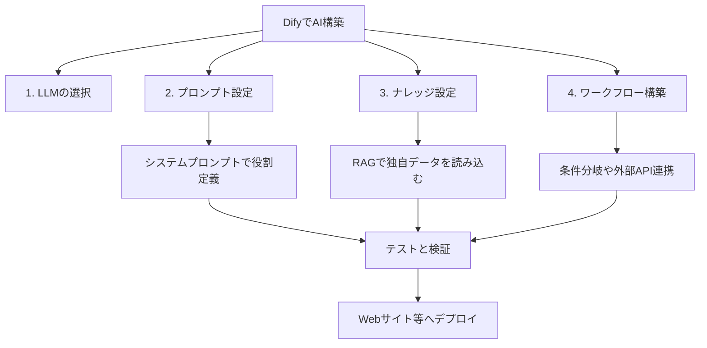

---

tags:
  - type/youtube
  - cat/google
  - topic/dify
  - topic/rag
---

# 【Dify超入門】ノーコードで自分専用のAIエージェント・チャットボットを開発する方法！基本設計から実装手順まで徹底解説

## タイムライン
| タイムスタンプ | セクションタイトル | 内容の要約 | キーポイント |
| --- | --- | --- | --- |
| [00:00] | イントロダクション：Difyとは | Difyの概要と注目される理由を解説。ノーコードで高度なAIチャットボットやエージェントを作成可能。 | プログラミング知識不要で最新AIを活用した業務効率化を実現。 |
| [01:15] | Difyの3つの主要機能 | LLM連携、ナレッジ（RAG）機能、視覚的なワークフロー構築について紹介。 | 多彩なモデルの使い分けと自社データの活用、複雑なプロセスの自動化が可能。 |
| [02:53] | AIエージェントの作成デモ | 実際の画面を用いて、プロジェクトの新規作成とシステムプロンプト設定の手順をデモンストレーション。 | プロンプトで明確な役割や回答のルールを与えることが極めて重要。 |
| [04:20] | ナレッジ（RAG）の設定手順 | 独自のPDFやCSV、URLなどを読み込ませ、AIに最新・独自の知識ベースを持たせる手順。 | データベース自動ベクトル化により嘘の回答（ハルシネーション）を防止。 |
| [05:45] | ワークフロー設計とAPI連携 | ドラッグ＆ドロップによる条件分岐、Web検索、翻訳などの外部ツールの組み合わせ手順。 | 雑談を超えた「自律的な業務プロセス」の自動化をビジュアルに構築。 |
| [07:15] | テスト検証と簡単デプロイ | プレビュー機能でのテスト確認と、Webサイトへの埋め込み・API公開の手順。 | ワンクリックで自社サイトに設置可能な利便性の高さを解説。 |
| [08:30] | エンディングとまとめ | 今回のまとめとDifyを活用した未来の業務改善についての展望。 | まずは手を動かして独自のAIエージェントを作ってみることを推奨。 |

## 文字起こし
[00:00] 皆さんこんにちは。今回は、今大注目のノーコードAIアプリ開発プラットフォーム『Dify（ディファイ）』の基礎知識と、実際に自分専用のAIエージェントを作る具体的な手順について、初心者向けに分かりやすく解説していきます。Difyを使えば、プログラミングコードを一切書くことなく、ChatGPTやClaudeなどの最新AIモデルを組み込んだ、高度なチャットボットや社内業務支援ツールを数分で構築することができます。

[01:15] まず、Difyの主な特徴を3つご紹介します。1つ目は、OpenAIやAnthropicなど、世界中の主要なLLM（大規模言語モデル）を自由自在に選択・変更できる点です。2つ目は、PDFやスプレッドシート、Webサイトなどの独自データをAIに読み込ませることができる『ナレッジ』機能です。これにより、AIが社内規定や独自のサービス仕様に基づいた正確な回答を行えるようになります。3つ目は、直感的なビジュアルエディタを使って、処理のフローを構築できる『ワークフロー』機能です。

[02:53] それでは、実際にDifyを使ってAIエージェントを作る手順を見ていきましょう。管理画面の『アプリを作成』から『エージェント』を選択し、新しいプロジェクトを立ち上げます。まず行うのがシステムプロンプトの設定です。ここではAIに『あなたはプロのマーケティングコンサルタントです』といった具体的な役割や、回答時のルール、トーン＆マナーを指定します。この設定次第でAIの回答クオリティが大きく変わるため、非常に重要なフェーズとなります。

[04:20] 次に、AIに独自知識を持たせるための『ナレッジ』機能の設定です。画面左側のメニューからナレッジセクションに入り、手元にある資料をアップロードします。Difyは自動的にテキストを適切なサイズに分割し、ベクトル化してデータベースに保存してくれます。この独自データとLLMを組み合わせる仕組みをRAG（検索拡張生成）と呼び、ハルシネーション（嘘の回答）を防ぐために欠かせない設定です。

[05:45] さらに高度なAIを作りたい場合は、ワークフロー機能を使用します。例えば、ユーザーから質問が来たら、まず『社内データベースを検索する』、情報が見つからなければ『Web検索で最新情報を取得する』、最後に『結果を指定のフォーマットで要約して回答する』といった一連の処理プロセスを、ドラッグ＆ドロップで視覚的に組み立てることができます。これにより、単なる雑談AIを超えた、完全自動の業務プロセスを自動化することが可能になります。

[07:15] 最後に、作成したエージェントのテストとデプロイです。画面右側にあるプレビュー機能を使って、想定通りにAIが動作するか、ナレッジから正しい情報を参照できているかを検証します。動作に問題がなければ、画面上部の『デプロイ』ボタンをクリックするだけで完了です。発行された埋め込みコードを自身のWebサイトに貼り付けるだけで、一瞬で自社サイトに高機能なチャットボットを設置することができます。

[08:30] いかがでしたでしょうか。Difyを使えば、これまで専門の開発会社に依頼して数百万円かかっていたようなAIシステムを、誰でもノーコードで、かつ数時間で構築することができます。ぜひ今回の動画を参考に、ご自身の業務に合わせた最強のAIエージェントを作ってみてください。それでは、また次回の動画でお会いしましょう。

## 概要
Difyを活用してノーコードで高度なAIエージェントやチャットボットを開発するための入門ガイドです。主なポイントは以下の通りです。
1. Difyとは: プログラミング知識不要で、主要なLLM（ChatGPTやClaude等）や外部知識ベース（RAG）を組み合わせたAIアプリをビジュアル構築できるプラットフォーム。
2. システムプロンプト設計: AIエージェントに役割や回答のトーン＆マナーなどの指示を正確に与えることの重要性。
3. ナレッジ機能（RAG）: 独自のPDFやCSV資料をアップロードすることで、社内独自のデータに基づいた回答が可能になり、嘘（ハルシネーション）を激減させる。
4. ワークフローと外部API: ビジュアルエディタを用いた直感的な条件分岐やWeb検索などの複数プロセスの自動化。
5. ワンクリックデプロイ: テスト後に容易にWebサイトに埋め込んだりAPI公開できる利便性。

## 構成図 (Mermaid)

