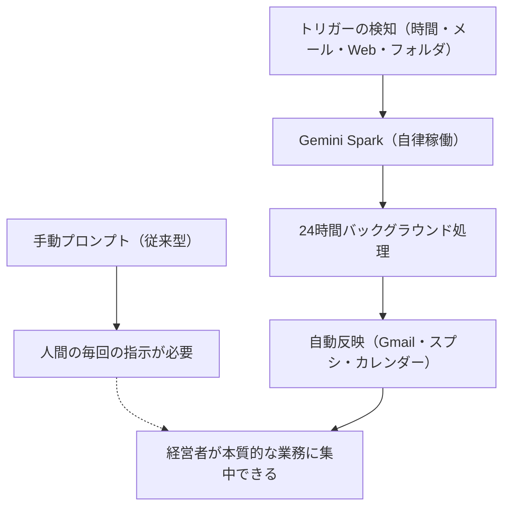

# 【Gemini Spark】指示出しはもう古い！PCを閉じたまま仕事が完了する『5大自動トリガー』実践活用術

## タイムライン
| タイムスタンプ | 項目・トピック | 内容の概要 |
| --- | --- | --- |
| 00:00 | オープニング | 指示出し不要の「5大自動トリガー」を活用してPCを閉じたまま仕事を完了させる方法の概要を紹介。 |
| 01:25 | Gemini Sparkとは | 従来の「人間がプロンプトを入力して動かす対話型AI」と異なり、事前に登録した条件で自律実行する「AIエージェント」である点を解説。 |
| 03:05 | 料金プランの朗報 | 月額2000円台の「Google One AI Premium（AI Pro）」プランでGemini Sparkが解放されたことを紹介。 |
| 03:51 | トリガーの仕組み | 手動操作を必要とせず、事前に設定された特定の「イベントや条件（合図）」を起点としてAIがバックグラウンドで動作する仕組みを説明。 |
| 04:53 | 5つのトリガー種類 | 時間ベース、メール受信、ドライブ監視（ファイル検知）、Webシグナル（Web監視）、他システム連携の5つの自動起動パターンを紹介。 |
| 06:03 | 実際のトリガー一覧 | 配信者が自ら裏側で運用している最新AIニュース要約、ミーティング前文脈レポート、領収書自動記帳などのリアルな活用例。 |
| 09:27 | トリガーの設定方法 | 日本語の自然な文章（プロンプト）を一度指定するだけで、ノーコードでトリガー登録ができる具体的な手順を解説。 |
| 11:25 | 実演デモ | Microsoft Copilotの最新動向をWeb監視し、Gmailへ要約レポートを送信する具体的な設定実演。 |
| 14:08 | テスト実行と結果確認 | 設定したトリガーが正しく作動するか、実際に即時テストしてGmailに自動生成された最新レポートを確認するデモ。 |
| 15:12 | 世界①：ニュース自動受信 | 毎朝自動で自分の追いたいAI関連 of 最新ニュースが、読みやすく要約された状態でメールに届く変化を解説。 |
| 16:45 | 世界②：ミーティング前文脈 | カレンダー予定を起点に、前日のうちに前回ミーティングの議事録や関連資料の要約が届き、準備作業を自動化。 |
| 17:33 | 世界③：Meet完了後全自動 | Google Meetのウェブ会議完了と同時に文字起こしから議事録作成、フォルダ保存、次回予定の登録まで全自動で行う流れ。 |
| 18:48 | 世界④：領収書スキャン記帳 | スマートフォンで領収書をスキャンするだけで、金額や仕訳を読み取りスプレッドシートの資金繰り表に自動反映。 |
| 20:41 | 世界⑤：Webサイト自動監視 | 自治体の補助金公募ページや競合サイト、モデル企業サイトの更新情報のみを検知して瞬時に自動レポート化。 |
| 24:00 | まとめ | 人間がプロンプトを入力する時代からワークフローを構築し自律動作させる「AIエージェント」の時代へ移行することの重要性。 |
| 25:10 | エンディング | メンバーシップ「AIビジネス実装ラボ」の案内と、チャンネル登録のお願い。 |

## 文字起こし
[00:00] みなさん、こんにちは。「社長のAI実践チャンネル」の長島です。今回の動画では、Googleの最新AIエージェント「Gemini Spark」の最大の目玉機能である「自動トリガー機能」について完全解説します。これまでの生成AIは、チャット画面を開いてプロンプト（指示）を手で打ち込む必要がありましたが、Gemini Sparkは違います。事前にトリガー（条件）を登録しておくだけで、PCを閉じた状態でも、裏側でAIが24時間体制で自律的に仕事を完了してくれます。毎朝のAIニュースの自動受信から、ミーティング前の文脈共有、Meet完了後の顧客管理、領収書のスキャン自動記帳、さらにはウェブサイトの自動監視まで、日常業務を全自動で回転させる実践的な活用術をすべてお見せします。

[01:25] それでは早速、内容に入っていきましょう。まず「Gemini Spark（ジェミニ・スパーク）」とは何なのか、従来の対話型Geminiとの根本的な違いから整理していきます。従来のGeminiやChatGPTは、ブラウザを開いて「〇〇をやってください」と人間が指示文を送信して初めて動き出すものでした。つまり、常に人間が起点（プロンプト送信）となる必要がありました。これに対してGemini Sparkは、事前に設定された特定の「トリガー（イベント）」を起点にして、自律的に動く「AIエージェント」です。作業の手順だけを一度教えておけば、あなたが寝ている間や、スマートフォンを閉じて移動している間でも、裏側の仮想マシンがタスクを勝手に実行して結果を報告してくれます。

[03:05] そして非常に嬉しいニュースがあります。当初、このGemini Sparkは非常に高度なプランでのみ提供されると予想されていましたが、なんと月額2000円台で利用可能な「Google One AI Premium（AI Pro）」プランでも解放されることになりました。これにより、個人のビジネスパーソンや、中小企業の経営者、フリーランスの方でも、非常にリーズナブルな価格でこの強力な自動化エージェントを自分の「専属秘書」として手に入れることができるようになったのです。

[03:51] ここから、Spark最大の目玉機能である「トリガー」の仕組みについて深掘りしていきましょう。トリガーとは、いわば「仕事を開始するための合図」です。人間が「今やって」と指示する代わりに、「〇〇という状況が発生したら、自動的にこのタスクを実行して」という設定をしておくものです。このトリガーをうまく使うことで、私たちが毎日手動で行っていた「情報のコピー＆ペースト」や「状況の確認」といった定型的なルーティン作業から完全に解放されます。

[04:53] Gemini Sparkのトリガーとして設定できる種類は、大きく分けて5つあります。1つ目は「時間ベーストリガー」。例えば、毎朝8時など決まった時間に自動実行するものです。2つ目は「メール受信トリガー」。特定のアドレスやフィルター条件に該当するメールが届いた瞬間に起動します。3つ目は「ドライブ監視（ファイル検知）トリガー」。Googleドライブの指定フォルダにファイル、音声、画像が置かれたときに動きます。4つ目は「Webシグナル監視（Webサイト監視）トリガー」。競合サイトの更新情報や自治体の補助金公募の状況を検知して自動で起動するトリガーです。5つ目は「他システム連携によるイベントトリガー」です。これらの組み合わせで、様々な自動化を実現できます。

[06:03] 続いて、実際に私（長島）が裏側で走らせているリアルなトリガー設定の一覧をご紹介します。私の場合、日々YouTubeなどで最新情報を発信する必要があるため、「AI関連の最新ニュース（Google, OpenAI, Anthropicなど主要AI企業の最新動向）の自動収集・要約」を毎日走らせています。さらに、クライアントとのミーティング前日に自動で「前回の議事録や文脈」をまとめて自分宛てに送信する設定、Google Meet終了後に自動で「議事録のフォルダ整理とカレンダー登録」を行う設定、スマートフォンで領収書をスキャンするだけで「スプレッドシートの資金繰り表に自動記帳」される設定、競合他社や自治体の「Web更新監視」など、私のビジネスのあらゆる部分がトリガーによって自動で回転しています。

[09:27] それでは、実際にどのようにトリガーを設定するのか、具体的な手順を実演でお見せします。難しそうに聞こえるかもしれませんが、Gemini Sparkの設定は「日本語の自然な文章で指示を指定するだけ」で完結します。プログラミングの知識は一切必要ありません。「タスク設定画面」から「新しく自動化したい作業」を会話形式、または設定パネルで打ち込んでいきます。

[11:25] ここでは「Microsoft Copilotの最新動向を監視する」という具体的なテーマで、Web監視トリガーの設定デモを行います。Sparkのプロンプト入力欄に「Microsoft Copilotに関する公式リリースや最新ニュースを定点観測し、新規情報があれば要約して私のGmailに送ってください」と日本語で入力するだけで、裏側で監視タスクとスケジュールが自動構築されます。画面上でどのようにトリガーが定義され、カレンダーやメールと連携されるかをご覧ください。

[14:08] トリガーを登録したら、まずは正しく機能するか「テスト実行」を行います。手動でテストボタンを押すと、Sparkが即座にWeb上の最新情報を検索し、設定に沿ったフォーマットでGmailに結果を送信してくれます。ご覧のように、わずか数十秒で「Microsoft Copilotに関する最新動向レポート」が作成され、見やすいリスト形式で私のメールボックスに届いていることが確認できます。これが一度設定できれば、あとは完全に放置で毎日実行されます。

[15:12] ここからは、トリガーがビジネスに導入されることで、私たちの日常（世界）がどのように変わるか、5つの具体的なシーンをご紹介します。まず「世界①：毎朝、最新ニュースが自動で手元に届く」です。朝起きてメールを開くだけで、自分が追いたいトピック（私の場合は国内外のAI最新アップデート情報）が、Sparkによって簡潔に日本語でまとめられた状態で用意されています。膨大なニュースサイトを巡回する時間がゼロになります。

[16:45] 次に「世界②：ミーティング前に前回の文脈が届く」です。打ち合わせの前日や数時間前、カレンダーの予定をトリガーにして、SparkがGoogleドライブから「前回そのクライアントと何を話したか」「どんなアジェンダがあるか」を自動で探し出し、要点レポートとしてメールで教えてくれます。「前回の話って何だっけ？」とフォルダをあさる準備時間が不要になります。

[17:33] そして「世界③：Google Meet完了後に顧客フォルダ整理とカレンダーが自動更新される」です。オンライン会議（Meet）が終わると、自動で文字起こしデータが読み込まれ、議事録の要約が作成されます。それだけでなく、その顧客のGoogleドライブ内専用フォルダに議事録が自動保存され、会議中で合意した次回ミーティングの予定がGoogleカレンダーに自動登録されます。

[18:48] 「世界④：書類をドライブにスキャンするだけで資金繰り表へ自動記帳される」です。スマホのGoogleドライブアプリにあるスキャン機能を使って、領収書や請求書をカレンダーまたはフォルダに取り込むだけで、SparkがOCRで文字と金額を読み取ります。さらに仕訳の推測まで行い、自分の管理用スプレッドシート（資金繰り表など）に自動で転記・保存をしてくれます。手入力の負担がほぼ皆無になります。

[20:41] 最後の「世界⑤：競合やモデル企業、自治体のWeb更新を自動キャッチする」です。毎日何度もチェックするのが面倒な「国や地方自治体のAI補助金ページ」や「マークしている他社サイト」をSparkに監視させます。何か更新（テキストや資料の追加）があった時だけ通知されるようにすることで、チャンスを逃さず、かつ無駄なサイト訪問を徹底的に削減できます。

[24:00] まとめです。従来の「手動でプロンプトを入力してAIを動かす」というフェーズは、もう古くなりつつあります。これからは、人間が一度ルールやワークフロー（タスク・スケジュール・スキル）を設計し、AIがトリガーによって勝手に動き、結果だけを受け取る「自律型AIエージェント」の時代です。定型的な業務の手間を極限まで減らし、経営者やビジネスパーソンが「本当に集中すべき創造的な仕事や本質的な経営判断」にすべてのリソースを投入できる環境を作りましょう。ぜひ皆さんもトリガー設定を試してみてください。

[25:10] エンディングとなります。今回はGemini Sparkの5大自動トリガーについてお届けしました。私のYouTubeメンバーシップ「AIビジネス実装ラボ」では、こうした最新のAIツールをビジネス現場へどのように泥臭く実装していくか、具体的な手順やプロンプトの裏側をさらに深く提供しています。興味のある方はぜひ概要欄のリンクからチェックしてみてください。それでは、また次回の動画でお会いしましょう！チャンネル登録と高評価もぜひよろしくお願いします。ありがとうございました！

## 概要
この動画では、Googleが展開する最新の自律型AIエージェント「Gemini Spark（ジェミニ・スパーク）」の目玉機能である「自動トリガー（スケジュール）」の仕組みと実践的なビジネス活用方法を解説しています。

従来の「人間が毎回プロンプトを手動入力する」対話型AIから、「あらかじめ条件を登録しておき、裏側でAIが24時間自律稼働する」自律エージェントへと変化しました。 この画期的な機能が、月額2000円台の「Google One AI Premium（AI Pro）」プランに開放されたことで、誰でも手軽に導入可能になりました。

自動化の起点となる5大トリガー（時間、メール、ファイル検知、Web監視など）を組み合わせ、最新AIニュースの自動レポート、ミーティング前日の文脈自動共有、Meet終了後の資料整理・カレンダー自動登録、領収書スキャンからの自動記帳、競合や自治体Webの自動更新キャッチといった、経営者やビジネスパーソンのルーティンを自動化し「本質的業務」に集中できる環境の作り方を実演を交えて詳しく紹介しています。

## 構成図 (Mermaid)

