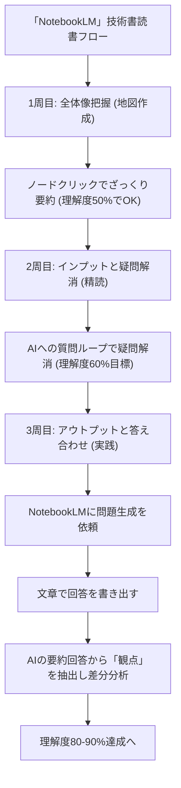

---

tags:
  - type/youtube
  - cat/google
  - topic/gemini
  - topic/notebooklm
---

【NotebookLM】AIを使えば技術書は10倍速く理解できる

  

## 概要

本動画では、時間の限られたエンジニアに向けて、GoogleのAIツール「NotebookLM」を効果的に活用し、技術書を高速かつ高精度で読破・理解するための「3ステップ読書法」を解説しています。一ページ目から順に読んでいく従来型の非効率なアプローチを脱却し、AIとの双方向コミュニケーションを通じて、短期間で知識を「自分のもの」にするプロセスを紹介しています。

  

【重要なポイント】

1. 1周目（全体像把握）: 技術書をNotebookLMに読み込ませ、大まかな章立てや関連性を1〜2日で確認します。理解度は半分以下で十分であり、脳内に「知識の地図」を作ることに集中して全体の認知負荷を下げます。

2. 2周目（疑問解消・インプット）: 詳細を読み進めながら、専門的で不明な箇所をAIに質問して解決します。Gemini連携の強みを活かし、わかりやすい解説を新規ソースとして蓄積。完璧を求めず理解度6割程度を目標に進めます。

3. 3周目（アウトプット・答え合わせ）: NotebookLMに生成させた問題に対し、文章で自己回答を作成します。AIが提示する要点（必要な観点）と自己の回答との「差分」を抽出して確認・修正を繰り返すことで、理解度を80〜90%の定着度へと引き上げます。

  

## タイムライン

| タイムスタンプ | セクション名 | 重要ポイント |

| --- | --- | --- |

| 00:00 - 01:15 | イントロダクション | 技術書読書における「時間が足りない」「最初の方を忘れてしまう」という課題を提示。 |

| 01:15 - 02:45 | 読書法の全体像紹介 | Google NotebookLMを駆使した、全体像・インプット・アウトプットによる3ステップ学習法を提示。 |

| 02:45 - 05:30 | Step 1：1周目のアプローチ | 書籍をソースに追加し、最上階層ノードからざっくりした要約を掴んで1〜2日で脳内に知識の地図を作成。 |

| 05:30 - 08:45 | Step 2：2周目のアプローチ | 不明点をAIに質問するループ。Gemini連携で解説を再ソース化し、理解度6割目安で次章へ進む。 |

| 08:45 - 13:30 | Step 3：3周目のアプローチ | AIに問題を作成させ、文章で自己回答。AIの要約から必須観点を抽出し、現状と目標の差分分析を行う。 |

| 13:30 - 15:09 | まとめとエンディング | 3つのステップによる効果の総括。NotebookLMの活用メリットを強調し、視聴者へ意見募集の呼びかけ。 |

  

## 構成図 (Mermaid)

  

## 文字起こし

どうも、えびえびです。毎日仕事が忙しくて、新しく買った技術書をじっくり読む時間が取れないと悩んでいませんか？分厚い技術書を1ページ目から順番に読んでいくと、途中で挫折してしまったり、最後まで読んでも最初の方の内容を忘れてしまったりすることがよくありますよね。今回は、そんな忙しいエンジニアの方向けに、Googleが提供している無料のAIツール「NotebookLM」を活用して、技術書を従来の10倍のスピードで爆速で理解する、新しい読書法について詳しく解説します。この読書法は、単に「AIに本を要約させて終わり」というものではありません。AIと対話しながら効率的に脳内に「知識の地図」を作り上げ、アウトプットを通じて深く記憶に定着させる実践的な学習フローとなっています。具体的には、1周目で全体像を把握し、2周目で疑問を解消するインプットを行い、3周目で問題演習を通じたアウトプットと答え合わせを行う、という3ステップで進めます。それでは、さっそく「1周目：全体像把握」から見ていきましょう。まず、読み込みたい技術書の電子データ（PDFやテキストなど）をNotebookLMのソースとして追加します。1周目の最大の目的は、「この書籍にはどのような情報が、どのような順番で並べられ、どう関連付けられているのか」をメタ的に把握することです。つまり、頭の中に「知識の地図」を作成することです。具体的な進め方としては、NotebookLMの画面上で生成される章立てや重要ノードを上から順番にクリックし、出力される解説をざっと読んでいきます。一番上の階層のノードをクリックして出力される解説は、非常にざっくりとした要約になるため、最初は少し分かりにくいかもしれません。しかし、この段階ではざっと全体を把握したいだけなので、内容の半分も理解できなくて大丈夫です。もし、あまりにも要約されすぎていて何が書いてあるかさっぱり分からないという場合は、1つ下の階層に下がってノードをクリックし、少し詳しい要約を出力してもらいましょう。ただ、1周目はあくまで「どこに何が書いてあるか」という全体像を知るためのものなので、階層を下がっても分からない場合は、一旦飛ばして次に進めてしまうのがコツです。この全体像の把握は、時間をかけすぎると後半に進んだときに前半の内容を忘れてしまい、頭の中の地図が作れなくなってしまいます。そのため、できれば1日、長くても2日程度で一気に終わらせるのが理想的です。こうして最初に全体像の地図を持っておくことで、2周目以降で理解を深める際にかかる「認知負荷」を大幅に減らすことができます。続いて、「2周目：インプットと疑問解消」のステップです。全体像の地図ができたら、次はじっくりと本を読み進めながら、理解できない部分をピンポイントで解消していきます。本を読んでいて「ここはどういう意味だろう？」「このコードの挙動がわからない」といった疑問が出てきたら、その部分をコピーしてNotebookLMやChatGPTに投げ、分かりやすく解説してもらいましょう。もし解説の中でさらに分からない専門用語などが出てきたら、追加で質問を繰り返す、という質問のループで理解を深めていきます。ちなみに、もしGemini（ジェミニ）を連携して使っている場合は、AIが出力してくれた非常に分かりやすい解説文を、そのままNotebookLMの新しい「ソース」として簡単に追加することができます。一度読んで難しかった部分は、後で読み返した時にもやはり同じように詰まりやすいので、自分専用の解説ソースとして追加しておけるのは本当に便利です。ただし、ソースをあまりに多く追加しすぎると、NotebookLMの最大のメリットである「ソースに閉じているからハルシネーション（嘘の出力）が発生しにくい」という強みを薄めてしまう可能性があるので、追加しすぎには少し注意してください。また、2周目の時点で100%完璧に理解しようとする必要はありません。前の章の理解がまだ浅いせいで引っかかっているだけで、後の章を読み進めてから戻ってくると、パズルのピースがはまるようにすんなり理解できることがよくあるからです。そのため、2周目も「理解度は6割くらいでいい」と割り切って進めるのが、挫折しない重要なポイントです。最後に、「3周目：アウトプットと答え合わせ」に進みます。いよいよ最後の仕上げとして、本当に本の内容が身についているか、アウトプットを通じて確認します。まず、NotebookLMに「この本の内容に基づいて、理解度を確かめるための問題（クイズ）を作成してください」と指示して、問題を作ってもらいます。そして、出力された問題に対して、自分の回答を「実際の文章」として作成してみます。ここは少し面倒くさい作業ですが、自分の回答を頭の中だけで済ませず、一度ちゃんと文章化してからこの後の答え合わせに進むことが、理解を深める上で一番重要なプロセスになります。このアウトプットのステップがないと、この読書法をやっている意味が半減してしまうと言っても過言ではありません。回答を作成したら、答え合わせに進みます。答え合わせの方法は非常にシンプルで、NotebookLMが作ってくれた質問をそのままプロンプトとしてAIに投げるだけです。すると、NotebookLMがその質問に対する解答を出力してくれます。ここで、答え合わせのやり方には大切なポイントがあります。NotebookLMが出力する解答は、あなたの書いた文章を一言一句採点するような「模範解答」というよりは、書籍の中でその問題に関連する部分をまとめた要約になっています。そのため、「自分の回答がAIの出力と一致しているか」を比べるのではなく、AIの解答から「この問題に答えるためには、少なくともこの観点の説明は必要だな」と思う要素を自分で抽出し、自分の書いた回答にその重要な観点がしっかりと含まれているかどうかを確認するようにしてください。要するに、自分の現状の理解と、目指すべき目標の「差分」を自分で認識し、それを改善していくような使い方をするのがベストです。この3周目のプロセスを経ることで、より下の階層にある深い知識にアクセスし、理解度を8割から9割へと一気に引き上げることができます。以上が、NotebookLMを活用した技術書の爆速読書法です。毎日忙しくてなかなか読書の時間が取れないというエンジニアの皆様も、この「全体像把握」「疑問解消」「アウトプットと答え合わせ」の3つのサイクルを回すことで、これまでとは比べ物にならないスピードと深い理解で技術書をマスターできるようになります。シンプルな使い方ではありますが、非常に強力ですので、ぜひ今日から試してみてください。私もまだまだNotebookLMを活用し始めたばかりですので、「他にもこんな素晴らしい使い方があるよ！」というアイデアがあれば、ぜひコメント欄で教えていただけると嬉しいです。この動画が少しでも皆さんの学習の役に立てば幸いです。それでは、また次回の動画でお会いしましょう！