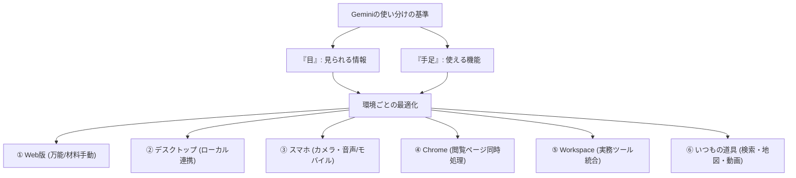

---

tags:
  - type/youtube
  - cat/google
  - topic/gemini
---

# 【保存版】Geminiは実は6種類ある！？今、絶対に押さえるべき“使い分け“｜ブラウザ・デスクトップアプリ・スマホ・Chrome・Workspace

## タイムライン
| タイムスタンプ | セクション名 | 内容の要約 |
| --- | --- | --- |
| 0:00 | はじめに | Geminiのアクセス環境（ブラウザ、スマホ、Workspace等）が乱立して迷うユーザーへの問題提起 |
| 1:31 | 第1部 何が違うのかを一言で言うと | 使い分けは「見られる情報（目）」と「使える手足（機能）」の掛け算で決まるという原則を解説 |
| 4:06 | 第2部 代表的な5つ | 状況に応じた代表的な5つのアクセス方法（Web、デスクトップ、スマホ、Chrome、Workspace）の紹介 |
| 4:16 | ① ブラウザのGemini（Web版） | ファイルやURLを自分でアップロードして指示を出す、機能が最も標準的で万能な起点 |
| 6:13 | ② デスクトップアプリ | PC内のローカルファイルをダウンロード不要でそのままシームレスに扱える実務向けの環境 |
| 8:10 | ③ スマホアプリ | 音声対話やカメラ撮影、GPSなどモバイルならではの「手足」を活かした外出先での活用法 |
| 9:30 | ④ Gemini in Chrome | 表示中のWebサイトを開いたまま、画面の横で即座に要約や追加質問ができるサイドパネル機能 |
| 10:56 | ⑤ Google Workspace | Gmailやスプレッドシートの画面を切り替えずに、その場でデータ分析や返信文作成を行えるビジネス用連携 |
| 13:39 | 第3部 その他 いつもの道具の中にも | Google検索、YouTube、マップ等に内蔵されたGeminiが、日常の使用感のまま裏側でアシストする機能 |
| 15:20 | まとめ | やりたいタスクと現在ある情報に合わせて6つのGeminiを適切に選択・使い分ける重要性を提示 |

## 文字起こし
[00:00] みなさんこんにちは、テックキャンプAIカレッジのGENです。ブラウザのタブにもGeminiがいて、デスクトップにもGeminiのアイコンがあって、スマホにも入っていて。最近、Geminiは色々な場所に登場しています。でも、「結局どれを使えばいいの？」「全部同じじゃないの？」と迷っている方も多いのではないでしょうか。中身は同じだと思ってなんとなく使っていると、毎回チャット欄にファイルをアップロードするという遠回りをすることになり、非常にもったいないです。実はGeminiは、同じ名前で同じように話しかけても、開く場所（環境）によって得意なことが全く変わります。

[01:31] それでは第1部、「何が違うのかを一言で言うと」について解説していきます。結論からお伝えすると、使い分けの基準となるのは「見られる情報（目）」と「使える手足（機能）」の掛け算です。同じGeminiという「頭脳」を共有していても、ブラウザ、デスクトップ、スマホなど、開く場所によって「何が見えているか（コンテキスト）」、そして「実際に何ができるか（使える機能）」が異なります。例えば、スマホ版はカメラやGPSという「目」を持っており、現実世界の情報を取り込めます。一方で、デスクトップアプリはパソコンのローカルファイルを直接触れる「手足」を持っています。この掛け算によって、それぞれの得意分野が決定するのです。

[04:06] ここからは第2部、代表的な5つのGeminiについて具体的に紹介していきます。

[04:16] まず1つ目は「ブラウザのGemini（Web版）」です。gemini.google.com から直接アクセスする、もっとも標準的なWeb版のGeminiです。こちらは、自分でファイルやURLを貼り付けて、AIに材料を渡すという特徴があります。なんでも器用にこなす万能な存在ですが、ユーザーが自ら資料を手動でアップロードして指示を出す必要があります。基本となる起点として使いやすい一方で、手作業でのタブの切り替えやダウンロード、アップロードの往復が発生するのが難点です。

[06:13] 2つ目は「デスクトップアプリ版」のGeminiです。こちらはPWA機能などを使って、パソコンにアプリとして独立させて使う方法です。最大の特徴は、パソコン内のローカルフォルダやファイルを、ダウンロードフォルダを経由せずにそのままシームレスに扱える点です。ブラウザ版でよくある「一度ダウンロードして、それをまたブラウザにドラッグ＆ドロップしてアップロードする」という手間が一切不要になります。ファイル保存や管理の手間を大幅に減らし、PC上の作業効率を爆速に高めてくれます。

[08:10] 3つ目は「スマホアプリ版」のGeminiです。移動中や外出先といったオフラインに近いモバイル環境で大活躍します。こちらは音声入力（Gemini Liveなど）やスマートフォンのカメラ、GPSを「手足」として使えるのが最大の強みです。街中で見かけたものにカメラを向けて「これについて教えてにゃ」と話しかけたり、移動中に音声のみでハンズフリーの壁打ち相談を行ったりするのに最適です。デスクを離れた場所で、リアルタイムに情報を得るための使い方が適しています。

[09:30] 4つ目は「Gemini in Chrome」です。ブラウザであるGoogle Chromeのサイドパネルに常駐するGeminiです。こちらは、今見ているウェブページを一緒に並行して「見てくれる」のが特徴です。新しいタブを開いたり、別の画面に切り替えたりすることなく、記事やドキュメントを開きっぱなしのままで「このページの要点を教えて」と即座に要約させたり、疑問点を深掘りしたりできます。情報のインプットとAIへの質問をワン画面で完結させたいときに非常に便利です。

[10:56] 5つ目は「Google Workspace内のGemini」です。Gmail、Googleドキュメント、Googleスプレッドシート、スライドといった、日常的に使っている仕事用ツールの中に組み込まれているGeminiです。例えば、スプレッドシートの数式エラーをその画面のままでAIに直してもらったり、Gmailで過去のやり取りを参照しながら自動で返信文を作成してもらったりすることができます。ファイルをどこかに貼り付けたり、アプリを切り替えたりする手間の差がゼロになるため、オフィスワークの作業時間を劇的に削減できます。

[13:39] 続いて第3部、「その他 いつもの道具の中にも入っているGemini」についてです。実は意識していないかもしれませんが、Google検索、YouTube、Googleマップといった日常的に愛用している既存のサービスの中にも、Geminiはすでに溶け込んでいます。検索結果を分かりやすくまとめてくれたり、YouTubeの動画内容をその場で解説してくれたり、マップのルート案内にAIがアドバイスをくれたりと、私たちのすぐ隣で静かにサポートしてくれています。

[15:20] 最後にまとめです。今回は、開く場所や環境によって全く異なる得意分野を持つ「6つのGemini」の使い分けについてご紹介しました。「どれか1つのアプリだけ使えばいい」というわけではなく、「今、自分の目の前にある情報」と「やりたいタスク」に合わせて最適なGeminiを呼び出すことが、これからのAI時代に仕事を爆速で終わらせるための最大のコツです。みなさんもぜひ、それぞれのGeminiを賢く使い分けてみてください。

## 概要
本動画では、Googleの生成AI「Gemini」がアクセスする環境（デバイスやアプリケーション）によって、得意とする機能やアプローチがどのように変わるかを解説しています。使い分けを判断する基準として「見られる情報（目）」と「使える手足（機能）」の掛け算を提示し、それぞれの特徴を整理しています。

■ キーポイント：
1. 【ブラウザのGemini (Web版)】：万能で手軽な起点。自分で材料（ファイルやURL）を渡して作業させるのに適しています。
2. 【デスクトップアプリ】：ローカルファイルを直接シームレスに処理。ダウンロード・アップロードの手間を削減します。
3. 【スマホアプリ】：カメラ・音声・GPSを駆使。移動中や外出先でのハンズフリー対話や現実世界の撮影分析に最適です。
4. 【Gemini in Chrome】：ブラウザのサイドパネルで稼働。見ているページを開きっぱなしにしたまま要約や深掘り質問が可能です。
5. 【Google Workspace】：Gmailやスプレッドシートに直接組み込まれ、ツールの画面を切り替えずに業務を完結できます。
6. 【検索・マップ・YouTube等との統合】：日常のツールに最初から溶け込んでおり、ユーザーが意識せずに裏側でサポートします。

## 構成図 (Mermaid)

