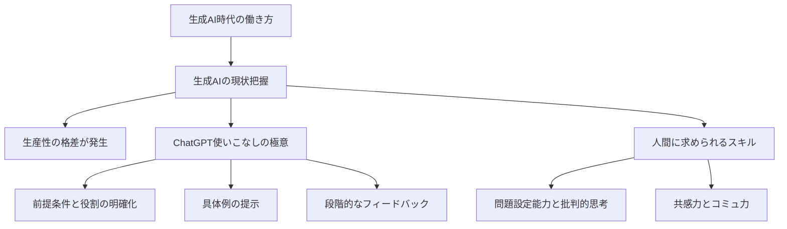

---

tags:
  - type/youtube
  - cat/google
  - topic/chatgpt
  - topic/automation
---

# 【完全解説】ChatGPT・生成AIで仕事が変わる！2026年最新の業務効率化と未来の働き方

## タイムライン
| タイムスタンプ | セクション名 | 主な内容 |
| :--- | :--- | :--- |
| 00:00 | イントロダクション | AI時代の生産性向上と本動画の主旨について紹介。 |
| 02:15 | 第1章：生成AIがもたらす変化 | AIを使う人と使わない人の間に生じる「生産性の格差」を説明。 |
| 05:30 | 第2章：ChatGPT使いこなしの極意 | 前提条件の付与、具体例の提示、段階的修正という3つのプロンプト技術。 |
| 09:45 | 第3章：業務効率化の具体例 | 文章作成、データ分析、プログラミング自動化における実践的な活用法。 |
| 14:20 | 第4章：人間に求められるスキル | クリティカルシンキング、問題設定能力、共感力など人間の強みの再定義。 |
| 18:50 | エンディング | 完璧を求めず、まずは小さな業務から実践することの重要性を伝達。 |

## 文字起こし
[00:00] みなさん、こんにちは。本日は「ChatGPT・生成AIで仕事が変わる！業務効率化と未来の働き方」というテーマで、生成AIをどのように日々の業務に落とし込み、生産性を劇的に向上させるかについて徹底解説していきます。現在、AI技術は急速に進化しており、もはや単なる「便利なツール」を超えて、私たちの働き方そのものを根本から変えるゲームチェンジャーとなっています。この動画では、AIを使いこなして自分の価値を高める方法をステップバイステップでお伝えします。

[02:15] まず第1章として、生成AIがもたらしている社会的な変化と現状について整理しましょう。多くの人が「AIに仕事が奪われるのではないか」という漠然とした不安を抱えています。しかし、実際には「AIを使う人に、AIを使わない人が仕事を奪われる」というのが正確な表現です。例えば、これまで数時間かかっていた市場調査や資料の要約、メールの返信文作成などは、AIを適切に活用することで数分で完了するようになっています。この圧倒的なスピードの差が、個人の生産性に決定的な格差を生み出しているのです。

[05:30] それでは、第2章として、実際にChatGPTなどの生成AIを使いこなすための「3つの極意」を紹介します。1つ目は「前提条件と役割の明確化」です。単に「企画書を書いて」と指示するのではなく、「あなたは優秀なマーケティングコンサルタントです」と役割を与え、ターゲットや目的を詳細に伝えることが重要です。2つ目は「具体例（Few-shotプロンプト）の提示」です。期待する出力のフォーマットやトーンの例をあらかじめ示すことで、精度が劇的に向上します。3つ目は「フィードバックによる段階的な修正」です。一度の回答で満足せず、対話を重ねて磨き上げていく姿勢が不可欠です。

[09:45] 続いて第3章では、具体的な業務効率化の事例をいくつかご紹介します。1つ目は「文章作成と編集」です。ブログ記事の執筆から、プレスリリース、さらには謝罪メールの文面まで、トーン＆マナーを指定して一瞬で作成できます。2つ目は「データ分析とアイデア出し」です。大量のアンケート結果から課題を抽出させたり、新規事業のアイデアを100個ブレインストーミングさせたりする作業はAIの得意分野です。3つ目は「簡易的なプログラミングとツール連携」です。Excelのマクロ（VBA）やPythonのコードを書いてもらうことで、非エンジニアであっても業務の自動化を容易に実現できるようになります。

[14:20] 第4章では、AI時代にこそ求められる「人間のスキルとマインドセット」について深掘りします。AIが誰でも使えるようになった結果、単に「知識を持っていること」の価値は低下しました。これからの時代に最も重要となるのは、AIが出した回答の真偽や妥当性を見極める「批判的思考力（クリティカルシンキング）」、そして課題そのものを発見して定義する「問題設定能力」です。また、AIに的確な指示を与えるための「言語化能力」や、感情を伴う高度な「コミュニケーション能力」「共感力」も、人間にしか発揮できない貴重なスキルとなります。

[18:50] 最後にエンディングです。本日の内容をまとめます。生成AIは私たちの敵ではなく、頼もしい「超優秀なアシスタント」です。大切なのは、完璧を求めず、まずは日々の小さな業務から実際に使ってみることです。試行錯誤を繰り返すなかで、自分なりのAI活用ノウハウが蓄積され、それが今後のキャリアにおいて強力な武器となるはずです。本日の動画がみなさんの新しい一歩のきっかけになれば幸いです。もし役に立ったと感じたら、ぜひチャンネル登録と高評価をお願いいたします。それでは、また次回の動画でお会いしましょう。

## 概要
生成AI（特にChatGPT）の普及に伴うビジネス環境の変化と、それを活用して劇的な業務効率化を達成するための実践的アプローチを解説する動画です。AIに仕事を奪われるのではなく、AIを「超優秀なアシスタント」として使いこなす側に回ることの重要性を説き、具体的なプロンプト作成のコツや業務適用事例、そしてAI時代に人間に求められる独自のスキル（問題設定能力や共感力など）について詳しくまとめています。

## 構成図 (Mermaid)

flowchart TD
    subgraph Conceptualization["ひらめきがポコポコ生まれる型（類推・抽象化）"]
        direction TB

        A["具体的事実 / 日常の事象 （例: リンゴが木から落ちる / NotebookLM）"]
        
        B["一段上の抽象度へ引き上げる 「要するにどういう構造か？」 （アナロジー思考 / 縦の運動）"]
        
        C["本質・構造の抽出 （例: 引力という法則 / 自分専用の博物館）"]
        
        D["コンセプトメモの作成"]
        
        E["アイデア同士の縦横無尽なリンク"]
        
        F["ひらめきの創出"]

        A -->|抽象化| B
        B --> C
        C -->|言語化| D
        D --> E
        E --> F
    end

    %% 例示の補足
    subgraph Example["具体例：NotebookLMをおばあちゃんへ説明"]
        direction LR
        Ex1["AIツール（技術用語）"] -->|構造化・例え| Ex2["自分専用の資料をきれいに並べた博物館"]
    end

    Conceptualization -.-> Example

