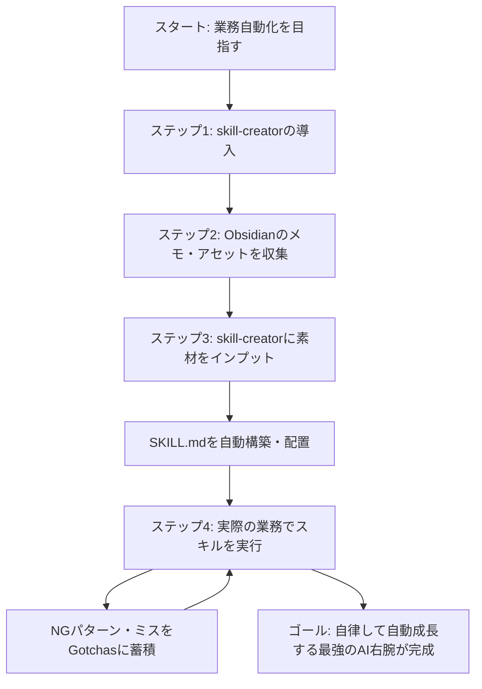

# AIを9割使いこなせていません【skill-creator/Claude】

## タイムライン
| 時間枠 | セクション名 | 主な内容・キーポイント |
| :--- | :--- | :--- |
| 00:00 - 01:56 | 導入 | AIを使いこなす鍵である「Skill」の重要性と動画全体のロードマップを提示。 |
| 01:56 - 08:24 | Skillとは？ | 定型タスクや業務フローをClaudeに再現させる専門命令セット。高品質な成果物を一貫して出力可能。 |
| 08:24 - 09:03 | Skillとプロンプトの使い分け | 単発質問にはプロンプトを、複雑な連続タスク・メンテ性や共有が必要なものにはSkillを推奨。 |
| 09:03 - 11:49 | Skillの作成方法と管理方法 | 1. skill-creatorの導入、2. 素材の収集、3. 微調整運用の3つの基本ステップを解説。 |
| 11:49 - 20:19 | Skill作成の実演 | Obsidianのメモ、キャラクター素材、過去のサムネ画像等をskill-creatorに渡してSKILL.mdを自動生成。 |
| 20:19 - 22:19 | サムネイル作成のSkill実演！ | 生成されたスキルを使用し、YouTube台本ファイルを入力するだけで完璧なサムネイル指示書が出力される様子を実演。 |
| 22:19 - 25:33 | Skillが自動で育つための裏技 | ミスを蓄積して次回からのエラーを防ぐ「Gotchas (落とし穴) セクション」の解説と自動成長の仕組み。 |
| 25:33 - 27:51 | 本日のまとめ | スキル化による10倍の知的レバレッジの獲得。メモの蓄積から最強のAI右腕を育てる重要性。 |
| 27:51 - 30:10 | アフタートーク | AIエージェントが自律的にスキルを駆動する未来の自動化・バックアップ運用の展望。 |

## 文字起こし
[00:00] **導入**
みなさんこんにちは、飯塚浩也です。本日の動画では、ClaudeやClaude Codeのポテンシャルを最大限に引き出す「Skill（スキル）」の作成方法について完全解説します。現在「Skill」の機能を活用していない方は、AIの真の実力を9割も使いこなせていないと言っても過言ではありません。動画の中では、通常のプロンプトとSkillの根本的な違い、具体的なスキルの作成手順、そして作ったスキルを日々の運用の中で自動的に「育てる」ための強力な裏技（落とし穴セクションの活用法）について、実演を交えながら詳しくお伝えします。

[01:56] **Skillとは？**
そもそも「Skill（スキル）」とは、AIエージェントに社内知識、特定の業務ルール、個人のこだわり（ブランドボイスやガイドラインなど）を埋め込み、特定の定型タスクに専門特化させたカスタム命令セットのことです。例えば、ブログやメルマガの作成、LP（ランディングページ）の設計、あるいはデザイン作成指示など、普段人間が行っている専門業務をプログラミングや複雑な設定なしにパッケージ化できます。これにより、長い初期指示を何度もコピペすることなく、常に高品質かつ一貫した出力を得ることが可能になります。

[08:24] **Skillとプロンプトの使い分け**
一回きりの質問や、汎用的な情報検索には通常の「プロンプト」で十分対応できます。しかし、段階的なワークフローを伴うもの（ステップ1、2、3といった順序処理）や、過去の参考データ、特定のルールに厳格に従わせたい業務には「Skill」が真価を発揮します。情報を1つのフォルダ（SKILL.md）に集約して管理できるため、メンテナンスが非常に容易になり、他のユーザーやチームメンバーへの共有も劇的にシンプルになります。

[09:03] **Skillの作成方法と管理方法**
カスタムスキルを作成し管理するための手順は、大きく分けて3ステップあります。丸1、Anthropicが公式に提供している「skill-creator（スキルクリエイター）」という、スキルを作成するためのメタ・スキルをPCに導入します。丸2、作成したいスキルの元となる素材（Obsidianに貯めたメモや、過去の成功事例、画像素材など）を用意して、このクリエイターにインプットします。丸3、生成されたSKILL.mdをプロジェクトに配置し、実際に使ってみて調整・運用を開始します。

[11:49] **Skill作成の実演**
それでは、実際に画面をお見せしながらスキルの構築を実演します。今回は「YouTubeのサムネイル作成を支援するスキル」を作成します。準備として、自分のObsidian（第2の脳）から「サムネイルの作り方のコツ」をまとめたメモ、キャラクター画像（オブ君など）、そして過去に好成績を収めた実際のサムネイル画像のスクリーンショットを読み込ませます。これらを「skill-creator」にドラッグ＆ドロップし、「これらを参考にした高品質なサムネ作成スキルを作成して」と指示を与えるだけで、最適なSKILL.mdが自動で構築されます。

[20:19] **サムネイル作成のSkill実演！**
生成された「YouTubeサムネイル作成スキル」が正常に機能するか実演します。これまでは、デザイン指示やキャラクターの配置ルールなどをいちいち指定する必要がありましたが、このスキルを使えば、新規で作成したYouTubeの動画台本ファイルをドラッグして「これのサムネを作って」と指示するだけで、デザインルールに沿った正確なレイアウト提案やプロンプト指示が数秒で出力されます。最初から100点を目指す必要はなく、使いながら育てていく姿勢が大切です。

[22:19] **Skillが自動で育つための裏技**
ここで、最も価値あるテクニック「Gotchas（ゴッチャーズ / 落とし穴）セクション」を紹介します。これはAnthropic公式でも推奨されている方法で、スキルを運用する中でAIが失敗した点や、誤って出力されたNGパターン（文字が被る、構成が崩れるなど）を「落とし穴」としてSKILL.mdに追記していくアプローチです。AIは次回このスキルを発火させる際、この落とし穴セクションを学習し、同じミスを繰り返さなくなります。これにより、手動でプロンプトを書き換え続けなくても、スキルが自然と自動で育つ仕組みが整います。

[25:33] **本日のまとめ**
本日のまとめです。プロンプト任せの作業から、特定の定型業務を再現可能な「Skill」へと置き換えることで、知的生産性は10倍以上に高まります。まずは、1. skill-creatorを導入し、2. Obsidian等で自分のメモやルールをしっかり集め、3. 実践のフィードバックと落とし穴（Gotchas）セクションの追加により、スキルを少しずつ育てていく。このサイクルを回すことで、あなたの日常業務を代わりにこなしてくれる「最強のAI右腕」が数多く誕生します。

[27:51] **アフタートーク**
実演はいかがでしたでしょうか。今後のAIエージェント時代では、自分が作業していなくても、裏側でAIエージェント（Claude CodeやCoworkなど）がこれらの「スキル」を活用して、指示なしに自律してタスク（バックアップやコンテンツ作成）をこなしてくれるようになります。ぜひ本日の手順を参考に、皆さんもご自身の専門業務を1つずつスキル化してみてください。チャンネル登録と高評価もよろしくお願いします！

## 概要
知的生産のプロである飯塚浩也氏が、ClaudeやClaude Code、Codexで劇的に業務効率を高める「Skill（スキル）」の自作方法を完全解説する動画。単なる一回限りのプロンプトではなく、複数の手順やブランドガイドライン、社内ルールを一箇所に格納し再利用できる「Skill」の強みを解説。Anthropic公式の「skill-creator」を用いた自動生成手順、Obsidian内に蓄積された個人的なメモや過去の成功事例アセットを流し込む方法を実演を交えて示す。さらに、運用中の失敗やミスルールを自動・手動でフィードバックして反映し続ける「Gotchas（落とし穴）セクション」の活用により、スキルを半自動的に高精度なものへと進化させる「ボトムアップ型」の最強の育成ワークフローを提唱している。

## 構成図 (Mermaid)

######################################################################################################