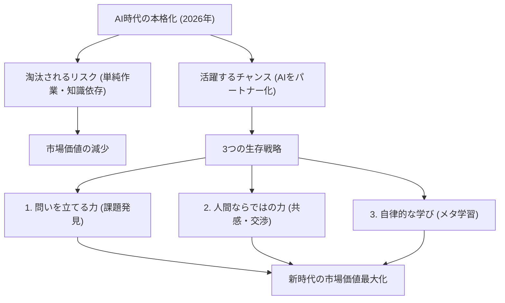

# 【2026年最新】AI時代を生き抜くための「3つの生存戦略」：淘汰される人と使いこなす人の違い

## タイムライン
| 時間 | セクション名 | 主な内容 | キーポイント |
| :--- | :--- | :--- | :--- |
| [00:00] | 導入：2026年のAI現状 | 生成AIの急速な普及に伴う社会とスキルの変化について解説 | 知識の暗記や定型作業の価値が低下している現状 |
| [03:15] | 生存戦略①：問いを立てる力 | AIから最大限の成果を引き出すための質問力と批判的思考 | AIへのインプット（プロンプト）の質がアウトプットを決定する |
| [06:45] | 生存戦略②：共感とコラボレーション | 機械には代替不可能な、人間特有の感情的インテリジェンスの重要性 | チームビルディングや信頼関係の構築が最後の砦となる |
| [10:10] | 生存戦略③：自律的なリスキリング | 変化し続ける技術に適応するための「学び方を学ぶ」メタ学習の重要性 | 過去の知識をアンラーンし、常に新しいスキルを習得する習慣 |
| [13:30] | 結論：AIをパートナーに | テクノロジーを脅威として恐れるのではなく、共創する仲間として捉える姿勢 | 自ら主導権を握り、人間らしさを発揮して未来を拓くこと |

## 文字起こし
[00:00] みなさん、こんにちは。今日は2026年現在、私たちの働き方や生活を劇的に変えつつある「生成AI」の進化と、その時代を私たちがどう生き抜くべきかという非常に重要なテーマについてお話しします。ここ数年で、AIの進化スピードは私たちの想像をはるかに超えるものとなりました。以前は「人間独自の仕事」と言われていた文章作成、プログラミング、デザイン、さらには高度なデータ分析まで、今やAIが瞬時に、しかも極めて高いクオリティで実行できるようになっています。このような時代において、これまでの「知識を多く持っている人」や「真面目に定型業務をこなす人」が直面している危機、そして逆にAIを相棒としてこれまでにない大きな成果を上げる人たちの特徴について、詳しく紐解いていきましょう。

[03:15] そこで、AI時代に淘汰されず、むしろ活躍するための「第1の生存戦略」は、「問いを立てる力」です。AIは膨大なデータから答えを導き出すことには非常に長けていますが、自分自身で「そもそも何が課題なのか」「何を解決すべきなのか」という問いをゼロから生み出すことはできません。これからの時代に求められるのは、優れた答えを出すことではなく、AIに対して適切な指示（プロンプト）を与えるための「優れた問いを設計する能力」です。クリティカルシンキング（批判的思考）を研ぎ澄まし、目の前の状況に対して「本当にこれでいいのか？」「もっと別の視点はないか？」と問い直す姿勢が、あなたの市場価値を最大化します。

[06:45] 続いて、「第2の生存戦略」は「共感とコラボレーション力」です。AIはテキストや音声を介して極めて自然な会話をすることができますが、本質的な意味での「心からの共感」や「熱量を持った信頼関係の構築」は人間にしかできません。ビジネスの現場では、どれだけ論理的で正しい答えが提示されたとしても、最終的に意思決定をし、行動を起こすのは人間です。他者の感情に寄り添い、ビジョンを掲げて人々を巻き込む力、そしてチームメンバーやステークホルダーとの強固な信頼関係を築く「エモーショナル・インテリジェンス（感情的知性）」の重要性は、テクノロジーが進化すればするほど、むしろその希少性と価値が高まっていくのです。

[10:10] そして、「第3の生存戦略」は「自律的なリスキリングとメタ学習」です。現代の技術のトレンドは数ヶ月、場合によっては数週間単位で変化します。5年前に学んだ専門知識が、今ではまったく通用しないということも珍しくありません。このような不確実な世界で重要となるのは、「学び方を学ぶ（メタ学習）」というアプローチです。過去の成功体験や古い知識を一度手放す「アンラーニング」を行い、新しいツールや概念を素早く吸収し、実践に落とし込む学習アジリティ（俊敏性）が求められます。自分の学習プロセスを常に客観的に評価し、自律的にスキルをアップデートし続ける人だけが、変化の激しい時代を柔軟にサバイブできるのです。

[13:30] 最後になりますが、AIは私たちの雇用を奪う「脅威」ではなく、私たちの可能性を何倍にも広げてくれる最高の「パートナー」です。大切なのは、AIに使われる側になるのではなく、主体性を持ってAIを使いこなす側に回ることです。自ら問いを立て、人間ならではの温かいコミュニケーションと共感を大切にし、常に学び続ける姿勢を失わなければ、AI時代はあなたにとって史上最高のチャンスに満ちた黄金期となるはずです。恐れることなく、新しいテクノロジーの波に乗り、共に素晴らしい未来を創り出していきましょう。それでは、また次回の動画でお会いしましょう。ありがとうございました。

## 概要
生成AIの高度化が進む2026年において、個人が市場価値を維持し、キャリアを切り拓くための「3つの生存戦略」を提示しています。単なる知識保有や定型業務の価値が薄れる中、(1)AIに適切な指示を出すための「問いを立てる力」、(2)人間にしかできない「共感・コラボレーション力」、(3)急速な変化に適応するための「自律的なリスキリング（メタ学習）」の重要性を強調しています。AIを脅威として恐れるのではなく、自身の創造性を拡張する「共創パートナー」として捉え、自律的に学び続ける重要性を説く啓発的な内容です。

## 構成図 (Mermaid)

